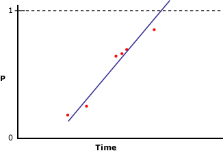
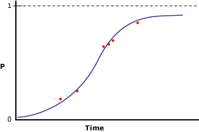

# Microsoft Logistic Regression Algorithm Technical Reference
  The [!INCLUDE[msCoName](../../includes/msconame-md.md)] Logistic Regression algorithm is a variation of the [!INCLUDE[msCoName](../../includes/msconame-md.md)] Neural Network algorithm, where the *HIDDEN_NODE_RATIO* parameter is set to 0. This setting will create a neural network model that does not contain a hidden layer, and that therefore is equivalent to logistic regression.  
  
## Implementation of the Microsoft Logistic Regression Algorithm  
 Suppose the predictable column contains only two states, yet you still want to perform a regression analysis, relating input columns to the probability that the predictable column will contain a specific state. The following diagram illustrates the results you will obtain if you assign 1 and 0 to the states of the predictable column, calculate the probability that the column will contain a specific state, and perform a linear regression against an input variable.  
  
   
  
 The x-axis contains values of an input column. The y-axis contains the probabilities that the predictable column will be one state or the other. The problem with this is that the linear regression does not constrain the column to be between 0 and 1, even though those are the maximum and minimum values of the column. A way to solve this problem is to perform logistic regression. Instead of creating a straight line, logistic regression analysis creates an "S" shaped curve that contains maximum and minimum constraints. For example, the following diagram illustrates the results you will achieve if you perform a logistic regression against the same data as used for the previous example.  
  
   
  
 Notice how the curve never goes above 1 or below 0. You can use logistic regression to describe which input columns are important in determining the state of the predictable column.  
  
### Feature Selection  
 Feature selection is used automatically by all Analysis Services data mining algorithms to improve analysis and reduce processing load. The method used for feature selection in a logistic regression model depends on the data type of the attribute. Because logistic regression is based on the Microsoft Neural Network algorithm, it uses a subset of the feature selection methods that apply to neural networks. For more information, see [Feature Selection &#40;Data Mining&#41;](feature-selection-data-mining.md).  
  
### Scoring Inputs  
 *Scoring* in the context of a neural network model or logistic regression model means the process of converting the values that are present in the data into a set of values that use the same scale and therefore can be compared to each other. For example, suppose the inputs for Income range from 0 to 100,000 whereas the inputs for [Number of Children] range from 0 to 5. This conversion process allows you to *score*, or compare, the importance of each input regardless of the difference in values.  
  
 For each state that appears in the training set, the model generates an input. For discrete or discretized inputs, an additional input is created to represent the Missing state, if the missing state appears at least once in the training set. For continuous inputs, at most two input nodes are created: one for Missing values, if present in the training data, and one input for all existing, or non-null, values. Each input is scaled to a numeric format using the z-score normalization method, (x - μ)/StdDev.  
  
 During z-score normalization, the mean (μ) and standard deviation are obtained over the complete training set.  
  
 **Continuous values**  
  
 Value is present:   (X - μ)/σ // X is the actual value being encoded)  
  
 Value is absent:    -   μ/σ  // negative mu divided by sigma)  
  
 **Discrete values**  
  
 μ = p - (the prior probability of a state)  
  
 StdDev  = sqrt(p(1-p))  
  
 Value is present:     (1 - μ)/σ// (One minus mu) divided by sigma)  
  
 Value is absent:     (- μ)/σ// negative mu divided by sigma)  
  
### Understanding Logistic Regression Coefficients  
 There are various methods in the statistical literature for performing logistic regression, but an important part of all methods is assessing the fit of the model. A variety of goodness-to-fit statistics have been proposed, among them odds ratios and covariate patterns. A discussion of how to measure the fit of a model is beyond the scope of this topic; however, you can retrieve the value of the coefficients in the model and use them to design your own measures of fit.  
  
> [!NOTE]  
>  The coefficients that are created as part of a logistic regression model do not represent odds ratios and should not be interpreted as such.  
  
 The coefficients for each node in the model graph represent a weighted sum of the inputs to that node. In a logistic regression model, the hidden layer is empty; therefore, there is only one set of coefficients, which is stored in the output nodes. You can retrieve the values of the coefficients by using the following query:  
  
```  
SELECT FLATTENED [NODE_UNIQUE NAME],  
(SELECT ATTRIBUTE_NAME< ATTRIBUTE_VALUE  
FROM NODE_DISTRIBUTION) AS t  
FROM <model name>.CONTENT  
WHERE NODE_TYPE = 23  
```  
  
 For each output value, this query returns the coefficients and an ID that points back to the related input node. It also returns a row that contains the value of the output and the intercept. Each input X has its own coefficient (Ci), but the nested table also contains a "free" coefficient (Co), calculated according to the following formula:  
  
 F(X) = X1*C1 + X2\*C2 + ... +Xn\*Cn + X0  
  
 Activation: exp(F(X)) / (1 + exp(F(X)) )  
  
 For more information, see [Logistic Regression Model Query Examples](logistic-regression-model-query-examples.md).  
  
## Customizing the Logistic Regression Algorithm  
 The [!INCLUDE[msCoName](../../includes/msconame-md.md)] logistic regression algorithm supports several parameters that affect the behavior, performance, and accuracy of the resulting mining model. You can also modify the behavior of the model by setting modeling flags on the columns used as input.  
  
### Setting Algorithm Parameters  
 The following table describes the parameters that can be used with the Microsoft Logistic Regression algorithm.  
  
 HOLDOUT_PERCENTAGE  
 Specifies the percentage of cases within the training data used to calculate the holdout error. HOLDOUT_PERCENTAGE is used as part of the stopping criteria while training the mining model.  
  
 The default is 30.  
  
 HOLDOUT_SEED  
 Specifies a number to use to seed the pseudo-random generator when randomly determining the holdout data. If HOLDOUT_SEED is set to 0, the algorithm generates the seed based on the name of the mining model, to guarantee that the model content remains the same during reprocessing.  
  
 The default is 0.  
  
 MAXIMUM_INPUT_ATTRIBUTES  
 Defines the number of input attributes that the algorithm can handle before it invokes feature selection. Set this value to 0 to turn off feature selection.  
  
 The default is 255.  
  
 MAXIMUM_OUTPUT_ATTRIBUTES  
 Defines the number of output attributes that the algorithm can handle before it invokes feature selection. Set this value to 0 to turn off feature selection.  
  
 The default is 255.  
  
 MAXIMUM_STATES  
 Specifies the maximum number of attribute states that the algorithm supports. If the number of states that an attribute has is larger than the maximum number of states, the algorithm uses the most popular states of the attribute and ignores the remaining states.  
  
 The default is 100.  
  
 SAMPLE_SIZE  
 Specifies the number of cases to be used to train the model. The algorithm provider uses either this number or the percentage of total of cases that are not included in the holdout percentage as specified by the HOLDOUT_PERCENTAGE parameter, whichever value is smaller.  
  
 In other words, if HOLDOUT_PERCENTAGE is set to 30, the algorithm will use either the value of this parameter, or a value that is equal to 70 percent of the total number of cases, whichever is smaller.  
  
 The default is 10000.  
  
### Modeling Flags  
 The following modeling flags are supported for use with the [!INCLUDE[msCoName](../../includes/msconame-md.md)] Logistic Regression algorithm.  
  
 NOT NULL  
 Indicates that the column cannot contain a null. An error will result if Analysis Services encounters a null during model training.  
  
 Applies to mining structure columns.  
  
 MODEL_EXISTENCE_ONLY  
 Means that the column will be treated as having two possible states: `Missing` and `Existing`. A null is a missing value.  
  
 Applies to mining model column.  
  
## Requirements  
 A logistic regression model must contain a key column, input columns, and at least one predictable column.  
  
### Input and Predictable Columns  
 The [!INCLUDE[msCoName](../../includes/msconame-md.md)] Logistic Regression algorithm supports the specific input column content types, predictable column content types, and modeling flags that are listed in the following table. For more information about what the content types mean when used in a mining model, see [Content Types &#40;Data Mining&#41;](content-types-data-mining.md).  
  
|Column|Content types|  
|------------|-------------------|  
|Input attribute|Continuous, Discrete, Discretized, Key, Table|  
|Predictable attribute|Continuous, Discrete, Discretized|  
  
## See Also  
 [Microsoft Logistic Regression Algorithm](microsoft-logistic-regression-algorithm.md)   
 [Linear Regression Model Query Examples](linear-regression-model-query-examples.md)   
 [Mining Model Content for Logistic Regression Models &#40;Analysis Services - Data Mining&#41;](mining-model-content-for-logistic-regression-models.md)   
 [Microsoft Neural Network Algorithm](microsoft-neural-network-algorithm.md)  
  
  
