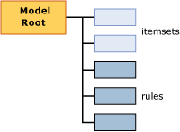

# Mining Model Content for Association Models (Analysis Services - Data Mining)
  This topic describes mining model content that is specific to models that use the [!INCLUDE[msCoName](../../includes/msconame-md.md)] Association Rules algorithm. For an explanation of general and statistical terminology related to mining model content that applies to all model types, see [Mining Model Content &#40;Analysis Services - Data Mining&#41;](mining-model-content-analysis-services-data-mining.md).  
  
## Understanding the Structure of an Association Model  
 An association model has a simple structure. Each model has a single parent node that represents the model and its metadata, and each parent node has a flat list of itemsets and rules. The itemsets and rules are not organized in trees, they are ordered with itemsets first and rules next as shown in the following diagram.  
  
   
  
 Each itemset is contained in its own node (NODE_TYPE = 7). The *node* includes the definition of the itemset, the number of cases that contain this itemset, and other information.  
  
 Each rule is also contained in its own node (NODE_TYPE = 8). A *rule* describes a general pattern for how items are associated. A rule is like an IF-THEN statement. The left-hand side of the rule shows an existing condition or set of conditions. The right-hand side of the rule shows the item in your data set that is usually associated with the conditions on the left side.  
  
 **Note** If you want to extract either the rules or the itemsets, you can use a query to return only the node types that you want. For more information, see [Association Model Query Examples](association-model-query-examples.md).  
  
## Model Content for an Association Model  
 This section provides detail and examples only for those columns in the mining model content that are relevant for association models.  
  
 For information about the general-purpose columns in the schema rowset, such as MODEL_CATALOG and MODEL_NAME, see [Mining Model Content &#40;Analysis Services - Data Mining&#41;](mining-model-content-analysis-services-data-mining.md).  
  
 MODEL_CATALOG  
 Name of the database where the model is stored.  
  
 MODEL_NAME  
 Name of the model.  
  
 ATTRIBUTE_NAME  
 The names of the attributes that correspond to this node.  
  
 NODE_NAME  
 The name of the node. For an association model, this column contains the same value as NODE_UNIQUE_NAME.  
  
 NODE_UNIQUE_NAME  
 The unique name of the node.  
  
 NODE_TYPE  
 A association model outputs only the following node types:  
  
|Node Type ID|Type|  
|------------------|----------|  
|1 (Model)|Root or parent node.|  
|7 (Itemset)|An itemset, or collection of attribute-value pairs. Examples:   `Product 1 = Existing, Product 2 = Existing`   or   `Gender = Male`.|  
|8 (Rule)|A rule defining how items relate to each other.   Example:   `Product 1 = Existing, Product 2 = Existing -> Product 3 = Existing`.|  
  
 NODE_CAPTION  
 A label or a caption associated with the node.  
  
 **Itemset node** A comma-separated list of items.  
  
 **Rule node** Contains the left and right-hand sides of the rule.  
  
 CHILDREN_CARDINALITY  
 Indicates the number of children of the current node.  
  
 **Parent node** Indicates the total number of itemsets plus rules.  
  
> [!NOTE]  
>  To get a breakdown of the count for itemsets and rules, see the NODE_DESCRIPTION for the root node of the model.  
  
 **Itemset or rule node** Always 0.  
  
 PARENT_UNIQUE_NAME  
 The unique name of the node's parent.  
  
 **Parent node** Always NULL.  
  
 **Itemset or rule node** Always 0.  
  
 NODE_DESCRIPTION  
 A user-friendly description of the contents of the node.  
  
 **Parent node** Includes a comma-separated list of the following information about the model:  
  
|Item|Description|  
|----------|-----------------|  
|ITEMSET_COUNT|Count of all itemsets in model.|  
|RULE_COUNT|Count of all rules in model.|  
|MIN_SUPPORT|The minimum support found for any single itemset.   **Note** This value might differ from the value that you set for the *MINIMUM _SUPPORT* parameter.|  
|MAX_SUPPORT|The maximum support found for any single itemset.   **Note** This value might differ from the value that you set for the *MAXIMUM_SUPPORT* parameter.|  
|MIN_ITEMSET_SIZE|The size of the smallest itemset, represented as a count of items.   A value of 0 indicates that the `Missing` state was treated as an independent item.   **Note** The default value of the *MINIMUM_ITEMSET_SIZE* parameter is 1.|  
|MAX_ITEMSET_SIZE|Indicates the size of the largest itemset that was found.   **Note** This value is constrained by the value that you set for the *MAX_ITEMSET_SIZE* parameter when you created the model. This value can never exceed that value; however, it can be less. The default value is 3.|  
|MIN_PROBABILITY|The minimum probability detected for any single itemset or rule in the model.   Example: 0.400390625   **Note** For itemsets, this value is always greater than the value that you set for the *MINIMUM_PROBABILITY* parameter when you created the model.|  
|MAX_PROBABILITY|The maximum probability detected for any single itemset or rule in the model.   Example: 1   **Note** There is no parameter to constrain maximum probability of itemsets. If you want to eliminate items that are too frequent, use the *MAXIMUM_SUPPORT* parameter instead.|  
|MIN_LIFT|The minimum amount of lift that is provided by the model for any itemset.   Example: 0.14309369632511   Note: Knowing the minimum lift can help you determine whether the lift for any one itemset is significant.|  
|MAX_LIFT|The maximum amount of lift that is provided by the model for any itemset.   Example: 1.95758227647523 **Note** Knowing the maximum lift can help you determine whether the lift for any one itemset is significant.|  
  
 **Itemset node** Itemset nodes contain a list of the items, displayed as a comma-separated text string.  
  
 Example:  
  
 `Touring Tire = Existing, Water Bottle = Existing`  
  
 This means touring tires and water bottles were purchased together.  
  
 **Rule node** Rule nodes contains a left-hand and right-hand side of the rule, separated by an arrow.  
  
 Example: `Touring Tire = Existing, Water Bottle = Existing -> Cycling cap = Existing`  
  
 This means that if someone bought a touring tire and a water bottle, they were also likely to buy a cycling cap.  
  
 NODE_RULE  
 An XML fragment that describes the rule or itemset that is embedded in the node.  
  
 **Parent node** Blank.  
  
 **Itemset node** Blank.  
  
 **Rule node** The XML fragment includes additional useful information about the rule, such as support, confidence, and the number of items, and the ID of the node that represents the left-hand side of the rule.  
  
 MARGINAL_RULE  
 Blank.  
  
 NODE_PROBABILITY  
 A probability or confidence score associated with the itemset or rule.  
  
 **Parent node** Always 0.  
  
 **Itemset node** Probability of the itemset.  
  
 **Rule node** Confidence value for the rule.  
  
 MARGINAL_PROBABILITY  
 Same as NODE_PROBABILITY.  
  
 NODE_DISTRIBUTION  
 The table contains very different information, depending on whether the node is an itemset or a rule.  
  
 **Parent node** Blank.  
  
 **Itemset node** Lists each item in the itemset together with a probability and support value. For example, if the itemset contains two products, the name of each product is listed, together with the count of cases that include each product.  
  
 **Rule node** Contains two rows. The first row shows the attribute from the right-hand side of the rule, which is the predicted item, together with a confidence score.  
  
 The second row is unique to association models; it contains a pointer to the itemset on the right-hand side of the rule. The pointer is represented in the ATTRIBUTE_VALUE column as the ID of the itemset that contains only the right-hand item.  
  
 For example, if the rule is `If {A,B} Then {C}`, the table contains the name of the item `{C}`, and the ID of the node that contains the itemset for item C.  
  
 This pointer is useful because you can determine from the itemset node how many cases in all include the right-hand side product. The cases that are subject to the rule `If {A,B} Then {C}` are a subset of the cases listed in the itemset for `{C}`.  
  
 NODE_SUPPORT  
 The number of cases that support this node.  
  
 **Parent node** Number of cases in the model.  
  
 **Itemset node** Number of cases that contains all items in the itemset.  
  
 **Rule node** The number of cases that contain all items included in the rule.  
  
 MSOLAP_MODEL_COLUMN  
 Contains different information depending on whether the node is an itemset or rule.  
  
 **Parent node** Blank.  
  
 **Itemset node** Blank.  
  
 **Rule node** The ID of the itemset that contains the items in the left-hand side of the rule. For example, if the rule is `If {A,B} Then {C}`, this column contains the ID of the itemset that contains only `{A,B}`.  
  
 MSOLAP_NODE_SCORE  
 **Parent node** Blank.  
  
 **Itemset node** Importance score for the itemset.  
  
 **Rule node** Importance score for the rule.  
  
> [!NOTE]  
>  Importance is calculated differently for itemsets and rules. For more information, see [Microsoft Association Algorithm Technical Reference](microsoft-association-algorithm-technical-reference.md).  
  
 MSOLAP_NODE_SHORT_CAPTION  
 Blank.  
  
## See Also  
 [Mining Model Content &#40;Analysis Services - Data Mining&#41;](mining-model-content-analysis-services-data-mining.md)   
 [Microsoft Association Algorithm](microsoft-association-algorithm.md)   
 [Association Model Query Examples](association-model-query-examples.md)  
  
  
