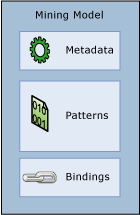

# Mining Models (Analysis Services - Data Mining)
  A *mining model* is created by applying an algorithm to data, but it is more than an algorithm or a metadata container: it is a set of data, statistics, and patterns that can be applied to new data to generate predictions and make inferences about relationships.  
  
 This section explains what a data mining model is and what it can be used for: the basic architecture of models and structures, the properties of mining models, and ways to create and work with mining models.  
  
 [Mining Model Architecture](#bkmk_mdlArch)  
  
 [Defining Data Mining Models](#bkmk_mdlDefine)  
  
 [Mining Model Properties](#bkmk_mdlProps)  
  
 [Mining Model Columns](#bkmk_mdlCols)  
  
 [Processing Mining Models](#bkmk_mdlProcess)  
  
 [Viewing and Querying Mining Models](#bkmk_mdlView)  
  
##   Mining Model Architecture  
 A data mining model gets data from a mining structure and then analyzes that data by using a data mining algorithm. The mining structure and mining model are separate objects. The mining structure stores information that defines the data source. A mining model stores information derived from statistical processing of the data, such as the patterns found as a result of analysis.  
  
 A mining model is empty until the data provided by the mining structure has been processed and analyzed. After a mining model has been processed, it contains metadata, results, and bindings back to the mining structure.  
  
   
  
 The metadata specifies the name of the model and the server where it is stored, as well as a definition of the model, including the columns from the mining structure that were used in building the model, the definitions of any filters that were applied when processing the model, and the algorithm that was used to analyze the data. All these choices-the data columns and their data types, filters, and algorithm-have a powerful influence on the results of analysis.  
  
 For example, you can use the same data to create multiple models, using perhaps a clustering algorithm, decision tree algorithm, and Naïve Bayes algorithm. Each model type creates different set of patterns, itemsets, rules, or formulas, which you can use for making predictions. Generally each algorithm analyses the data in a different way, so the *content* of the resulting model is also organized in different structures. In one type of model, the data and patterns might be grouped in *clusters*; in another type of model, data might be organized into trees, branches, and the rules that divide and define them.  
  
 The model is also affected by the data that you train it on: even models trained on the same mining structure can yield different results if you filter the data differently or use different seeds during analysis. However, the actual data is not stored in the model-only summary statistics are stored, with the actual data residing in the mining structure. If you have created filters on the data when you trained the model, the filter definitions are saved with the model object as well.  
  
 The model does contain a set of bindings, which point back to the data cached in the mining structure. If the data has been cached in the structure and has not been cleared after processing, these bindings enable you to drill through from the results to the cases that support the results. However, the actual data is stored in the structure cache, not in the model.  
  
 [Mining Model Architecture](#bkmk_mdlArch)  
  
##   Defining Data Mining Models  
 You create a data mining model by following these general steps:  
  
-   Create the underlying mining structure and include the columns of data that might be needed.  
  
-   Select the algorithm that is best suited to the analytical task.  
  
-   Choose the columns from the structure to use in the model, and specify how they should be used-which column contains the outcome you want to predict, which columns are for input only, and so forth.  
  
-   Optionally, set parameters to fine-tune the processing by the algorithm.  
  
-   Populate the model with data by *processing* the structure and model.  
  
 [!INCLUDE[ssASnoversion](../../includes/ssasnoversion-md.md)] provides the following tools to help you manage your mining models:  
  
-   The Data Mining Wizard helps you create a structure and related mining model. This is the easiest method to use. The wizard automatically creates the required mining structure and helps you with the configuration of the important settings.  
  
-   A DMX CREATE MODEL statement can be used to define a model. The required structure is automatically created as part of the process; therefore, you cannot reuse an existing structure with this method. Use this method if you already know exactly which model you want to create, or if you want to script models.  
  
-   A DMX ALTER STRUCTURE ADD MODEL statement can be used to add a new mining model to an existing structure. Use this method if you want to experiment with different models that are based on the same data set.  
  
 You can also create mining models programmatically, by using AMO or XML/A, or by using other clients such as the Data Mining Client for Excel. For more information, see the following topics:  
  
 [Mining Model Architecture](#bkmk_mdlArch)  
  
##   Mining Model Properties  
 Each mining model has properties that define the model and its metadata. These include the name, description, the date the model was last processed, permissions on the model, and any filters on the data that is used for training.  
  
 Each mining model also has properties that are derived from the mining structure, and that describe the columns of data used by the model. If any column used by the model is a nested table, the column can also have a separate filter applied.  
  
 In addition, each mining model contains two special properties: <xref:Microsoft.AnalysisServices.MiningModel.Algorithm%2A> and <xref:Microsoft.AnalysisServices.MiningModelColumn.Usage%2A>.  
  
-   **Algorithm property** Specifies the algorithm that is used to create the model. The algorithms that are available depend on the provider that you are using. For a list of the algorithms that are included with [!INCLUDE[ssNoVersion](../../includes/ssnoversion-md.md)] [!INCLUDE[ssASnoversion](../../includes/ssasnoversion-md.md)], see [Data Mining Algorithms &#40;Analysis Services - Data Mining&#41;](data-mining-algorithms-analysis-services-data-mining.md). The `Algorithm` property applies to the mining model and can be set only one time for each model. You can change the algorithm later but some columns in the mining model might become invalid if they are not supported by the algorithm that you choose. You must always reprocess the model following a change to this property.  
  
-   **Usage property** Defines how each column is used by the model. You can define the column usage as `Input`, `Predict`, `Predict Only`, or `Key`. The `Usage` property applies to individual mining model columns and must be set individually for every column that is included in a model. If the structure contains a column that you do not use in the model, the usage is set to `Ignore`. Examples of data that you might include in the mining structure but not use in analysis might be customer names or e-mail addresses. This way you can query them later without having to include them during the analysis phase.  
  
 You can change the value of mining model properties after you create a mining model. However, any change, even to the name of the mining model, requires that you reprocess the model. After you reprocess the model, you might see different results.  
  
 [Mining Model Architecture](#bkmk_mdlArch)  
  
##   Mining Model Columns  
 The mining model contains columns of data that are obtained from the columns defined in the mining structure. You can choose which columns from the mining structure to use in the model, and you can create copies of the mining structure columns and then rename them or change their usage. As part of the model building process, you must also define the usage of the column by the model. That includes such information as whether the column is a key, whether it is used for prediction, or whether it can be ignored by the algorithm.  
  
 While you are building a model, rather than automatically adding every column of data that is available, it is recommended that you review the data in the structure carefully and include in the model only those columns that make sense for analysis. For example, you should avoid including multiple columns that repeat the same data, and you should avoid using columns that have mostly unique values. If you think a column should not be used, you do not need to delete it from the mining structure or mining model; instead, you can just set a flag on the column that specifies that it should be ignored when building the model. This means that the column will remain in the mining structure, but will not be used in the mining model. If you have enabled drillthrough from the model to the mining structure, you can retrieve the information from the column later.  
  
 Depending on which algorithm you choose, some columns in the mining structure might be incompatible with certain model types, or might give you poor results. For example, if your data contains continuous numeric data, such as an Income column, and your model requires discrete values, you might need to convert the data to discrete ranges or remove it from the model. In some cases the algorithm will automatically convert or bin the data for you, but the results might not always be what you want or expect. Consider making additional copies of the column and trying out different models. You can also set flags on the individual columns to indicate where special processing is required. For example, if your data contains nulls, you can use a modeling flag to control handling. If you want a particular column to be considered as a regressor in a model you can do that with a modeling flag.  
  
 After you have created the model, you can make changes such as adding or removing columns, or changing the name of the model. However, any change, even only to the model metadata, requires that you reprocess the model.  
  
 [Mining Model Architecture](#bkmk_mdlArch)  
  
##   Processing Mining Models  
 A data mining model is an empty object until it is processed. When you process a model, the data that is cached by the structure is passed through a filter, if one has been defined in the model, and is analyzed by the algorithm. The algorithm computes a set of summary statistics that describes the data, identifies the rules and patterns within the data, and then uses these rules and patterns to populate the model.  
  
 After it has been processed, the mining model contains a wealth of information about the data and the patterns found through analysis, including statistics, rules, and regression formulas. You can use the custom viewers to browse this information, or you can create data mining queries to retrieve this information and use it for analysis and presentation.  
  
 [Mining Model Architecture](#bkmk_mdlArch)  
  
##   Viewing and Querying Mining Models  
 After you have processed a model, you can explore it by using the custom viewers that are provided in [!INCLUDE[ssBIDevStudioFull](../../includes/ssbidevstudiofull-md.md)] and [!INCLUDE[ssManStudioFull](../../includes/ssmanstudiofull-md.md)]. For  
  
 You can also create queries against the mining model either to make predictions, or to retrieve model metadata or the patterns created by the model. You create queries by using Data Mining Extensions (DMX).  
  
## Related Content  
  
|Topics|Links|  
|------------|-----------|  
|Learn how to build mining structures that can support multiple mining models. Learn about the usage of columns in models.|[Mining Structure Columns](mining-structure-columns.md)   [Mining Model Columns](mining-model-columns.md)   [Content Types &#40;Data Mining&#41;](content-types-data-mining.md)|  
|Learn about different algorithms, and how the choice of algorithm affects the model content.|[Mining Model Content &#40;Analysis Services - Data Mining&#41;](mining-model-content-analysis-services-data-mining.md)   [Data Mining Algorithms &#40;Analysis Services - Data Mining&#41;](data-mining-algorithms-analysis-services-data-mining.md)|  
|Learn now you can set properties on the model that affects its composition and behavior.|[Mining Model Properties](mining-model-properties.md)   [Modeling Flags &#40;Data Mining&#41;](modeling-flags-data-mining.md)|  
|Learn about the programmable interfaces for data mining.|[Developing with Analysis Management Objects &#40;AMO&#41;](https://docs.microsoft.com/bi-reference/amo/developing-with-analysis-management-objects-amo)   [Data Mining Extensions &#40;DMX&#41; Reference](/sql/dmx/data-mining-extensions-dmx-reference)|  
|Learn how to use the custom data mining viewers in [!INCLUDE[ssASnoversion](../../includes/ssasnoversion-md.md)].|[Data Mining Model Viewers](data-mining-model-viewers.md)|  
|View examples of the different types of queries that you can use against data mining models.|[Data Mining Queries](data-mining-queries.md)|  
  
## Related Tasks  
 Use the following links to get more specific information about working with data mining models  
  
|Task|Link|  
|----------|----------|  
|Add and delete mining models|[Add a Mining Model to an Existing Mining Structure](add-a-mining-model-to-an-existing-mining-structure.md)   [Delete a Mining Model from a Mining Structure](delete-a-mining-model-from-a-mining-structure.md)|  
|Work with mining model columns|[Exclude a Column from a Mining Model](exclude-a-column-from-a-mining-model.md)   [Create an Alias for a Model Column](create-an-alias-for-a-model-column.md)   [Change the Discretization of a Column in a Mining Model](change-the-discretization-of-a-column-in-a-mining-model.md)   [Specify a Column to Use as Regressor in a Model](specify-a-column-to-use-as-regressor-in-a-model.md)|  
|Alter model properties|[Change the Properties of a Mining Model](change-the-properties-of-a-mining-model.md)   [Apply a Filter to a Mining Model](apply-a-filter-to-a-mining-model.md)   [Delete a Filter from a Mining Model](delete-a-filter-from-a-mining-model.md)   [Enable Drillthrough for a Mining Model](enable-drillthrough-for-a-mining-model.md)   [View or Change Algorithm Parameters](view-or-change-algorithm-parameters.md)|  
|Copy. move, or manage models|[Make a Copy of a Mining Model](make-a-copy-of-a-mining-model.md)   [Copy a View of a Mining Model](copy-a-view-of-a-mining-model.md)   [EXPORT &#40;DMX&#41;](/sql/dmx/export-dmx)   [IMPORT &#40;DMX&#41;](/sql/dmx/import-dmx)|  
|Populate models with data, or update data in a model|[Process a Mining Model](process-a-mining-model.md)|  
|Work with OLAP models|[Create a Data Mining Dimension](create-a-data-mining-dimension.md)|  
  
## See Also  
 [Database Objects &#40;Analysis Services - Multidimensional Data&#41;](../multidimensional-models/olap-logical/database-objects-analysis-services-multidimensional-data.md)  
  
  
