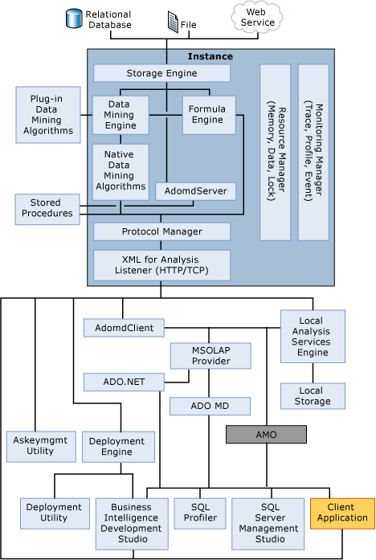

# Physical Architecture (Analysis Services - Data Mining)
  [!INCLUDE[msCoName](../../includes/msconame-md.md)] [!INCLUDE[ssASnoversion](../../includes/ssasnoversion-md.md)] uses both server and client components to supply data mining functionality for business intelligence applications:  
  
-   The server component is implemented as a Microsoft Windows service. You can have multiple instances on the same computer, with each instance of [!INCLUDE[ssASnoversion](../../includes/ssasnoversion-md.md)] implemented as a separate instance of the Windows service.  
  
-   Clients communicate with [!INCLUDE[ssASnoversion](../../includes/ssasnoversion-md.md)] using the public standard XML for Analysis (XMLA), a SOAP-based protocol for issuing commands and receiving responses, exposed as a Web service. Client object models are also provided over XMLA, and can be accessed either by using a managed provider, such as ADOMD.NET, or a native OLE DB provider.  
  
-   Query commands can be issued using Data Mining Extensions (DMX), an industry standard query language oriented toward data mining. Analysis Services Scripting Language (ASSL) can also be used to manage [!INCLUDE[ssASnoversion](../../includes/ssasnoversion-md.md)] database objects.  
  
## Architectural Diagram  
 An [!INCLUDE[ssASnoversion](../../includes/ssasnoversion-md.md)] instance runs as a stand-alone service and communication with the service occurs through XML for Analysis (XMLA), by using either HTTP or TCP.  
  
 AMO is a layer between the user application and the [!INCLUDE[ssASnoversion](../../includes/ssasnoversion-md.md)] instance that provides access to [!INCLUDE[ssASnoversion](../../includes/ssasnoversion-md.md)] administrative objects. AMO is a class library that takes commands from a client application and converts those commands into XMLA messages for the [!INCLUDE[ssASnoversion](../../includes/ssasnoversion-md.md)] instance. AMO presents [!INCLUDE[ssASnoversion](../../includes/ssasnoversion-md.md)] instance objects as classes to the end user application, with method members that run commands and property members that hold the data for the [!INCLUDE[ssASnoversion](../../includes/ssasnoversion-md.md)] objects.  
  
 The following illustration shows the [!INCLUDE[ssASnoversion](../../includes/ssasnoversion-md.md)] components architecture, including services within the [!INCLUDE[ssASnoversion](../../includes/ssasnoversion-md.md)] instance and user components that interact with the instance.  
  
 The illustration shows that the only way to access the instance is by using the XML for Analysis (XMLA) Listener, either by using HTTP or TCP.  
  
> [!WARNING]  
>  DSO has been deprecated. You should not use DSO to develop solutions.  
  
   
  
## Server Configuration  
 One server instance can support multiple [!INCLUDE[ssASnoversion](../../includes/ssasnoversion-md.md)] databases, each with its own instance of the [!INCLUDE[ssASnoversion](../../includes/ssasnoversion-md.md)] service that responds to client requests and processes objects.  
  
 Separate instances must be installed if you want to work with both tabular models and data mining and/or multidimensional models. [!INCLUDE[ssASnoversion](../../includes/ssasnoversion-md.md)] supports side-by-side installation of instances running in tabular mode (which uses the xVelocity in-memory analytics engine (VertiPaq) storage engine) and instances running in one of the conventional OLAP, MOLAP, or ROLAP configurations. For more information, see [Determine the Server Mode of an Analysis Services Instance](../instances/determine-the-server-mode-of-an-analysis-services-instance.md).  
  
 All communications between a client and the Analysis Services server use XMLA, which is a platform-independent and language-independent protocol. When a request is received from a client, Analysis Services determines whether the request relates to OLAP or data mining, and routes the request appropriately. For more information, see [OLAP Engine Server Components](../multidimensional-models/olap-physical/olap-engine-server-components.md).  
  
## See Also  
 [Logical Architecture &#40;Analysis Services - Data Mining&#41;](logical-architecture-analysis-services-data-mining.md)  
  
  
