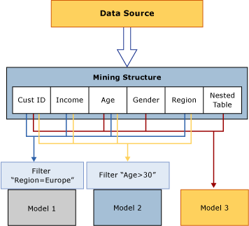

# Processing Data Mining Objects
  A data mining object is only an empty container until it has been processed. *Processing* a data mining model is also called *training*.  
  
 **Processing mining structures:** A mining structure gets data from an external data source, as defined by the column bindings and usage metadata, and reads the data. This data is read in full and then analyzed to extract various statistics. Analysis Services stores a compact representation of the data, which is suitable for analysis by data mining algorithms, in a local cache. You can either keep this cache or delete it after your models have been processed. By default, the cache is stored. For more information, see [Process a Mining Structure](process-a-mining-structure.md).  
  
 **Processing mining models:** A mining model is empty, containing definitions only, until it is processed. To process a mining model, the mining structure that it is based on must have been processed. The mining model gets the data from the mining structure cache, applies any filters that may have been created on the model, and then passes the data set through the algorithm to detect patterns. After the model is processed, the model stores only the results of processing, not the data itself. For more information, see [Process a Mining Model](process-a-mining-model.md).  
  
 The following diagram illustrates the flow of data when a mining structure is processed, and when a mining model is processed.  
  
   
  
## Viewing the Results of Processing  
 After a mining structure has been processed, it contains a compact representation of the data for use in statistical analysis. If the cache has not been cleared, you can access the data in this cache in the following ways:  
  
-   Creating a Data Mining Extensions (DMX) query on the model and drilling through to the structure. For more information, see [SELECT FROM &#60;model&#62;.CASES &#40;DMX&#41;](/sql/dmx/select-from-model-content-dmx).  
  
-   Browsing a model based on the structure, and using one of the options in the user interface to drill through to structure cases. For more information, see [Data Mining Model Viewers](data-mining-model-viewers.md), or [Drill Through to Case Data from a Mining Model](drill-through-to-case-data-from-a-mining-model.md).  
  
-   Creating a DMX query on the structure cases. For more information, see [SELECT FROM &#60;structure&#62;.CASES](/sql/dmx/select-from-structure-cases).  
  
 After a mining model has been processed, it contains only the patterns that were derived from analysis, and mappings from the model results to the cached training data. You can browse or query the model results, called *model content*, or you can query the model and structure cases, if they have been cached.  
  
 The model content for each mining model depends on the algorithm that was used to create it. For example, if one model is a clustering model and another is a decision trees model, the model content is very different even though the models use exactly the same data. For more information, see [Mining Model Content &#40;Analysis Services - Data Mining&#41;](mining-model-content-analysis-services-data-mining.md).  
  
## Processing Requirements  
 Processing requirements may differ depending on whether your mining models are based solely on relational data, or on multidimensional data source.  
  
 For relational data source, processing requires only that you create training data and run mining algorithms on that data. However, mining models that are based on OLAP objects, such as dimensions and measures, require that the underlying data be in a processed state. This may requires that the multidimensional objects be processed to populate the mining model.  
  
 For more information, see [Processing Requirements and Considerations &#40;Data Mining&#41;](processing-requirements-and-considerations-data-mining.md).  
  
## See Also  
 [Drillthrough Queries &#40;Data Mining&#41;](drillthrough-queries-data-mining.md)   
 [Mining Structures &#40;Analysis Services - Data Mining&#41;](mining-structures-analysis-services-data-mining.md)   
 [Mining Models &#40;Analysis Services - Data Mining&#41;](mining-models-analysis-services-data-mining.md)   
 [Logical Architecture &#40;Analysis Services - Data Mining&#41;](logical-architecture-analysis-services-data-mining.md)  
  
  
