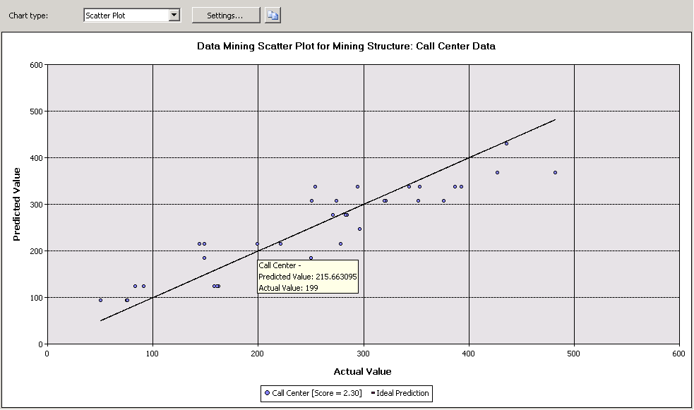

# Scatter Plot (Analysis Services - Data Mining)
  A *scatter plot* graphs the actual values in your data against the values predicted by the model. The scatter plot displays the actual values along the X-axis, and displays the predicted values along the Y-axis. It also displays a line that illustrates the perfect prediction, where the predicted value exactly matches the actual value. The distance of a point from this ideal 45-degree angle line indicates how well or how poorly the prediction performed.  
  
## Understanding the Scatter Plot  
 Consider a model in which the marketing department predicts daily sales based on the number of clicks on a link sent in a promotional e-mail. Because both the number of clicks and the amount of sales are continuous numeric values, you can graph the number of clicks as the independent variable and the sales as the dependent variable. When you do so, the straight line shows the expected linear relationship, and the points scattered around that line show how the actual data diverges from the expected. This analysis tells you at a glance how closely a set of results is correlated with a particular input, and how much variation there is from the ideal model  
  
## Interpreting the Results  
 The following diagram shows an example of a scatter plot, created for the scenario just described.  
  
   
  
 You can pause the mouse on any point scattered around the line to view the predicted and actual values in a tooltip. There is no **Mining Legend** for a scatter plot; however, the chart itself contains a legend that displays the score associated with the model. For more information about interpreting the score, see [Mining Model Content for Linear Regression Models &#40;Analysis Services - Data Mining&#41;](mining-model-content-for-linear-regression-models-analysis-services-data-mining.md).  
  
 You can copy the visual representation of the chart to the Clipboard, but not the underlying data or the formula. If you want to view the regression formula for the line, you can create a content query against the model. For more information, see [Linear Regression Model Query Examples](linear-regression-model-query-examples.md).  
  
## Restrictions on Scatter Plots  
 A scatter plot can only be created if the model that you choose on the **Input Selection** tab contains a continuous predictable attribute. You do not have to make any additional selections; the scatter plot chart type is automatically displayed in the **Lift Chart** tab based on model and attribute type.  
  
 Although time series models predict continuous numbers, you cannot measure the accuracy of a time series model by using a scatter plot. There are other methods that you can use, such as reserving a portion of the historical data. For more information, see [Time Series Model Query Examples](time-series-model-query-examples.md).  
  
## Related Content  
 The following topics contain more information about how you can build and use scatter plots and related accuracy charts.  
  
|Topics|Links|  
|------------|-----------|  
|Provides a walkthrough of how to create a lift chart for the Targeted Mailing model.|[Basic Data Mining Tutorial](../../tutorials/basic-data-mining-tutorial.md)   [Testing Accuracy with Lift Charts &#40;Basic Data Mining Tutorial&#41;](../../tutorials/testing-accuracy-with-lift-charts-basic-data-mining-tutorial.md)|  
|Explains related chart types.|[Lift Chart &#40;Analysis Services - Data Mining&#41;](lift-chart-analysis-services-data-mining.md)   [Profit Chart &#40;Analysis Services - Data Mining&#41;](profit-chart-analysis-services-data-mining.md)   [Classification Matrix &#40;Analysis Services - Data Mining&#41;](classification-matrix-analysis-services-data-mining.md)|  
|Describes uses of cross-validation for mining models and mining structures.|[Cross-Validation &#40;Analysis Services - Data Mining&#41;](cross-validation-analysis-services-data-mining.md)|  
|Describes steps for creating lift charts and other accuracy charts.|[Testing and Validation Tasks and How-tos &#40;Data Mining&#41;](testing-and-validation-tasks-and-how-tos-data-mining.md)|  
  
## See Also  
 [Testing and Validation &#40;Data Mining&#41;](testing-and-validation-data-mining.md)  
  
  
