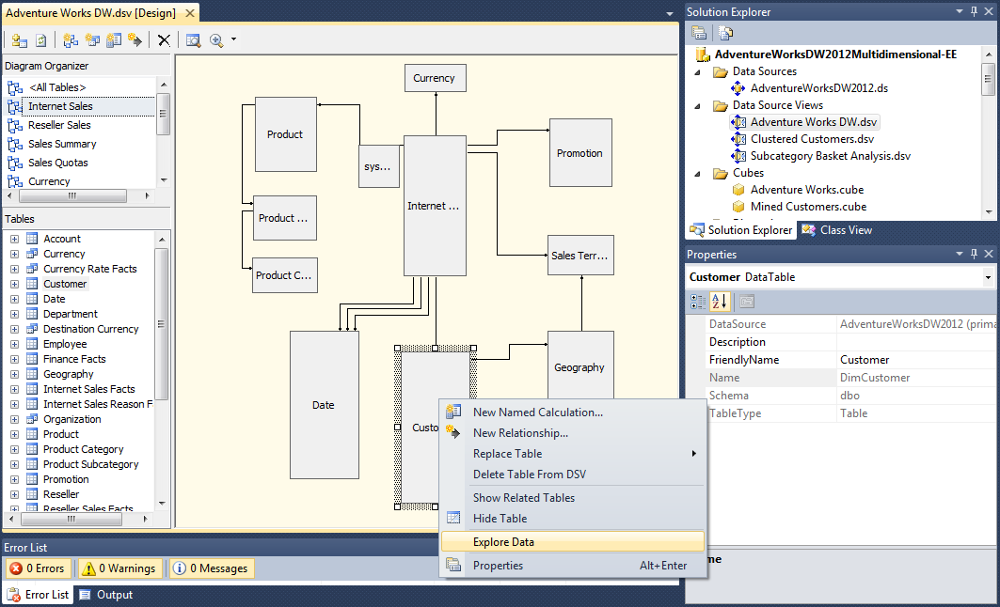

# Data Source View Designer (Analysis Services - Multidimensional Data)
  A data source view (DSV) is a logical view of an external relational data source used to create cubes and dimensions in a multidimensional model.  
  
 After a DSV is generated, you can use the **Data Source View Designer** in [!INCLUDE[ssBIDevStudioFull](../includes/ssbidevstudiofull-md.md)] to work directly on the DSV, which can be useful if the underlying data source is missing data elements needed in a multidimensional model.  
  
 To open **Data Source View Designer** :  
  
-   Double-click a data source view in **Solution Explorer**.  
  
-   Right-click a data source view in **Solution Explorer** and select **Open** or **View Designer**.  
  
 The **Data Source View Designer** contains a toolbar, a diagram showing the objects and relationships in the DSV, a table pane listing tables and named queries in alphabetical order, and a Diagram Organizer pane used to create and view specific diagrams of the DSV. You can right-click a table or relationship to access context-sensitive commands.  
  
   
  
 At a minimum, a DSV shows the relational database tables that will be used to populate model objects during processing. A DSV is generated, usually by using the Data Source View wizard. Tables, columns, and relationships in the DSV become the basis for dimensions and measures in a cube. Once the DSV is created, you can use the Data Source View Designer to modify it.  
  
 Most Analysis Services developers use a generated DSV as is, with few customizations. This is especially common if source data originates from a view in a SQL Server database. In this case, you might prefer to manage data relationships and calculations in a T-SQL view rather than an Analysis Services DSV. However, if you are not the owner of the underlying database, you can modify the DSV in Analysis Services to further develop the data structures used in your model.  
  
## Tasks in Data Source View Designer  
 Using Data Source View Designer, you can make the following edits to a DSV:  
  
|||  
|-|-|  
|Rename columns or tables, or create new calculated columns. For example, concatenate a first name and last name into a new full-name column.|[Define Named Calculations in a Data Source View &#40;Analysis Services&#41;](multidimensional-models/define-named-calculations-in-a-data-source-view-analysis-services.md)|  
|Manually add table relationships|[Define Logical Relationships in a Data Source View &#40;Analysis Services&#41;](multidimensional-models/define-logical-relationships-in-a-data-source-view-analysis-services.md)|  
|Create a named query to define a new object based on a T-SQL query.|[Define Named Queries in a Data Source View &#40;Analysis Services&#41;](multidimensional-models/define-named-queries-in-a-data-source-view-analysis-services.md)|  
|Explore underlying data to view actual data values represented by model objects.   Data exploration lets you visually inspect and copy data that is returned from the underlying dimensional table or query. By default, data exploration uses the top count sampling methodology, with a sample count of 5000, but you can revise these settings.|[Explore Data in a Data Source View &#40;Analysis Services&#41;](multidimensional-models/explore-data-in-a-data-source-view-analysis-services.md)|  
|Diagram all or part of the tables and relationships in a DSV|[Work with Diagrams in Data Source View Designer &#40;Analysis Services&#41;](multidimensional-models/work-with-diagrams-in-data-source-view-designer-analysis-services.md)|  
  
## See Also  
 [Data Source Views in Multidimensional Models](multidimensional-models/data-source-views-in-multidimensional-models.md)   
 [Adding or Removing Tables or Views in a Data Source View &#40;Analysis Services&#41;](multidimensional-models/adding-or-removing-tables-or-views-in-a-data-source-view-analysis-services.md)  
  
  
