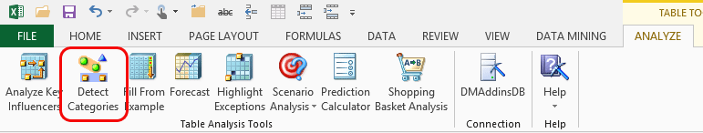
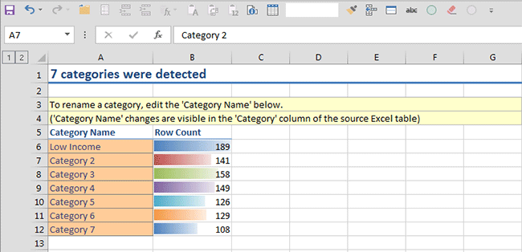
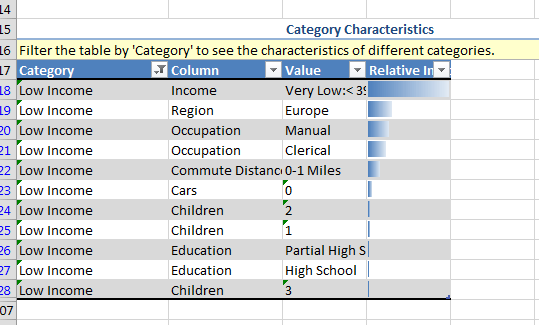
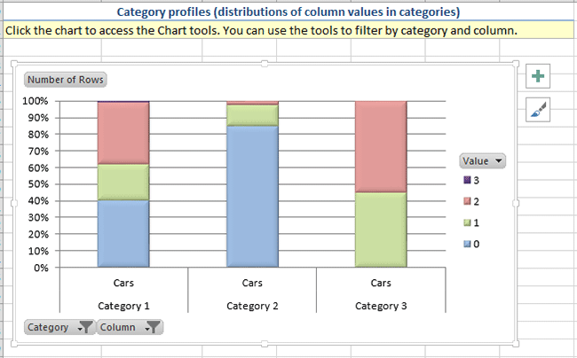

# Detect Categories (Table Analysis Tools for Excel)
    
  
 The **Detect Categories** tool automatically finds rows in a table that have similar characteristics.  
  
 When the tool finishes, it creates a report that lists the categories it found, together with their distinguishing characteristics. By default, it adds a new column to the data table that contains the proposed category for each row of your data. You can then review the categories and rename them.  
  
## Using the Detect Categories Tool  
  
1.  Open an Excel table.  
  
2.  Click **Detect Categories**.  
  
3.  Specify the columns to use in analysis. You can deselect columns that have distinct values, such as personal names or record IDs, because these columns might not be useful for analysis.  
  
4.  Optionally, specify the maximum number of categories to create. By default, the tool automatically creates as many categories as it finds.  
  
5.  Click **Run**.  
  
6.  The tool creates a new worksheet, named Categories Report, which contains the list of categories and their characteristics.  
  
 For more information about how to specify options for the tool, see [Detect Categories Dialog Box (Table Analysis Tools for Excel)](detect-categories-table-analysis-tools-for-excel.md).  
  
## Understanding the Categories Report  
 The **Categories Report** contains two tables, **Category List** and **Category Characteristics**, and a **Category Profiles** chart.  
  
### Category List  
 The first table lists the categories that were found. The **Row Count** column indicates how many rows of data were assigned to each category.  
  
 The model creates temporary names for each category, but you can rename the categories as you like. For example, in the following example, the first category has been renamed **Low Income**, because that was the top attribute of the cluster.  
  
   
  
 As soon as you type the new label, the change is propagated to all the other charts as well as to the category list added in the source data worksheet.  
  
### Category Characteristics  
 The second table, **Category Characteristics**, shows details about the makeup of each category. Click the **Filter** button at the top of the **Category** column to see focus on one or just a few categories.  
  
   
  
 The shading in the column, **Relative Importance**, indicates how important that combination of attribute and value is as a distinguishing factor. The longer the bar, the more likely it is that this attribute is strongly representative of this category.  
  
### Categories Profile Chart  
 The final chart in the **Categories Report** worksheet, **Category Profiles**, is an interactive **Pivot Chart** that you can use to rearrange and hide fields, filter on values, and customize the chart's appearance.  
  
 Excel 2013 now provides **Chart Styles** and **Chart Elements** controls right in the design surface that make it easy to improve the chart design.  
  
   
  
## Requirements  
 The **Detect Categories** tool has no requirements for the amount or type of data.  
  
> [!NOTE]  
>  When you use the **Detect Categories** tool, it creates a new column, Category, in the original data table. If you leave this column in the data table and then perform subsequent data mining operations, the presence of this column could influence your results. To ensure that this does not affect other operations, you should make a copy of the data table without the Category column before using other data mining tools.  
  
## Related Tools  
 When the **Detect Categories** tool analyzes your data, it creates a data mining structure and data mining model by using the [!INCLUDE[msCoName](../includes/msconame-md.md)] Clustering algorithm.  
  
 After you have created a data mining model by using the **Analyze Key Influencers** tool, you can use the Data Mining Client for Excel to browse the model and explore relationships in more detail. The Data Mining Client for Excel is a separate add-in that provides more advanced data mining functionality. For information, see [Browsing Models in Excel &#40;SQL Server Data Mining Add-ins&#41;](browsing-models-in-excel-sql-server-data-mining-add-ins.md).  
  
 For more information about using the data modeling capabilities in the Data Mining Client for Excel, see [Creating a Data Mining Model](creating-a-data-mining-model.md).  
  
 For more information about the algorithm used by the **Detect Categories** tool, see the topic "Microsoft Clustering Algorithm" in [!INCLUDE[ssNoVersion](../includes/ssnoversion-md.md)] Books Online.  
  
## See Also  
 [Table Analysis Tools for Excel](table-analysis-tools-for-excel.md)  
  
  
