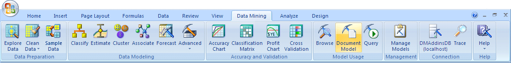

# Documenting Mining Models (Data Mining Add-ins for Excel)
    
  
 The **Document Model** wizard creates a report that provides useful information about the mining models that you have created. By documenting the models that you create, you can track the source of the data used to generate a model, get additional information about when the model was processed, and track parameter changes that affect the results of the model.  
  
## Using the Document Model Wizard  
  
1.  Click the **Data Mining** tab.  
  
2.  In the **Model Usage** group, click **Document Model**.  
  
3.  In the **Select Model** dialog box, select the model on which to report, and then click **Next**. You must run the **Document Model** wizard separately for each model that you want to document.  
  
4.  In the **Select documentation details** dialog box, choose one of two options: **Complete information** or **Summary information**.  
  
5.  Click **Finish**.  
  
6.  The wizard automatically creates a new worksheet that contains the specified report, titled **Model Documentation**,  
  
## Understanding the Report  
 When you create a report that documents a data mining model, you can create a summary,which contains basic information containing the name and description of the model, or a complete report, which contains details about the underlying structure and advanced information about the mining model.  
  
 Depending on the algorithm that was used to create the model, different types of information is provided. For example, in an association model, you are more interested in knowing the number of itemsets and rules that were generated. For a clustering model, the number of clusters is more interesting.  
  
 The following table lists the options and the information that is provided in the report for each option.  
  
> [!NOTE]  
>  The columns in the report are set to a particular size by default. Therefore, if any columns names or values are very long, they might not be visible, or might appear as ### in Excel. To make the values visible, you can resize the row. If the cell is selected, you can click and drag the double arrows at the right end of the formula bar to show the complete value or string.  
  
### Summary Report  
  
||||  
|-|-|-|  
|**Metadata**|Model name   Model description   Algorithm name   Date last processed||  
|**Model results**|Association|Count of itemsets   Count of rules|  
||Clustering|Count of clusters   Support for each cluster|  
||Decision tree|Number of trees   Number of nodes in each tree|  
||Linear regression|Number of trees (always 1)   Number of nodes (always 1)|  
||Naïve Bayes|Important attributes|  
||Neural network|Number of input nodes   Number of output nodes   Number of hidden nodes|  
||Sequence clustering|Number of clusters|  
  
### Complete Report  
 The complete report contains everything that is in the summary report, plus  detailed information about the columns of data used in the model and the results of analysis:  
  
||||  
|-|-|-|  
|**Metadata**|Model metadata|Algorithm parameters and values|  
||Column metadata|Column name   Usage   Data type   Content type   Values (list of discrete values, or range of values)|  
|**Model statistics**|Continuous columns|Mean value   Minimum value   Maximum value   Root mean square error   Mean absolute error   Log score   Regression formula (for linear regression models only)|  
||Discrete columns|Count of passing   Count of failing   Log score   Lift|  
  
> [!NOTE]  
>  You can document any model type that is supported by SQL Server Analysis Services. Therefore, the table lists some model types that cannot be created by using the Table Analysis Tools or by using the wizards in the Data Mining Client. However, you can create all model types by using the **Advanced Data Mining Query Editor**. For more information, see [Query &#40;SQL Server Data Mining Add-ins&#41;](query-sql-server-data-mining-add-ins.md).  
  
## See Also  
 [Deploying and Scaling Mining Models &#40;Data Mining Add-ins for Excel&#41;](deploying-and-scaling-mining-models-data-mining-add-ins-for-excel.md)  
  
  
