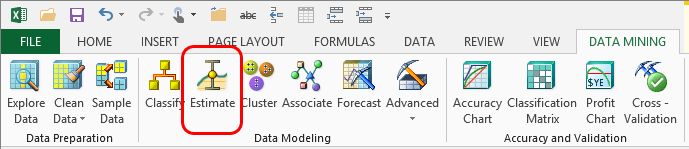

# Estimate Wizard (Data Mining Add-ins for Excel)
    
  
 The **Estimate** wizard helps you create an estimation model. An estimation model extracts patterns from data and uses the patterns to predict the factors that affect outcomes.  
  
 Estimation is used for predicting numeric outcomes. For example, if your target column contains graduation rates for schools, with graduation rates expressed as percentages, you could analyze factors that potentially increase or decrease graduation rates, such as the number of students per school, the student-teacher ratio, and the number of teachers.  
  
## Using the Estimate Data Wizard  
  
1.  On the **Data Mining** ribbon, click **Estimate**.  
  
2.  In the **Select Source Data** dialog box, select the source data to use. You can use data in an Excel **Table**, an Excel **Data Range**, or from an **External data source**.  
  
     If you use an external data source, you can create custom views or queries and save them as an [!INCLUDE[ssASnoversion](../includes/ssasnoversion-md.md)] data source.  
  
3.  In the **Estimation** dialog box, select the **Column to analyze**.  
  
     The target column must contain continuous numeric data.  
  
4.  Select columns to use as input by checking the **Input columns** checkbox.  
  
     These columns will be used to create the patterns. You should eliminate from analysis any columns that are not likely to help, such as ID numbers, or columns that contain irrelevant data.  
  
5.  The **Estimate** wizard selects the optimum algorithm for your data set. However, you can click **Parameters** to open the **Algorithm Parameters** dialog box and set advanced options.  
  
6.  If your data is numeric and you can use the Microsoft Linear Regression method, you can check the **Regressor** box for any numeric columns that you know (or strongly suspect) to be correlated with the predictable value.  
  
     The algorithm will then test the values in that column to determine if they affect the outcomes. If you are unsure, click **Suggest** and the algorithm will test all column and automatically detect the best values to use as regressors.  
  
    > [!NOTE]  
    >  A regressor is required to create an estimate. The wizard always recommends the best regressor, based on an initial pass over the data. Therefore, if you are not sure, it is best to accept the recommended selections.  
  
7.  On the **Split data into training and testing sets** page, specify whether you want to create a small subset of the data for testing.  
  
8.  On the **Finish** page, provide names for the new mining structure and mining mode, or accept the default names that are provided.  
  
9. Set options for using the model.  
  
    -   Select **Browse** to immediately open the model in a viewer.  
  
         This graphical viewer displays a dependency network graph and the decision tree generated by the algorithm. By exploring this information, you can better understand the factors that contribute to the estimated values.  
  
    -   Select **Enable drillthrough** to let users of your analysis view the underlying data.  
  
         This option is available only if you use the Decision Trees opr Linear Regression algorithms.  
  
    -   **Use temporary model**. If you select this option, the model will not be saved to the server. Temporary models are deleted when you close Excel.  
  
## More About Estimation Models  
 The **Estimate** wizard supports the use of any of the following algorithms:  
  
-   Microsoft Decision Tree algorithm  
  
-   Microsoft Linear Regression algorithm  
  
-   Microsoft Logistic Regression algorithm  
  
-   Microsoft Neural network algorithm  
  
 In the **Algorithm Parameters** dialog box, you can set additional advanced options, depending on which algorithm you chose. For information on the options for each algorithm see these topics in SQL Server Books Online:  
  
 [Microsoft Decision Trees Algorithm Technical Reference](data-mining/microsoft-decision-trees-algorithm-technical-reference.md)  
  
 [Microsoft Linear Regression Algorithm Technical Reference](data-mining/microsoft-linear-regression-algorithm-technical-reference.md)  
  
 [Microsoft Logistic Regression Algorithm Technical Reference](data-mining/microsoft-logistic-regression-algorithm-technical-reference.md)  
  
 [Microsoft Neural Network Algorithm Technical Reference](data-mining/microsoft-neural-network-algorithm-technical-reference.md)  
  
### Requirements  
 To use the Estimate Data Wizard, you must be connected to a [!INCLUDE[ssASnoversion](../includes/ssasnoversion-md.md)] database.  
  
 For information about how to create a connection, see [Connect to Source Data &#40;Data Mining Client for Excel&#41;](connect-to-source-data-data-mining-client-for-excel.md).  
  
 To use the estimation algorithm, the outcome that you are trying to predict must be expressed as a numeric value, such as a currency, sales amount, date, or time.  
  
## See Also  
 [Creating a Data Mining Model](creating-a-data-mining-model.md)   
 [Decision Tree Diagram Walkthrough  &#40;Data Mining Add-ins&#41;](decision-tree-diagram-walkthrough-data-mining-add-ins.md)  
  
  
