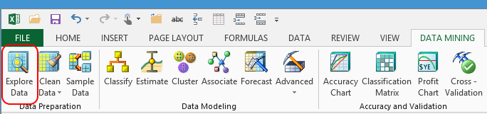

# Explore Data (SQL Server Data Mining Add-ins)
    
  
 The **Explore Data** wizard helps you understand the type and amount of data in your data table. The wizard graphs the distribution and values for the selected columns, one column at a time. You can then experiment with changing the way that data is grouped, or copy the chart that shows the content to an Excel workbook for review.  
  
 If your data contains continuous numeric data, you can toggle between these two views:  
  
-   **Line graph.** This graph charts the data values on the X-axis and the number of cases on the y-axis.  
  
-   **Bar chart.** This graph groups values by the number of cases for each value.  
  
 When the wizard finds groups in the data, it uses the actual distribution of data values. Therefore, the bar chart does not show typical whole-number numeric axis markers such as 10 or 100. Instead, the ranges shown in the bar chart might be something like 43521-55603 (for the Income column).  
  
 If you want to group your data into other ranges, you should do this in Excel before analyzing the data. Or, you can relabel the data by using the [Relabel](relabel-sql-server-data-mining-add-ins.md) wizard.  
  
## Using the Explore Data Wizard  
  
1.  In the **Data Mining** ribbon, click **Explore Data**.  
  
2.  In the **Select Source** dialog box, select the table or range of cells that contains your data.  
  
3.  In the **Select Column** dialog box, choose the column to analyze, from the sample data displayed in the pane.  
  
4.  In the **Explore Data** dialog box, choose the chart types for displaying the distribution of data.  
  
5.  Optionally, you can add new columns to the data, change the way that the data is segmented, or copy the chart to Excel.  
  
### Requirements  
 To use the **Explore Data** wizard, your data must be in an Excel data table.   
  
## See Also  
 [Checklist of Preparation for Data Mining](checklist-of-preparation-for-data-mining.md)  
  
  
