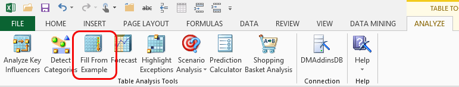

# Fill From Example (Table Analysis Tools for Excel)
    
  
 The **Fill From Example** tool helps you build new columns of data based on existing values.  
  
 For example, suppose your data contains a **Purchase Amount** column, an **Orders Quantity** column, and a **Premier Customer** column that is based on some formula using the other columns. If the  **Premier Customer** column contains many blank rows, you could use the **Purchase Amount** and **Orders Quantity** columns as the inputs, to infer the missing values. The tool analyzes existing patterns in the data together with the examples you entered, and predicts which category to assign to each customer.  
  
 If you are not satisfied with the results, you can refine the results by providing more examples.  
  
## Using the Fill From Example Tool  
  
1.  In the **Analyze** ribbon, click **Fill From Example**.  
  
2.  The tool will automatically pick a column to fill based on analysis of the data, and you can either accept or override this suggestion.  
  
3.  Create a column for the new data, and type in examples of the data that you want to predict. Make sure that there is at least one example for every value that you want to predict. If you are filling in data in an existing column, select the column that has missing values.  
  
4.  Optionally, click **Choose columns to be used in analysis**. In the **Advanced Columns Selection** dialog box, specify the columns that are most likely to be useful when filling in the missing data.  
  
     For example, if you know from experience that there is a causal effect between one column and the column that has missing values, you can deselect other columns to get better results.  
  
     Click **OK**.  
  
5.  Click **Run**.  
  
     When analysis is complete, the tool creates a new **Patterns** worksheet that contains the results of analysis. The report lists the rules, or key influencers, that were found, and shows the probability for each rule.  
  
     The tool also automatically adds a column that contains the new values to the original data table. You can review the values and compare them against the original.  
  
### Requirements  
 You can only work with data in columns. If the series that you want to fill is stored in a row, you can use the Paste, Transpose function in Excel to change the data to a columnar format.  
  
## Understanding the Pattern Report  
 When you run the **Fill From Example** tool, a report is created that provides more information about the patterns that were detected. These patterns are used for extrapolating new data values.  
  
 The Pattern Report shows the key influencers for each value that was predicted. Each influencer or rule is described as a combination of a column, the value in that column, and the relative impact of the rule on the prediction.  
  
 For example, if you were trying to fill in a worksheet that shows the shipping distance for orders, you might logically expect the destination to have a strong impact on the value for shipping distance. In this case, the report might contain the following row:  
  
|Column|Value|Favors|Relative Impact|  
|------------|-----------|------------|---------------------|  
|StateProvinceCode|AB|>500 kilometers|80%|  
  
 This means that the value AB in the **StateProvinceCode** column strongly predicts a shipping distance of >500 kilometers.  
  
 Typically, predictions are based on patterns that are far more complex than this example, and the report may contain many rows of rules for each prediction. The effect of all the rules are combined to derive the predicted value.  
  
> [!NOTE]  
>  **Relative Impact** is shown as a shaded bar. The longer the bar, the greater the probability that this rule is predictive of the filled-in value.  
  
 The tool also adds a new column to the original data table, named \<column name> Extended.  
  
 If the original data column contained a value, that value is copied into the new column. However, if the original column contained a blank cell, the new column contains the value that was predicted by the wizard.  
  
## Related Tools and Information  
 You can also use the [Explore Data](explore-data-sql-server-data-mining-add-ins.md) wizard, available in the Data Mining Client for Excel, to examine the distribution of values in an Excel column. For more information, see [Exploring and Cleaning Data](exploring-and-cleaning-data.md).  
  
## See Also  
 [Table Analysis Tools for Excel](table-analysis-tools-for-excel.md)  
  
  
