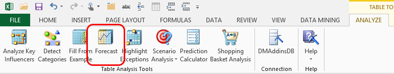

# Forecast (Table Analysis Tools for Excel)
    
  
 The **Forecast** tool helps you make predictions based on data in an Excel data table or other data source, and optionally view the probabilities associated with each predicted value. For example, if your data contains a date column and a column that shows total sales for each day of the month, you could predict the sales for future days. You can also specify the number of predictions to make. For example, you can predict five days, or thirty.  
  
 When the tool completes, it appends the new predictions to the end of the source data table, and highlights the new values. New time series values are not appended; this allows you to review the predictions first.  
  
 The tool also creates a new worksheet named **Forecasting Report**. This worksheet reports whether the wizard successfully created a prediction. The new worksheet also contains a line graph that shows the historical trends.  
  
 When you extend the time series to include the new predictions, the predicted values are added to the line graph. The historical values are shown as a solid line and the predictions are shown as a dotted line.  
  
## Using the Forecast Tool  
  
1.  Open an Excel table that contains predictable numeric data.  
  
2.  Click **Forecast** on the **Analyze** tab.  
  
3.  Specify the columns to forecast. The tool automatically selects columns in the data that have a predictable data type-that is, continuous numeric data. The tool might not select some columns that have continuous numeric data if the columns contain many null or zero values, because the missing data might affect the results. If this happens, you can fix the data by using the [Relabel &#40;SQL Server Data Mining Add-ins&#41;](relabel-sql-server-data-mining-add-ins.md) tool.  
  
4.  Specify the column that contains the date, time, or other series identifier. If you select the option **\<no time stamp>** the tool will create a series based on the sequence of rows in the source data.  
  
5.  Specify the number of predictions to make.  
  
6.  Optionally, provide a hint to the algorithm about whether you expect your data to repeat weekly, monthly, or in other periods. If your data does not fit any of the given patterns, or if you are unaware of any patterns, select **\<detect automatically>** to have the tool find the repeating time periods.  
  
7.  The wizard adds the predictions to the source table, and creates a forecasting report in a new worksheet.  
  
8.  To add the new values to the prediction graph, extend the time series to include the forecasted values.  
  
### Requirements  
 The columns that you predict must contain continuous numeric data, such as currency or other numbers.  
  
 If possible, your data should also include a column that contains a series of times or dates. You can use a numeric series (1,2,3....) instead of date and time data. However, values in the series column must be unique. An error occurs if the **Forecast** tool finds duplicate values in the series column.  
  
 You cannot predict a date by using the **Forecast** tool. Although an error might not occur, this algorithm is not designed to use dates as predictable values.  
  
### Understanding Time Stamps  
 You must identify a column to use as a *time stamp*. The time stamp serves two purposes. First, it uniquely identifies a value in a time series. For example, if you are tracking sales on a daily basis, you should have only one sales value for each day. The calendar date can be used as the time stamp. Second, the time stamp column indicates the unit for making predictions. If you are tracking daily sales, your predictions will also be in units of days.  
  
 If your data does not include a date or time column, the tool will automatically create a temporary series key, named _RowIndex. The key will be based on the order of the rows in the data set.  
  
 When you specify the number of predictions, you enter a whole number that indicates the number of steps. The units for these steps depend on the units used in the time and date series in your data. If your data lists sales results by the month, the prediction will be for a series of months. You cannot change the units of time unless you change the source data.  
  
### Understanding Periodicity  
 A forecast is based on repeating patterns over a period of time. Therefore, the Microsoft Time Series algorithm performs calculations to determine the time periods that have the strongest patterns. *Periodicity* refers to these time periods.  
  
 A time series can contain many potential patterns. If you are certain that your data contains a certain pattern, you may be able to improve the quality of prediction by providing a hint to the algorithm.  
  
 For example, if you expect that your data repeats on a weekly basis, you can select Weekly to indicate that the algorithm should look for weekly patterns. However, if no strong weekly patterns are found, the algorithm will ignore the hint.  
  
## Understanding the Forecasting Report  
 In this graph, the historical values from your data table appear as a dark line. The predicted values appear as dotted lines. You can click a point on the line to see the forecasted value.  
  
> [!NOTE]  
>  If you do not see labels on the time axis for the predicted values in the graph, open the worksheet that contains the predicted values, and use the **Fill, Series** function in Excel to extend the time stamp column to include the predicted values.  
  
 In some cases, the forecast may not have as many time slices as requested. This usually means that data was insufficient to allow the algorithm to forecast that far into the future. The **Forecast** tool will only make predictions that meet a minimum probability threshold.  
  
## Related Tools  
 The Data Mining Client for Excel, which is a separate add-in that provides more advanced data mining functionality, also contains a wizard for forecasting.  
  
 Both the **Forecast** tool (in the Table Analysis Tools for Excel) and the **Forecast** wizard (in the Data Mining Client for Excel) use the [!INCLUDE[msCoName](../includes/msconame-md.md)] Time Series algorithm.  
  
-   The **Forecast** tool is easier to use because it automatically configures the algorithm to use the settings that are best for your data.  
  
-   The **Forecast** wizard in the Data Mining Client for Excel provides you with the ability to customize the parameters.  
  
 For more information about the **Forecast** wizard, see [Forecast Wizard &#40;Data Mining Add-ins for Excel&#41;](forecast-wizard-data-mining-add-ins-for-excel.md). For more information about the algorithm used for forecasting, see the topic "Microsoft Time Series Algorithm" in [!INCLUDE[ssNoVersion](../includes/ssnoversion-md.md)] Books Online.  
  
## See Also  
 [Table Analysis Tools for Excel](table-analysis-tools-for-excel.md)  
  
  
