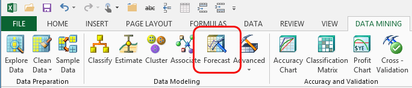

# Forecast Wizard (Data Mining Add-ins for Excel)
    
  
 The Forecast wizard helps you predict values in a time series. The Forecast wizard uses the [!INCLUDE[msCoName](../includes/msconame-md.md)] Time Series algorithm, which is a regression algorithm for use in predicting continuous columns, such as product sales.  
  
 Each forecasting model must contain a case series, which is the column that distinguishes between points in a sequence. For example, if you are using historical data to forecast sales over a period of several months, you would use a column containing a series of dates as the case series.  
  
 You can create predictions from a forecasting model without providing new input data.  
  
 The [Forecast &#40;Table Analysis Tools for Excel&#41;](forecast-table-analysis-tools-for-excel.md) tool, in the **Analyze** ribbon, also lets you create forecasting models, but it is less customizable and can only use data in Excel tables.  
  
## Using the Forecast Wizard  
  
1.  In the **Data Mining** ribbon, click **Forecast**.  
  
2.  In the **Select Source Data**, choose the Excel table, range, or external data source to use as inputs.  
  
     If you use an external data source, you can define custom view or queries and save it as an [!INCLUDE[ssASnoversion](../includes/ssasnoversion-md.md)] data source.  
  
3.  On the **Forecasting** page, for **Time stamp**, select a column that contains unique numeric value (this includes date and time values) that can be used as the case series. The data source must be sorted in ascending order by this column.  
  
     If your data does not have such a column, you can use the option \<no time stamp>. The wizard will add a unique order column for the input data; therefore, you must make sure that the data is sorted the way you want before running the wizard and choosing this option.  
  
4.  Optionally, you can click **Parameters** and customize the behavior of the mining model.  
  
     Forecasting models support several different algorithms:  
  
    -   ARIMA  
  
    -   ARTXP (a type of regression model)  
  
    -   ARTXP and ARIMA combined  
  
     For information about the differences, see [Microsoft Time Series Algorithm Technical Reference](data-mining/microsoft-time-series-algorithm-technical-reference.md).  
  
     You can also add periodicity hints, specify smoothing options, and customize regression options for the model.  
  
5.  On the **Finish** page, provide a descriptive name for your data set and model, and set the following options that control how you work with the finished model:  
  
    -   **Browse model**. When this option is selected, as soon as the wizard finishes processing the model, it opens a **Browse** window to help you explore the results. The contents of the viewer depend on the type of model you built. For more information, see [Browsing a Forecasting Model](browsing-a-forecasting-model.md).  
  
    -   **Enable drillthrough**. Select this option to view the underlying data from the finished model. This option is only available if you build a Decision Tree model.  
  
    -   **Use temporary model**. If you select this option, the model will not be saved to the server. Temporary models are deleted when you close Excel.  
  
### Requirements  
 Your data should include at least one column that can be used as the time series. The values in this column should be unique and continuous - that is, there should be no gaps. Before running the wizard, sort the data by the time series column in ascending order.  
  
 If your data does not include a time or date column, you can assign an arbitrary numeric series, or let the wizard create one. F you let the wizard create the series order column, make sure the other columns are sorted in the worder you want them before starting the wizard.  
  
## See Also  
 [Creating a Data Mining Model](creating-a-data-mining-model.md)   
 [Forecast &#40;Table Analysis Tools for Excel&#41;](forecast-table-analysis-tools-for-excel.md)   
 [Browsing a Forecasting Model](browsing-a-forecasting-model.md)  
  
  
