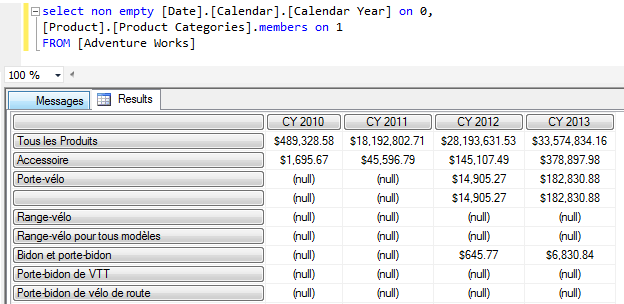

# Globalization Tips and Best Practices (Analysis Services)
  **[!INCLUDE[applies](../includes/applies-md.md)]**  Multidimensional only  
  
 These tips and guidelines can help increase the portability of your business intelligence solutions and avoid errors that are directly related to language and collation settings.  
  
-   [Use similar collations throughout the stack](#bkmk_sameColl)  
  
-   [Common collation recommendations](#bkmk_recos)  
  
-   [Case sensitivity of object identifiers](#bkmk_objid)  
  
-   [Locale testing using Excel and SQL Server Profiler](#bkmk_test)  
  
-   [Writing MDX queries in a solution containing Translations](#bkmk_mdx)  
  
-   [Writing MDX queries containing Date and Time Values](#bkmk_datetime)  
  
##  <a name="bkmk_sameColl"></a> Use similar collations throughout the stack  
 If possible, try to use the same collation settings in [!INCLUDE[ssASnoversion](../includes/ssasnoversion-md.md)] that you use for the database engine, striving for correspondence in width-sensitivity and case-sensitivity, and access-sensitivity.  
  
 Each service has its own collation settings, with the database engine default set to SQL_Latin1_General_CP1_CI_AS and Analysis Services set to Latin1_General_AS. The defaults are compatible in term of case, width, and accent sensitivity. Be forewarned that if you vary the settings of either collation, you can run into problems when the collation properties diverge in fundamental ways.  
  
 Even when collation settings are functionally equivalent, you can run into a special case where an empty space anywhere within a string is interpreted differently by each service.  
  
 The space character is a 'special case' because it can be represented as a single-byte (SBCS) or double-byte character set (DBCS) in Unicode. In the relational engine, two compound strings separated by a space -- one using SBCS, the other in DBCS -- are considered identical. In Analysis Services, during processing, the same two compound strings are not identical, and the second instance will be flagged as a duplicate.  
  
 For more details and suggested workarounds, see [Blanks in a Unicode string have different processing outcomes based on collation](https://social.technet.microsoft.com/wiki/contents/articles/23979.ssas-processing-error-blanks-in-a-unicode-string-have-different-processing-outcomes-based-on-collation-and-character-set.aspx).  
  
##  <a name="bkmk_recos"></a> Common collation recommendations  
 Analysis Services always presents the full list of all available languages and collations; it does not filter the collations based on the language you selected. Be sure to choose a workable combination.  
  
 Some of the more commonly used collations include those in the following list.  
  
 You should consider this list to be a starting point for further investigation, rather than a definitive recommendation that excludes other options. You might find that a collation not specifically recommended is the one that works best for your data. Thorough testing is the only way to verify whether data values are sorted and compared appropriately. As always, be sure to run both processing and query workloads when testing collation.  
  
-   Latin1_General_100_AS is often used for applications that use the 26 characters of the [ISO basic Latin alphabet](http://en.wikipedia.org/wiki/ISO_basic_Latin_alphabet).  
  
-   North European languages that include Scandinavian letters (such as ø) can use Finnish_Swedish_100.  
  
-   East European languages, such as Russian, often use Cyrillic_General_100.  
  
-   Chinese language and collations vary by region, but are generally either Chinese Simplified or Chinese Traditional.  
  
     In PRC and Singapore, Microsoft Support tends to see Simplified Chinese, with Pinyin as the preferred sort order. The recommended collations are Chinese_PRC (for SQL Server 2000), Chinese_PRC_90 (for SQL Server 2005) or Chinese_Simplified_Pinyin_100 (for SQL Server 2008 and later).  
  
     In Taiwan, it is more common to see Traditional Chinese with the recommended sort order is based on Stroke Count: Chinese_Taiwan_Stroke (for SQL Server 2000), Chinese_Taiwan_Stroke_90 (for SQL Server 2005) or Chinese_Traditional_Stroke_Count_100 (for SQL Server 2008 and later).  
  
     Other regions (such as Hong Kong and Macau) also use Traditional Chinese. For collations, in Hong Kong, it's not unusual to see Chinese_Hong_Kong_Stroke_90 (on SQL Server 2005). In Macau, Chinese_Traditional_Stroke_Count_100 (on SQL Server 2008 and later) is used fairly often.  
  
-   For Japanese, the most commonly used collation is Japanese_CI_AS. Japanese_XJIS_100 is used in installations supporting [JIS2004](http://en.wikipedia.org/wiki/JIS_X_0213). Japanese_BIN2 is typically seen in data migration projects, with data originating from non-Windows platforms, or from data sources other than the SQL Server relational database engine.  
  
     Japanese_Bushu_Kakusu_100 is rarely seen in servers that run Analysis Services workloads.  
  
-   Korean_100 is recommended for Korean. Although Korean_Wansung_Unicode is still available in the list, it has been deprecated.  
  
##  <a name="bkmk_objid"></a> Case sensitivity of object identifiers  
 Starting in SQL Server 2012 SP2, case sensitivity of object IDs is enforced independently of the collation, but the behavior varies by language:  
  
|Language script|Case sensitivity|  
|---------------------|----------------------|  
|**Basic Latin alphabet**|Object identifiers expressed in Latin script (any of the 26 English upper or lower case letters) are treated as case-insensitive, regardless of collation. For example, the following object IDs are considered identical: 54321**abcdef**, 54321**ABCDEF**, 54321**AbCdEf**. Internally, Analysis Services treats the characters in the string as if all are uppercase, and then performs a simple byte comparison that is independent of language.<br /><br /> Note that only the 26 characters are affected. If the language is West European, but uses Scandinavian characters, the additional character will not be upper-cased.|  
|**Cyrillic, Greek, Coptic, Armenian**|Object identifiers in non-Latin bicameral script, such as Cyrillic, are always case-sensitive. For example, Измерение and измерение are considered two distinct values, even though the only difference is the case of the first letter.|  
  
 **Implications of case-sensitivity for object identifiers**  
  
 Only object identifiers, and not object names, are subject to the casing behaviors described in the table. If you see a change in how your solution works (a before and after comparison -- after installing SQL Server 2012 SP2 or later), it will most likely be a processing issue. Queries are not impacted by object identifiers. For both query languages (DAX and MDX), the formula engine uses the object name (not the identifier).  
  
> [!NOTE]  
>  Code changes related to case-sensitivity have been a breaking change for some applications. See [Breaking Changes to Analysis Services Features in SQL Server 2014](breaking-changes-to-analysis-services-features-in-sql-server-2014.md) for more information.  
  
##  <a name="bkmk_test"></a> Locale testing using Excel, SQL Server Profiler and SQL Server Management Studio  
 When testing translations, the connection must specify the LCID of the translation. As documented in [Get Different Language from SSAS into Excel](http://extremeexperts.com/sql/Tips/ExcelDiffLocale.aspx), you can use Excel to test your translations.  
  
 You can do this by hand editing the .odc file to include the locale identifier connection string property. Try this out with the Adventure Works sample multidimensional database.  
  
-   Search for existing .odc files. When you find the one for Adventure Works multidimensional, right-click the file to open it in Notepad.  
  
-   Add `Locale Identifier=1036` to the connection string. Save and close the file.  
  
-   Open Excel | **Data** | **Existing Connections**. Filter the list to just connections files on this computer. Find the connection for Adventure Works (look at the name carefully; you might have more than one). Open the connection.  
  
     You should see the French translations from the Adventure Works sample database.  
  
       
  
 As a follow up, you can use SQL Server Profiler to confirm the locale. Click a `Session Initialize` event and then look at the property list in the text area below to find `<localeidentifier>1036</localeidentifier>`.  
  
 In Management Studio, you can specify Locale Identifier on a server connection.  
  
-   In Object Explorer | **Connect** | **Analysis Services** | **Options**, click the **Additional Connection Parameters** tab.  
  
-   Enter `Local Identifier=1036` and then click **Connect**.  
  
-   Execute an MDX query against the Adventure Works database. The query results should be the French translations.  
  
       
  
##  <a name="bkmk_mdx"></a> Writing MDX queries in a solution containing Translations  
 Translations provide display information for the names of [!INCLUDE[ssASnoversion](../includes/ssasnoversion-md.md)] objects, but the identifiers for the same objects are not translated. Whenever possible, use the identifiers and keys for [!INCLUDE[ssASnoversion](../includes/ssasnoversion-md.md)] objects instead of the translated captions and names. For example, use member keys instead of member names for Multidimensional Expressions (MDX) statements and scripts to ensure portability across multiple languages.  
  
> [!NOTE]  
>  Recall that tabular object names are always case-insensitive, regardless of collation. Multidimensional object names, on the other hand, follow the case sensitivity of the collation. Since only multidimensional object names are case-sensitive make sure that all MDX queries referencing multidimensional objects are cased correctly.  
  
##  <a name="bkmk_datetime"></a> Writing MDX queries containing Date and Time Values  
 The following suggestions to make your date and time-based MDX queries more portable across different languages:  
  
1.  **Use numeric parts for comparisons and operations**  
  
     When you perform month and day-of-week comparisons and operations, use the numeric date and time parts instead of the string equivalents (for example, use MonthNumberofYear instead of MonthName). Numeric values are least affected by differences in language translations.  
  
2.  **Use string equivalents in a result set**  
  
     When building result sets seen by end-users, consider using the string (such as MonthName) so that your multi-lingual audience can benefit from the translations you've provided.  
  
3.  **Use ISO date formats for universal date and time information**  
  
     One [Analysis Services expert](http://geekswithblogs.net/darrengosbell/Default.aspx) has this recommendation: "I always use the ISO date format yyyy-mm-dd for any date strings that I pass in to queries in SQL or MDX because it's unambiguous and will work regardless of the client or server's regional settings. I would agree that the server should defer to its regional settings when parsing an ambiguous date format, but I also think that if you've got an option that is not open to interpretation that you are better choosing that anyway".  
  
4.  `Use the Format function to enforce a specific format, regardless of regional language settings`  
  
     The following MDX query, borrowed from a forum post, illustrates how to use Format to return dates in a specific format, irrespective of the underlying regional settings.  
  
     See [SSAS 2012 generates invalid dates (forum post on Network Steve](http://www.networksteve.com/forum/topic.php/SSAS_2012_generates_invalid_dates/?TopicId=40504&Posts=2) for the original post.  
  
    ```  
    WITH MEMBER [LinkTimeAdd11Date_Manual] as Format(dateadd("d",15,"2014-12-11"), "mm/dd/yyyy")  
    member [LinkTimeAdd15Date_Manual] as Format(dateadd("d",11,"2014-12-13"), "mm/dd/yyyy")  
    SELECT  
    { [LinkTimeAdd11Date_Manual]  
    ,[LinkTimeAdd15Date_Manual]  
    }  
    ON COLUMNS   
    FROM [Adventure Works]  
  
    ```  
  
## See Also  
 [Globalization scenarios for Analysis Services Multiidimensional](globalization-scenarios-for-analysis-services-multiidimensional.md)   
 [Write International Transact-SQL Statements](../relational-databases/collations/write-international-transact-sql-statements.md)  
  
  
