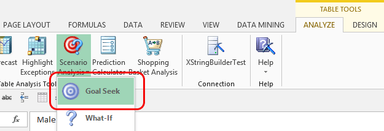

# Goal Seek Scenario (Table Analysis Tools for Excel)
    
  
 The **Goal Seek** scenario tool is complementary to the [What If](what-if-scenario-table-analysis-tools-for-excel.md) scenario tool. The **What-If** tool tells you the impact of making a change, whereas the **Goal Seek** tool tells you the underlying factors that must change to achieve a desired result.  
  
 For example, let's say your goal is to increase customer satisfaction. You can use **Goal Seek** analysis to determine which factors would be most likely to increase customer satisfaction, and decide whether those changes are cost-effective.  
  
 When the tool finishes its analysis, it creates two new columns in the source data table. These columns show the *likelihood* that the targeted outcome can be achieved, and the recommended change, if any.  
  
 The tool can analyze a set of data and make predictions for the entire set, or you can create the analysis and then test scenarios one at a time.  
  
## Using the Goal Seek Scenario Tool  
  
1.  Open an Excel table.  
  
2.  Click **Scenarios**, and select **Goal Seek**.  
  
3.  In the **Scenario Analysis: Goal Seek** dialog box, select the column that contains the target value from the list.  
  
4.  Specify the value that you want to achieve.  
  
     If the column goal contains continuous numeric values, you can also specify a desired increase or decrease in the value. For example, you might choose **Sales** as the column and specify that the target is an increase of 120%.  
  
     Or, you can specify the goal as a range of values, by typing a lower and upper limit.  
  
5.  Specify the column that contains the values you will change. In other words, pick the column that will be manipulated to produce the desired result.  
  
6.  Optionally, click **Choose columns to be used for analysis**, and select columns that contain useful information. Deselect columns that will not contribute to the analysis.  
  
    > [!NOTE]  
    >  Do not deselect columns that you will use for either the goal or the change. These columns are required.  
  
7.  Specify whether you want to make predictions for the entire table, or for only the selected row.  
  
8.  If you selected the **Entire table** option, the tool adds the predictions to the source table in two new columns.  
  
9. If you selected the option **On this row**, the results of analysis are output to the dialog box for review. The dialog box stays open so that you can continue trying out different values and goals.  
  
### Requirements  
 This tool uses the Microsoft Logistic Regression algorithm, which can process either numeric or discrete values.  
  
 You can run the prediction multiple times, and select different columns later, but each combination of a goal and a change must be calculated separately.  
  
 You can achieve better results if you select columns for analysis that contain useful information. However, if you include too few columns, it might be difficult to obtain a result.  
  
 When you create predictions one at a time, be sure to select a row that does not already contain the desired result, or you may get an error. In other words, if the purpose of goal seeking is to determine factors that encourage bike purchases, you should only include customers who did not purchase a bike.  
  
## Understanding the Results of Goal Seek Analysis  
 When you create a goal seeking scenario, the tool does three things:  
  
-   Creates a data mining structure that stores key facts about the data in your table.  
  
-   Creates a logistic regression mining model based on the data.  
  
-   Creates a prediction for each value that you specify.  
  
 If you test goal-seeking scenarios one at a time, you can view the results interactively. This is the same as creating a *singleton prediction query*.  
  
 The tool reports in the **Results** pane of the dialog box whether it was successful in finding a scenario that achieves the desired goal. If a successful solution was found, the tool also generates a recommendation that tells you the required change. For example, the **Goal Seek** tool might tell you that the commuting distance should be less than 5 miles.  
  
 Example results:  
  
 **Goal Seeking for Interest in Buying has found a solution.**  
  
 **Closest match obtained by changing 'Commute distance' to '2-5 miles'.**  
  
 Because this result is based on an existing row in the data table, it means that, for a particular customer, if all else about the customer stayed the same but the customer's commute was reduced to 2-5 miles, the customer would be somewhat more likely buy a bicycle.  
  
 If you create goal-seeking predictions for all the rows in the Excel table by specifying **Entire table**, thetool creates two new columns in the original data table. The first column that is added to the table contains either a check mark in a green circle, to indicate that the goal can be met, or an X mark in a red circle, to indicate that no changes can be made that will enable the goal.  
  
 The second column contains the recommended change.  
  
> [!NOTE]  
>  The confidence level for the recommendation and its success are predetermined by the algorithm and cannot be changed.  
  
## Related Tools  
 The Data Mining Client for Excel, which is a separate add-in that provides more advanced data mining functionality, includes wizards for creating data mining models that predict behavior. For more information, see [Creating a Data Mining Model](creating-a-data-mining-model.md).  
  
 For more information about the algorithm used by the **Goal Seek** scenario tool, see the topic "Microsoft Logistic Regression Algorithm" in [!INCLUDE[ssNoVersion](../includes/ssnoversion-md.md)] Books Online.  
  
## See Also  
 [Table Analysis Tools for Excel](table-analysis-tools-for-excel.md)  
  
  
