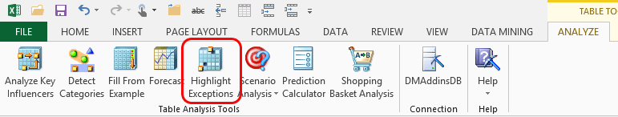

# Highlight Exceptions (Table Analysis Tools for Excel)
    
  
 Sometimes your data might contain peculiar values. For example, a homeowner's age might be listed as five years old. These values, often called *outliers*, might be wrong because of a data input error, or they might indicate unusual trends. Either way, exceptions can affect the quality of your analysis. The **Highlight Exceptions** tool helps you find these values and review them for further action.  
  
 The **Highlight Exceptions** tool can work with the entire range of data in an Excel data table, or you can select only a few columns. You can also adjust a threshold that controls the variability of data, to find more or fewer exceptions.  
  
 When the tool completes its analysis, it creates a new worksheet that contains a summary report of how many outliers were found in each of the columns that you analyzed. The tool also highlights the exceptions in the original data table. Because the tool analyzes overall trends, it might find that most of the values in a row are normal, and highlight only one cell in that row. In the homeowner example above, only the **Age** column might be highlighted.  
  
 You can also change the **Exception threshold** value in the **Summary Report**. This value indicates the probability that a particular cell contains an abnormal value. Therefore, if you increase the value, fewer values will be highlighted as outliers. Conversely, when you decrease the value, you will see more highlighted cells.  
  
## Using the Highlight Exceptions Tool  
  
1.  Open an Excel table and click **Highlight Exceptions**.  
  
2.  Specify the columns to analyze.  
  
3.  Click **Run**.  
  
4.  Open the worksheet titled \<table name> Outliers to view a summary of the outliers that were found.  
  
5.  To change the number of highlights, click the up and down arrows in the **Exception Threshold** row of the **Highlight Exceptions Report**.  
  
### Requirements  
 You can include columns that do not contain bad values if these values contain information that might be useful in predicting other rows. However, you should deselect columns that have many missing or zero values.  
  
 Because all of the selected columns are used to create a general pattern, you should avoid using input columns that you know to have poor information, such as the following:  
  
-   Columns that contain unique values such as IDs.  
  
-   Columns that contain a high percentage of wrong values.  
  
-   Columns with many missing values.  
  
     Note that there are some cases where it is useful to include input columns that have many missing values. For example, if the value of the address field is always missing when the customer buys through a retailer, the data mining algorithm can use this information to identify other similar customers. You must determine on a case-by-case basis whether data is missing by omission or because the Missing state is meaningful.  
  
-   Columns that are unlikely to be useful in creating a pattern. For example, a column that has the same value in every row adds no information that would be useful in building patterns.  
  
## Understanding the Highlight Exceptions Report  
 When you click **Run**, the tool does three things:  
  
-   Creates a data mining structure based on the current data in the table.  
  
-   Creates a new data mining model by using the [!INCLUDE[msCoName](../includes/msconame-md.md)] Clustering algorithm.  
  
-   Creates a prediction query based on the patterns to determine whether any values in the worksheet are improbable.  
  
 The initial value for the exception threshold is always 75, meaning that the algorithm calculated there is a 75% chance that the highlighted data is wrong. The tool automatically sets this threshold for the initial analysis pass, but you can change the value in the report.  
  
 The **Highlight Exceptions** tool highlights cells in the original data table that are suspicious. Dark highlighting means the row needs attention. Bright highlighting means the value in that particular cell was identified as suspect. If you change the threshold for the exceptions, the highlighted values will change accordingly.  
  
 The summary chart shows the number of cells in each column that were above the exception threshold.  
  
## Related Tools  
 When you are cleaning or reviewing data in preparation for data mining, you might also try the data exploration features in the Data Mining Client for Excel. This add-in provides more advanced tools to help you find outliers, relabel data, or view the distribution of data. For more information about data exploration tools in the Data Mining Client for Excel, see [Exploring and Cleaning Data](exploring-and-cleaning-data.md).  
  
 The **Highlight Exceptions** tool uses the [!INCLUDE[msCoName](../includes/msconame-md.md)] Clustering algorithm. A clustering model detects groups of rows that share similar characteristics. The Data Mining Client for Excel provides a **Browse** window that uses graphs and characteristic profiles to let you explore data mining models created by clustering. For information about how to browse the clustering model created by the **Highlight Exceptions** tool, see [Browse Models (Data Mining Client for Excel)](highlight-exceptions-table-analysis-tools-for-excel.md).  
  
 For more information about the [!INCLUDE[msCoName](../includes/msconame-md.md)] Clustering algorithm, see the topic "Microsoft Clustering Algorithm" in [!INCLUDE[ssNoVersion](../includes/ssnoversion-md.md)] Books Online.  
  
## See Also  
 [Table Analysis Tools for Excel](table-analysis-tools-for-excel.md)  
  
  
