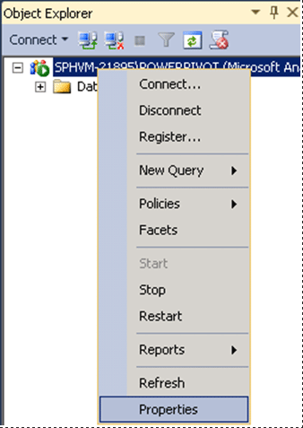
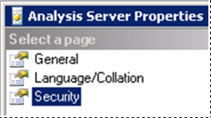

# PowerPivot for SharePoint 2013 Installation
  The procedures in this topic guide you through a single server installation of a [!INCLUDE[ssASnoversion](../../../includes/ssasnoversion-md.md)] server in SharePoint deployment mode. The steps include running the SQL Server installation wizard as well as configuration tasks that use SharePoint 2013 Central Administration.  
  
 **[!INCLUDE[applies](../../../includes/applies-md.md)]**  SharePoint 2013 | SharePoint 201  
  
 **In this topic:**  
  
 [Background](#bkmk_background)  
  
 [Prerequisites](#bkmk_prereq)  
  
 [Step 1: Install PowerPivot for SharePoint](#InstallSQL)  
  
 [Step 2: Configure Basic Analysis Services SharePoint Integration](#bkmk_config)  
  
 [Step 3: Verify the Integration](#bkmk_verify)  
  
 [Configure the Windows Firewall to Allow Analysis Services Access](#bkmk_firewall)  
  
 [Upgrade Workbooks and Scheduled Data Refresh](#bkmk_upgrade_workbook)  
  
 [Beyond the Single-Server Installation -PowerPivot for Microsoft SharePoint](#bkmk_multiple_servers)  
  
##  <a name="bkmk_background"></a> Background  
 PowerPivot for SharePoint is a collection of middle-tier and backend services that provide PowerPivot data access in a SharePoint 2013 farm.  
  
-   **Backend services:** If you use PowerPivot for Excel to create workbooks that contain analytical data, you must have PowerPivot for SharePoint to access that data in a server environment. You can run SQL Server Setup on a computer that has SharePoint Server 2013 installed, or on a different computer that has no SharePoint software. Analysis Services does not have any dependencies on SharePoint.  
  
     **Note:** This topic describes the installation of the [!INCLUDE[ssASnoversion](../../../includes/ssasnoversion-md.md)] server and the backend services.  
  
-   **Middle-tier:** Enhancements to the PowerPivot experiences in SharePoint including PowerPivot Gallery, Schedule data refresh, Management dashboard, and data providers. For more information on installing and configuring the middle-tier, see the following:  
  
    -   [Install or Uninstall the PowerPivot for SharePoint Add-in &#40;SharePoint 2013&#41;](../../../analysis-services/instances/install-windows/install-or-uninstall-the-power-pivot-for-sharepoint-add-in-sharepoint-2013.md)  
  
    -   [Configure PowerPivot and Deploy Solutions &#40;SharePoint 2013&#41;](../../../analysis-services/instances/install-windows/configure-power-pivot-and-deploy-solutions-sharepoint-2013.md)  
  
##  <a name="bkmk_prereq"></a> Prerequisites  
  
1.  You must be a local administrator to run SQL Server Setup.  
  
2.  SharePoint Server 2013 enterprise edition is required for PowerPivot for SharePoint. You can also use the evaluation enterprise edition.  
  
3.  The computer must be joined to a domain in the same Active Directory forest as Excel Services.  
  
4.  The PowerPivot instance name must be available. You cannot have an existing PowerPivot-named instance on the computer on which you are installing Analysis Services in SharePoint mode.  
  
5.  Review [Hardware and Software Requirements for Analysis Services Server in SharePoint Mode &#40;SQL Server 2014&#41;](../../../sql-server/install/hardware-software-requirements-analysis-services-server-sharepoint-mode.md).  
  
6.  Review the release notes at [SQL Server 2012 Service Pack 1 Release Notes](https://go.microsoft.com/fwlink/?LinkID=248389) (https://go.microsoft.com/fwlink/?LinkID=248389).  
  
###  <a name="bkmk_sqleditions"></a> SQL Server Edition Requirements  
 Business intelligence features are not all available in all editions of [!INCLUDE[ssCurrent](../../../includes/sscurrent-md.md)]. For details, see [Features Supported by the Editions of SQL Server 2012 (https://go.microsoft.com/fwlink/?linkid=232473)](https://go.microsoft.com/fwlink/?linkid=232473) and [Editions and Components of SQL Server 2014](../../../sql-server/editions-and-components-of-sql-server-2016.md).  
  
 The current release notes can be found at [SQL Server 2012 SP1 Release Notes](ttp://go.microsoft.com/fwlink/?LinkID=248389) (https://go.microsoft.com/fwlink/?LinkID=248389).  
  
 [Microsoft SQL Server 2012 Release Notes (https://go.microsoft.com/fwlink/?LinkId=236893)](https://go.microsoft.com/fwlink/?LinkId=236893).  
  
##  <a name="InstallSQL"></a> Step 1: Install PowerPivot for SharePoint  
 In this step, you run SQL Server Setup to install an [!INCLUDE[ssASnoversion](../../../includes/ssasnoversion-md.md)] server in SharePoint mode. In a subsequent step, you configure Excel Services to use this server for workbook data models.  
  
1.  Run the SQL Server Installation Wizard (Setup.exe).  
  
2.  Click **Installation** in the left navigation.  
  
3.  Click **New SQL Server stand-alone installation or add features to an existing installation**.  
  
4.  If you see the **Product Key** page, specify the evaluation edition or enter a product key for a licensed copy of the enterprise edition. Click **Next**. For more information on editions, see [Editions and Components of SQL Server 2014](../../../sql-server/editions-and-components-of-sql-server-2016.md).  
  
5.  Review and accept the Microsoft Software License Terms of agreement, and then click **Next**.  
  
6.  If you see the **Global Rules** page, review any rules information the setup wizard displays.  
  
7.  On the **Microsoft Update** page, it is recommended you use Microsoft Update to check for updates, then click **Next**.  
  
8.  The **Install Setup Files** page runs for several minutes. Review any rule warnings or failed rules, and then click **Next**.  
  
9. If you see another **Setup Support Rules**, review any warnings and click **Next**.  
  
     **Note:** Because Windows Firewall is enabled, you see a warning to open ports to enable remote access.  
  
10. On the **Setup Role** page, select **SQL Server PowerPivot for SharePoint**. This option installs Analysis Services in SharePoint mode.  
  
     Optionally, you can add an instance of the Database Engine to your installation. You might add the Database Engine when setting up a new farm and need a database server to run the farm's configuration and content databases. This option also installs [!INCLUDE[ssManStudioFull](../../../includes/ssmanstudiofull-md.md)].  
  
     If you add the Database Engine, it is installed as a **PowerPivot** named instance. Whenever you specify a connection to this instance, enter the database name in this format: [`servername`]\PowerPivot.  
  
     Click **Next**.  
  
       
  
11. In Feature Selection, a read-only list of the features is displayed for informational purposes. You cannot add or remove items the preselected items for this role. Click **Next**.  
  
12. On the **Instance Configuration** page, a read-only instance name of 'PowerPivot' is displayed for informational purposes. This instance name is required and it cannot be modified. However, you can enter a unique Instance ID to specify a descriptive directory name and registry keys. Click **Next**.  
  
13. On the **Server Configuration** page, configure all of the services for Automatic **Startup Type**. Specify the desired domain account and password for **SQL Server Analysis Services**, **(1)** in the following diagram.  
  
    -   For [!INCLUDE[ssASnoversion](../../../includes/ssasnoversion-md.md)], you can use a **domain user** account or **NetworkService** account. Do not use LocalSystem or LocalService accounts.  
  
    -   If you added the SQL Server Database Engine and SQL Server Agent, you can configure the services to run under domain user accounts or under the default virtual account.  
  
    -   Never provision service accounts with your own domain user account. Doing so grants the server the same permissions that you have to the resources in your network. If a malicious user compromises the server, that user is logged in under your domain credentials. The user has the permissions to download or use the same data and applications that you do.  
  
     Click **Next**.  
  
       
  
14. If you are installing the [!INCLUDE[ssDE](../../../includes/ssde-md.md)], the **Database Engine Configuration** page appears. In [!INCLUDE[ssDE](../../../includes/ssde-md.md)] Configuration, click **Add Current User** to grant your user account administrator permissions on the Database Engine instance.  
  
     Click **Next**.  
  
15. On the **Analysis Services Configuration** page, click **Add Current User** to grant your user account administrative permissions. You will need administrative permission to configure the server after Setup is finished.  
  
    -   In the same page, add the Windows user account of any person who also requires administrative permissions. For example, any user who wants to connect to the [!INCLUDE[ssGeminiSrv](../../../includes/ssgeminisrv-md.md)] instance in [!INCLUDE[ssManStudioFull](../../../includes/ssmanstudiofull-md.md)] to troubleshoot database connection problems must have system administrator permissions. Add the user account of any person who might need to troubleshoot or administer the server now.  
  
    -   > [!NOTE]  
        >  All service applications that require access to the Analysis Services server instance need to have Analysis Services Administrative permissions. For example, add the service accounts for Excel Services, Power View, and Performance Point Services. Also, add the SharePoint farm account, which is used as the identity of the web application that hosts Central Administration.  
  
     Click **Next**.  
  
16. On the **Error Reporting** page, click **Next**.  
  
17. On the **Ready to Install** page, click **Install**.  
  
18. If you see the dialog **Computer Restart Required**, click **OK**.  
  
19. When the installation is complete, click **Close**.  
  
20. Restart the computer.  
  
21. If you have a firewall in your environment, review the SQL Server Books Online topic, [Configure the Windows Firewall to Allow Analysis Services Access](../configure-the-windows-firewall-to-allow-analysis-services-access.md).  
  
### Verify the SQL Server Installation  
 Verify that the Analysis Services Service is running.  
  
1.  In Microsoft Windows click **Start**, click **All Programs**, and click the **Microsoft SQL Server 2012** group.  
  
2.  Click **SQL Server Management Studio**.  
  
3.  Connect to the Analysis Services instance, for example **[your server name]\POWERPIVOT**. If you can connect to the instance, you have verified the Service is running.  
  
##  <a name="bkmk_config"></a> Step 2: Configure Basic Analysis Services SharePoint Integration  
 The following steps describe configuration changes needed so you can interact with Excel advanced data models inside a SharePoint document library. Complete these steps after you install SharePoint Server 2013 and SQL Server Analysis Services.  
  
### Grant Excel Services Server Administration Rights on Analysis Services  
 You do not need to complete this section if during the Analysis Services installation; you added the Excel Services Application service account as an Analysis Services administrator.  
  
1.  On the Analysis Services server, start SQL Server Management Studio and connect to the Analysis Services instance, for example `[MyServer]\POWERPIVOT`.  
  
2.  In Object Explorer, Right-click the instance name and click **Properties**.  
  
       
  
3.  In the left pane, click **Security**. Add the domain login you configured for the Excel Services Application in step 1.  
  
       
  
### Configure Excel Services for Analysis Services integration  
  
1.  In SharePoint Central Administration, in the Application Management group, click **Manage Service Applications**.  
  
2.  Click the name of your service application, the default is **Excel Services Application**.  
  
3.  On the **Manage Excel Services Application page**, click **Data Model Settings**.  
  
4.  Click **Add Server**.  
  
5.  In **Server Name**, type the Analysis Services server name and the PowerPivot instance name. For example `MyServer\POWERPIVOT`. The PowerPivot instance name is required.  
  
     Type a description.  
  
6.  Click **Ok**.  
  
7.  The changes will take effect in a few minutes or you can **Stop** and **Start** the service **Excel Calculation Services**. To  
  
     Another option is to open a command prompt with administrative privileges, and type `iisreset /noforce`.  
  
     You can verify the server is recognized by Excel Services by reviewing entries in the ULS log. You will see entries similar to the following:  
  
    ```  
    Excel Services Application            Data Model        27           Medium                Check Administrator Access ([ServerName]\POWERPIVOT): Pass.        f127bd9b-bae3-e0e0-9b48-3f7b5ad1eae6  
    Excel Services Application            Data Model        27           Medium                Check Server Version ([ServerName]\POWERPIVOT): Pass (11.0.2809.24 >= 11.0.2800.0).         f127bd9b-bae3-e0e0-9b48-3f7b5ad1eae6  
    Excel Services Application            Data Model        27           Medium                Check Deployment Mode ([ServerName]\POWERPIVOT): Pass.            f127bd9b-bae3-e0e0-9b48-3f7b5ad1eae6  
  
    ```  
  
##  <a name="bkmk_verify"></a> Step 3: Verify the Integration  
 The following steps walk you through creating and uploading a new workbook to verify the Analysis Services integration. You will need a SQL Server database to complete the steps.  
  
1.  **Note:** If you already have an advanced workbook with slicers or filters, you can upload it to your SharePoint document library and verify you are able to interact with the slicers and filters from the document library view.  
  
2.  Start a new workbook in Excel.  
  
3.  On the Data tab, click **From Other Sources** on the ribbon in the **Get External Data**.  
  
4.  Select **From SQL Server**.  
  
5.  In the **Data Connection Wizard**, enter the name of the SQL Server instance that has the database you want to use.  
  
6.  or Log on credentials, verify that **Use Windows Authentication** is selected, and then click **Next**.  
  
7.  Select the database you want to use.  
  
8.  Verify that the **Connect to specific table** checkbox is selected.  
  
9. Click the **Enable selection of multiple tables and add tables to the Excel Data Model** checkbox.  
  
10. Select the tables you want to import.  
  
11. Click the checkbox **Import relationships between selected tables**, and then click **Next**. Importing multiple tables from a relational database lets you work with tables that are already related. You save steps because you don't have to build the relationships manually.  
  
12. In the **Save Data Connection File and Finish** page of the wizard,, type a dame for your connection and click **Finish**.  
  
13. The **Import Data** dialog box will appear. Choose **PivotTable Report**, and then click **Ok**.  
  
14. A PivotTable Field List appears in the workbook.   
    On the field list, click the **All** tab  
  
15. Add fields to the Row, Columns, and Value areas in the field list.  
  
16. Add a slicer or a filter to the PivotTable. **Do not skip this step**. A slicer or filter is the element that will help you verify your Analysis Services installation.  
  
17. Save the workbook to a document library on a SharePoint Server 2013 that has Excel Services configured. You can also save the workbook to a file share and then upload it to the SharePoint Server 2013 document library.  
  
18. Click the name of your workbook to view it in SharePoint and click the slicer or change the filter that you previously added. If a data update occurs, you know that Analysis Services is installed and available to Excel Services. If you open the workbook in Excel you will be using a cached copy and not using the Analysis Services server.  
  
##  <a name="bkmk_firewall"></a> Configure the Windows Firewall to Allow Analysis Services Access  
 Use the information in the topic [Configure the Windows Firewall to Allow Analysis Services Access](../configure-the-windows-firewall-to-allow-analysis-services-access.md) to determine whether you need to unblock ports in a firewall to allow access to Analysis Services or PowerPivot for SharePoint. You can follow the steps provided in the topic to configure both port and firewall settings. In practice, you should perform these steps together to allow access to your Analysis Services server.  
  
##  <a name="bkmk_upgrade_workbook"></a> Upgrade Workbooks and Scheduled Data Refresh  
 The steps required to upgrade workbooks created in previous versions of PowerPivot depend on what version of PowerPivot created the workbook. For more information, see [Upgrade Workbooks and Scheduled Data Refresh &#40;SharePoint 2013&#41;](../../../analysis-services/instances/install-windows/upgrade-workbooks-and-scheduled-data-refresh-sharepoint-2013.md).  
  
##  <a name="bkmk_multiple_servers"></a> Beyond the Single-Server Installation -PowerPivot for Microsoft SharePoint  
 **Web front-end (WFE)** or **Middle-tier:**: To use an [!INCLUDE[ssASnoversion](../../../includes/ssasnoversion-md.md)] server in SharePoint mode in a larger SharePoint farm and to install additional PowerPivot features into the farm, run the installer package **spPowerPivot.msi** on each of the SharePoint servers. The spPowerPivot.msi installs required data providers and the PowerPivot for SharePoint 2013 Configuration tool.  
  
 For more information on installing and configuring the middle-tier, see the following:  
  
-   [Install or Uninstall the PowerPivot for SharePoint Add-in &#40;SharePoint 2013&#41;](../../../analysis-services/instances/install-windows/install-or-uninstall-the-power-pivot-for-sharepoint-add-in-sharepoint-2013.md)  
  
-   To download the .msi, see [Microsoft SQL Server 2014 PowerPivot for Microsoft SharePoint 2013](https://go.microsoft.com/fwlink/?LinkID=324854)  
  
-   [Configure PowerPivot and Deploy Solutions &#40;SharePoint 2013&#41;](../../../analysis-services/instances/install-windows/configure-power-pivot-and-deploy-solutions-sharepoint-2013.md)  
  
 **Redundancy and server load:** Installing a second, or more [!INCLUDE[ssASnoversion](../../../includes/ssasnoversion-md.md)] servers in SharePoint mode will provide redundancy of the [!INCLUDE[ssASnoversion](../../../includes/ssasnoversion-md.md)] server functionality. Additional servers will also spread the load across servers. For more information, see the following:  
  
-   [Configure Analysis Services for processing data models in Excel Services](https://technet.microsoft.com/library/jj614437\(v=office.15\)) (https://technet.microsoft.com/library/jj614437(v=office.15)).  
  
-   [Manage Excel Services data model settings (SharePoint Server 2013)](https://technet.microsoft.com/library/jj219780\(v=office.15\)) (https://technet.microsoft.com/library/jj219780(v=office.15)).  
  
  [Submit feedback and contact information through Microsoft SQL Server Connect](https://connect.microsoft.com/SQLServer/Feedback) (https://connect.microsoft.com/SQLServer/Feedback).  
  
## See Also  
 [Migrate PowerPivot to SharePoint 2013](../../../analysis-services/instances/install-windows/migrate-power-pivot-to-sharepoint-2013.md)   
 [Install or Uninstall the PowerPivot for SharePoint Add-in &#40;SharePoint 2013&#41;](../../../analysis-services/instances/install-windows/install-or-uninstall-the-power-pivot-for-sharepoint-add-in-sharepoint-2013.md)   
 [Upgrade Workbooks and Scheduled Data Refresh &#40;SharePoint 2013&#41;](../../../analysis-services/instances/install-windows/upgrade-workbooks-and-scheduled-data-refresh-sharepoint-2013.md)  
  
  
