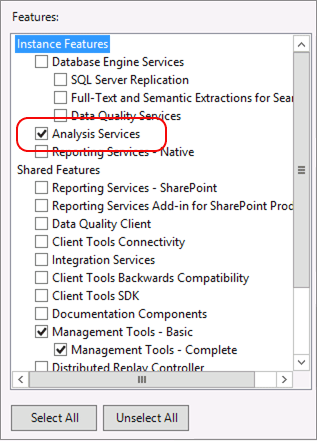
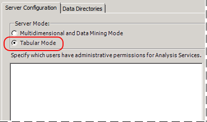

# Install Analysis Services in Tabular Mode
  If you are installing Analysis Services to use the new tabular modeling features, you must install Analysis Services in a server mode that supports that type of model. The server mode is Tabular, and it is configured during installation.  
  
 After you install the server in this mode, you can use it host solutions that you build in tabular model designer. A tabular mode server is required if you want tabular model data access over the network.  
  
 You can specify Tabular mode in the Installation Wizard or in a command line setup. The following sections describe each approach.  
  
## Installation Wizard  
 The following list shows you which pages in the SQL Server Installation wizard are used to install Analysis Services in Tabular mode:  
  
1.  Select **Analysis Services** from the Feature Tree in Setup.  
  
       
  
2.  On the Analysis Services Configuration page, be sure to select **Tabular Mode**.  
  
       
  
 Tabular mode uses the xVelocity in-memory analytics engine (VertiPaq), which is the default storage for tabular models that you deploy to Analysis Services. After you deploy tabular model solutions to the server, you can selectively configure tabular solutions to use DirectQuery disk storage as an alternative to memory-bound storage.  
  
## Command Line Setup  
 SQL Server Setup includes a new parameter (`ASSERVERMODE`) that specifies the server mode. The following example illustrates a command line setup that installs Analysis Services in Tabular server mode.  
  
```  
  
Setup.exe /q /IAcceptSQLServerLicenseTerms /ACTION=install /FEATURES=AS /ASSERVERMODE=TABULAR /INSTANCENAME=ASTabular /INDICATEPROGRESS/ASSVCACCOUNT=<DomainName\UserName> /ASSVCPASSWORD=<StrongPassword> /ASSYSADMINACCOUNTS=<DomainName\UserName>   
```  
  
 `INSTANCENAME` must be less than 17 characters.  
  
 All placeholder account values must be replaced with valid accounts and password.  
  
 Tools such as SQL Server Management Studio or [!INCLUDE[ssBIDevStudioFull](../../../includes/ssbidevstudiofull-md.md)] are not installed using the example command line syntax that is provided. For more information about adding features, see [Install SQL Server 2014 from the Command Prompt](../../../database-engine/install-windows/install-sql-server-from-the-command-prompt.md).  
  
 `ASSERVERMODE` is case-sensitive.  All values must be expressed in upper case. The following table describes the valid values for `ASSERVERMODE`.  
  
|Value|Description|  
|-----------|-----------------|  
|MULTIDIMENSIONAL|This is the default value. If you do not set `ASSERVERMODE`, the server is installed in Multidimensional server mode.|  
|POWERPIVOT|This value is optional. In practice, if you set the `ROLE` parameter, the server mode is automatically set to 1, making `ASSERVERMODE` optional for a PowerPivot for SharePoint installation. For more information, see [Install PowerPivot from the Command Prompt](../../../sql-server/install/install-powerpivot-from-the-command-prompt.md).|  
|TABULAR|This value is required if you are installing Analysis Services in Tabular mode using command line setup.|  
  
## See Also  
 [Determine the Server Mode of an Analysis Services Instance](../determine-the-server-mode-of-an-analysis-services-instance.md)   
 [Configure In-Memory or DirectQuery Access for a Tabular Model Database](../../tabular-models/enable-directquery-mode-in-ssms.md)   
 [Tabular Modeling &#40;SSAS Tabular&#41;](../../tabular-models/tabular-models-ssas.md)  
  
  
