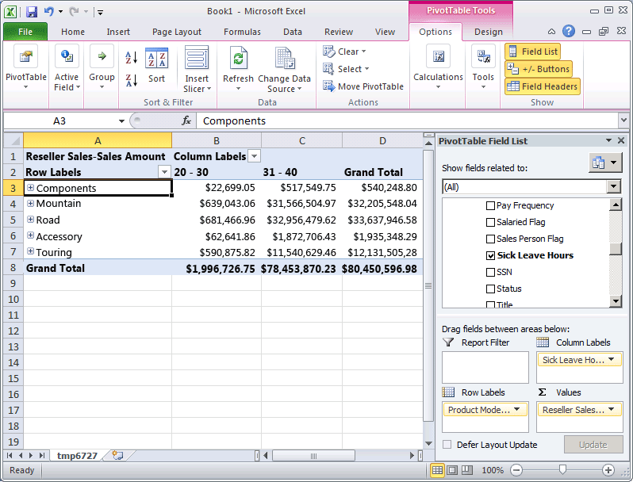

# Automatically Grouping Attribute Members
  When you browse a cube, you typically dimension the members of one attribute hierarchy by the members of another attribute hierarchy. For example, you might group customer sales by city, by product purchased, or by gender. However, with certain types of attributes, it is useful to have [!INCLUDE[msCoName](../includes/msconame-md.md)] [!INCLUDE[ssASnoversion](../includes/ssasnoversion-md.md)] automatically create groupings of attribute members based on the distribution of the members within an attribute hierarchy. For example, you can have [!INCLUDE[ssASnoversion](../includes/ssasnoversion-md.md)] create groups of yearly income values for customers. When you do this, users who browse the attribute hierarchy will see the names and values of the groups instead of the members themselves. This limits the number of levels that are presented to users, which can be more useful for analysis.  
  
 The **DiscretizationMethod** property determines whether [!INCLUDE[ssASnoversion](../includes/ssasnoversion-md.md)] creates groupings, and determines the type of grouping that is performed. By default, [!INCLUDE[ssASnoversion](../includes/ssasnoversion-md.md)] does not perform any groupings. When you enable automatic groupings, you can allow [!INCLUDE[ssASnoversion](../includes/ssasnoversion-md.md)] to automatically determine the best grouping method based on the structure of the attribute, or you can choose one of the grouping algorithms in the following list to specify the grouping method:  
  
 **EqualAreas**  
 [!INCLUDE[ssASnoversion](../includes/ssasnoversion-md.md)] creates group ranges so that the total population of dimension members is distributed equally across the groups.  
  
 **Clusters**  
 [!INCLUDE[ssASnoversion](../includes/ssasnoversion-md.md)] creates groups by performing single-dimensional clustering on the input values by using the K-Means clustering method with Gaussian distributions. This option is valid only for numeric columns.  
  
 After you specify a grouping method, you must specify the number of groups, by using the **DiscretizationBucketCount** property. For more information, see [Group Attribute Members &#40;Discretization&#41;](multidimensional-models/attribute-properties-group-attribute-members.md)  
  
 In the tasks in this topic, you will enable different types of groupings for the following: the yearly income values in the **Customer** dimension; the number of employee sick leave hours in the **Employees** dimension; and the number of employee vacation hours in the **Employees** dimension. You will then process and browse the [!INCLUDE[ssASnoversion](../includes/ssasnoversion-md.md)] Tutorial cube to view the effect of the member groups. Finally, you will modify the member group properties to see the effect of the change in grouping type.  
  
## Grouping Attribute Hierarchy Members in the Customer Dimension  
  
1.  In Solution Explorer, double-click **Customer** in the **Dimensions** folder to open Dimension Designer for the Customer dimension.  
  
2.  In the **Data Source View** pane, right-click the **Customer** table, and then click **Explore Data**.  
  
     Notice the range of values for the **YearlyIncome** column. These values become the members of the **Yearly Income** attribute hierarchy, unless you enable member grouping.  
  
3.  Close the **Explore Customer Table** tab.  
  
4.  In the **Attributes** pane, select **Yearly Income**.  
  
5.  In the Properties window, change the value for the **DiscretizationMethod** property to **Automatic** and change the value for the **DiscretizationBucketCount** property to `5`.  
  
     The following image shows the modified properties for **Yearly Income**.  
  
       
  
## Grouping Attribute Hierarchy Members in the Employee Dimension  
  
1.  Switch to Dimension Designer for the Employee dimension.  
  
2.  In the **Data Source View** pane, right-click the **Employee** table, and then click **Explore Data**.  
  
     Notice the values for the **SickLeaveHours** column and the **VacationHours** column.  
  
3.  Close the **Explore Employee Table** tab.  
  
4.  In the **Attributes** pane, select **Sick Leave Hours**.  
  
5.  In the Properties window, change the value for the **DiscretizationMethod** property to **Clusters** and change the value for the **DiscretizationBucketCount** property to `5`.  
  
6.  In the **Attributes** pane, select **Vacation Hours**.  
  
7.  In the Properties window, change the value for the **DiscretizationMethod** property to **Equal Areas** and change the value for the **DiscretizationBucketCount** property to `5`.  
  
## Browsing the Modified Attribute Hierarchies  
  
1.  On the **Build** menu of [!INCLUDE[ssBIDevStudioFull](../includes/ssbidevstudiofull-md.md)], click **Deploy Analysis Services Tutorial**.  
  
2.  When deployment has successfully completed, switch to Cube Designer for the [!INCLUDE[ssASnoversion](../includes/ssasnoversion-md.md)] Tutorial cube, and then click **Reconnect** on the **Browser** tab.  
  
3.  Click the Excel icon, and then click **Enable**.  
  
4.  Drag the **Internet Sales-Sales Amount** measure to the Values area of the PivotTable Field List.  
  
5.  In the field list, expand the **Product** dimension, and then drag the **Product Model Lines** user hierarchy to the **Row Labels** area of the field list.  
  
6.  Expand the **Customer** dimension in the field list, expand the **Demographic** display folder, and then drag the **Yearly Income** attribute hierarchy to the **Column Labels** area.  
  
     The members of the **Yearly Income** attribute hierarchy are now grouped into six buckets, including a bucket for sales to customers whose yearly income is unknown. Not all buckets are displayed.  
  
7.  Remove the **Yearly Income** attribute hierarchy from the columns area and remove the **Internet Sales-Sales Amount** measure from the **Values** area.  
  
8.  Add the **Reseller Sales-Sales Amount** measure to the data area.  
  
9. In the field list, expand the **Employee** dimension, expand **Organization**, then drag **Sick Leave Hours** to **Column Labels**.  
  
     Notice that all sales are made by employees within one of two groups. Notice also that the employees with 32 - 42 sick leave hours made significantly more sales than employees with 20 - 31 sick leave hours.  
  
     The following image shows sales dimensioned by employee sick leave hours.  
  
       
  
10. Remove the **Sick Leave Hours** attribute hierarchy from the column area of the **Data** pane.  
  
11. Add **Vacation Hours** to the column area of the **Data** pane.  
  
     Notice that two groups appear, based on the equal areas grouping method. Three other groups are hidden because they contain no data values.  
  
## Modifying Grouping Properties and Reviewing the Effect of the Changes  
  
1.  Switch to Dimension Designer for the **Employee** dimension, and then select **Vacation Hours** in the **Attributes** pane.  
  
2.  In the Properties window, change the value of the **DiscretizationBucketCount** property to **10.**  
  
3.  On the **Build** menu of [!INCLUDE[ssBIDevStudio](../includes/ssbidevstudio-md.md)], click **Deploy Analysis Services Tutorial**.  
  
4.  When deployment has successfully completed, switch back to Cube Designer for the [!INCLUDE[ssASnoversion](../includes/ssasnoversion-md.md)] Tutorial cube.  
  
5.  Click **Reconnect** on the **Browser** tab, click the Excel icon, and then reconstruct the PivotTable so that you can view the effect of the change to the grouping method:  
  
    1.  Drag Reseller Sales-Sales Amount to Values  
  
    2.  Drag Vacation Hours (in the Employees Organization folder) to Columns  
  
    3.  Drag Product Model Lines to Rows  
  
     Notice that there are now three groups of members of the **Vacation Hours** attribute that have sales values for products. (The other seven groups contain members with no sales data.)  
  
## Next Task in Lesson  
 [Hiding and Disabling Attribute Hierarchies](../analysis-services/lesson-4-4-hiding-and-disabling-attribute-hierarchies.md)  
  
## See Also  
 [Group Attribute Members &#40;Discretization&#41;](multidimensional-models/attribute-properties-group-attribute-members.md)  
  
  
