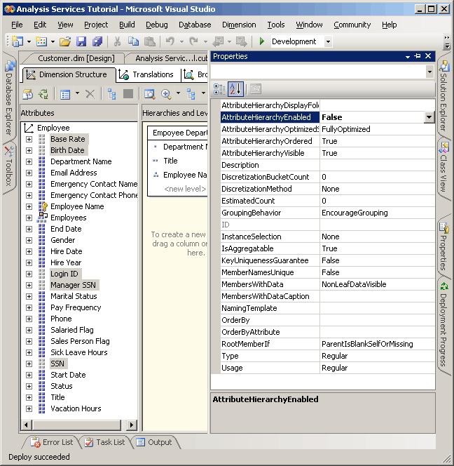
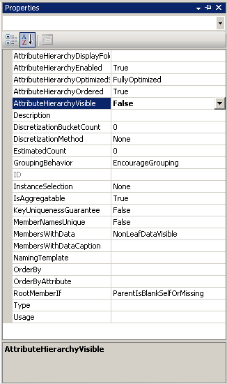

# Hiding and Disabling Attribute Hierarchies
  By default, an attribute hierarchy is created for every attribute in a dimension, and each hierarchy is available for dimensioning fact data. This hierarchy consists of an "All" level and a detail level containing all members of the hierarchy. As you have already learned, you can organize attributes into user-defined hierarchies to provide navigation paths in a cube. Under certain circumstances, you may want to disable or hide some attributes and their hierarchies. For example, certain attributes such as social security numbers or national identification numbers, pay rates, birth dates, and login information are not attributes by which users will dimension cube information. Instead, this information is generally only viewed as details of a particular attribute member. You may want to hide these attribute hierarchies, leaving the attributes visible only as member properties of a specific attribute. You may also want to make members of other attributes, such as customer names or postal codes, visible only when they are viewed through a user hierarchy instead of independently through an attribute hierarchy. One reason to do so may be the sheer number of distinct members in the attribute hierarchy. Finally, to improve processing performance, you should disable attribute hierarchies that users will not use for browsing.  
  
 The value of the **AttributeHierarchyEnabled** property determines whether an attribute hierarchy is created. If this property is set to **False**, the attribute hierarchy is not created and the attribute cannot be used as a level in a user hierarchy; the attribute hierarchy exists as a member property only. However, a disabled attribute hierarchy can still be used to order the members of another attribute. If the value of the **AttributeHierarchyEnabled** property is set to **True**, the value of the **AttributeHierarchyVisible** property determines whether the attribute hierarchy is visible independent of its use in a user-defined hierarchy.  
  
 When an attribute hierarchy is enabled, you may want to specify values for the following three additional properties:  
  
-   **IsAggregatable**  
  
     By default, an (All) level is defined for all attribute hierarchies. To disable the (All) level for an enabled attribute hierarchy, set the value for this property to **False**.  
  
    > [!NOTE]  
    >  An attribute that has its **IsAggregatable** property set to false can only be used as the root of a user-defined hierarchy and must have a default member specified (otherwise, one will be chosen for you by the [!INCLUDE[ssASnoversion](../includes/ssasnoversion-md.md)] engine).  
  
-   **AttributeHierarchyOrdered**  
  
     By default, [!INCLUDE[ssASnoversion](../includes/ssasnoversion-md.md)] orders the members of enabled attribute hierarchies during processing, and then stores the members by the value of the **OrderBy** property, such as by Name or Key. If you do not care about ordering, you can increase processing performance by setting the value of this property to **False**.  
  
-   **AttributeHierarchyOptimizedState**  
  
     By default, [!INCLUDE[ssASnoversion](../includes/ssasnoversion-md.md)] creates an index for each enabled attribute hierarchy during processing, to improve query performance. If you do not plan to use an attribute hierarchy for browsing, you can increase processing performance by setting the value of this property to **NotOptimized**. However, if you use a hidden hierarchy as the key attribute for the dimension, creating an index of the attribute members will still improve performance.  
  
 These properties do not apply if an attribute hierarchy is disabled.  
  
 In the tasks in this topic, you will disable social security numbers and other attributes in the Employee dimension that will not be used for browsing. You will then hide the customer name and postal code attribute hierarchies in the Customer dimension. The large number of attribute members in these hierarchies will make browsing these hierarchies very slow independent of a user hierarchy.  
  
## Setting Attribute Hierarchy Properties in the Employee Dimension  
  
1.  Switch to Dimension Designer for the Employee dimension, and then click the **Browser** tab.  
  
2.  Verify that the following attribute hierarchies appear in the **Hierarchy** list:  
  
    -   **Base Rate**  
  
    -   **Birth Date**  
  
    -   **Login ID**  
  
    -   **Manager SSN**  
  
    -   **SSN**  
  
3.  Switch to the **Dimension Structure** tab, and then select the following attributes in the **Attributes** pane. You can select multiple measures by clicking each while holding down the CTRL key:  
  
    -   **Base Rate**  
  
    -   **Birth Date**  
  
    -   **Login ID**  
  
    -   **Manager SSN**  
  
    -   **SSN**  
  
4.  In the Properties window, set the value of the **AttributeHierarchyEnabled** property to **False** for the selected attributes.  
  
     Notice in the **Attributes** pane that the icon for each attribute has changed to indicate that the attribute is not enabled.  
  
     The following image shows the **AttributeHierarchyEnabled** property set to False for the selected attributes.  
  
       
  
5.  On the **Build** menu, click **Deploy Analysis Services Tutorial**.  
  
6.  When processing has successfully completed, switch to the **Browser** tab, click **Reconnect**, and then try to browse the modified attribute hierarchies.  
  
     Notice that the members of the modified attributes are not available for browsing as attribute hierarchies in the **Hierarchy** list. If you try to add one of the disabled attribute hierarchies as a level in a user hierarchy, you will receive an error notifying you that the attribute hierarchy must be enabled to participate in a user-defined hierarchy.  
  
## Setting Attribute Hierarchy Properties in the Customer Dimension  
  
1.  Switch to Dimension Designer for the Customer dimension, and then click the **Browser** tab.  
  
2.  Verify that the following attribute hierarchies appear in the **Hierarchy** list:  
  
    -   **Full Name**  
  
    -   **Postal Code**  
  
3.  Switch to the **Dimension Structure** tab, and then select the following attributes in the **Attributes** pane by using the CTRL key to select multiple attributes at the same time:  
  
    -   **Full Name**  
  
    -   **Postal Code**  
  
4.  In the Properties window, set the value of the **AttributeHierarchyVisible** property to **False** for the selected attributes.  
  
     Because the members of these attribute hierarchies will be used for dimensioning fact data, ordering and optimizing the members of these attribute hierarchies will improve performance. Therefore, the properties of these attributes should not be changed.  
  
     The following image shows the **AttributeHierarchyVisible** property set to False.  
  
       
  
5.  Drag the **Postal Code** attribute from the **Attributes** pane into the **Customer Geography** user hierarchy in the **Hierarchies and Levels** pane, immediately under the **City** level.  
  
     Notice that a hidden attribute can still become a level in a user hierarchy.  
  
6.  On the **Build** menu, click **Deploy Analysis Services Tutorial**.  
  
7.  When deployment has successfully completed, switch to the **Browser** tab for the Customer dimension, and then click **Reconnect**.  
  
8.  Try to select either of the modified attribute hierarchies from the **Hierarchy** list.  
  
     Notice that neither of the modified attribute hierarchies appears in the **Hierarchy** list.  
  
9. In the **Hierarchy** list, select **Customer Geography**, and then browse each level in the browser pane.  
  
     Notice that the hidden levels, **Postal Code** and **Full Name**, are visible in the user-defined hierarchy.  
  
## Next Task in Lesson  
 [Sorting Attribute Members Based on a Secondary Attribute](../analysis-services/lesson-4-5-sorting-attribute-members-based-on-a-secondary-attribute.md)  
  
  
