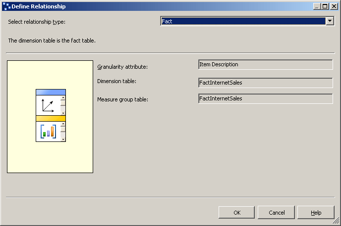

# Defining a Fact Relationship
  Users sometimes want to be able to dimension measures by data items that are in the fact table or to query the fact table for specific additional related information, such as invoice numbers or purchase order numbers related to specific sales facts. When you define a dimension based on such a fact table item, the dimension is called a *fact dimension*. Fact dimensions are also known as degenerate dimensions. Fact dimensions are useful for grouping together related fact table rows, such as all the rows that are related to a particular invoice number. Although you can put this information in a separate dimension table in the relational database, creating a separate dimension table for the information provides no benefit because the dimension table would grow at the same rate as the fact table, and would just create duplicate data and unnecessary complexity.  
  
 Within [!INCLUDE[ssASnoversion](../includes/ssasnoversion-md.md)], you can determine whether to duplicate the fact dimension data in a MOLAP dimension structure for increased query performance, or whether to define the fact dimension as a ROLAP dimension to save storage space at the expense of query performance. When you store a dimension with the MOLAP storage mode, all the dimension members are stored in the instance of [!INCLUDE[ssASnoversion](../includes/ssasnoversion-md.md)] in a highly compressed MOLAP structure, in addition to being stored in the measure group's partitions. When you store a dimension with the ROLAP storage mode, only the dimension definition is stored in the MOLAP structure-the dimension members themselves are queried from the underlying relational fact table at query time. You decide the appropriate storage mode based on how frequently the fact dimension is queried, the number of rows returned by a typical query, the performance of the query, and the processing cost. Defining a dimension as ROLAP does not require that all cubes that use the dimension also be stored with the ROLAP storage mode. The storage mode for each dimension can be configured independently.  
  
 When you define a fact dimension, you can define the relationship between the fact dimension and the measure group as a fact relationship. The following constraints apply to fact relationships:  
  
-   The granularity attribute must be the key column for the dimension, which creates a one-to-one relationship between the dimension and the facts in the fact table.  
  
-   A dimension can have a fact relationship with only a single measure group.  
  
> [!NOTE]  
>  Fact dimensions must be incrementally updated after every update to the measure group that the fact relationship references.  
  
 For more information, see [Dimension Relationships](multidimensional-models-olap-logical-cube-objects/dimension-relationships.md), and [Define a Fact Relationship and Fact Relationship Properties](multidimensional-models/define-a-fact-relationship-and-fact-relationship-properties.md).  
  
 In the tasks in this topic, you add a new cube dimension based on the **CustomerPONumber** column in the **FactInternetSales** fact table. You then define the relationship between this new cube dimension and the **Internet Sales** measure group as a fact relationship.  
  
## Defining the Internet Sales Orders Fact Dimension  
  
1.  In Solution Explorer, right-click **Dimensions**, and then click **New Dimension**.  
  
2.  On the **Welcome to the Dimension Wizard** page, click **Next**.  
  
3.  On the **Select Creation Method** page, verify that the **Use an existing table** option is selected, and then click **Next**.  
  
4.  On the **Specify Source Information** page, verify that the **Adventure Works DW 2012** data source view is selected.  
  
5.  In the **Main table** list, select **InternetSales**.  
  
6.  In the **Key columns** list, verify that **SalesOrderNumber** and **SalesOrderLineNumber** are listed.  
  
7.  In the **Name column** list, select **SalesOrderLineNumber**.  
  
8.  Click **Next**.  
  
9. On the **Select Related Tables** page, clear the check boxes beside all of the tables, and then click **Next**.  
  
10. On the **Select Dimension Attributes** page, click the check box in the header twice to clear all of the check boxes. The **Sales Order Number** attribute will remain selected because it is the key attribute.  
  
11. Select the **Customer PO Number** attribute, and then click **Next**.  
  
12. On the **Completing the Wizard** page, change the name to **Internet Sales Order Details** and then click **Finish** to complete the wizard.  
  
13. On the **File** menu, click **Save All**.  
  
14. In the **Attributes** pane of the Dimension Designer for the **Internet Sales Order Details** dimension, select **Sales Order Number**, and then change the **Name** property in the Properties window to `Item Description.`  
  
15. In the **NameColumn** property cell, click the browse button **(...)**. In the **Name Column** dialog box, select **Product** from the **Source table** list, select **EnglishProductName** for the **Source column**, and then click **OK**.  
  
16. Add the **Sales Order Number** attribute to the dimension by dragging the **SalesOrderNumber** column from the **InternetSales** table in the **Data Source View** pane to the **Attributes** pane.  
  
17. Change the **Name** property of the new **Sales Order Number** attribute to `Order Number`, and change the **OrderBy** property to **Key**.  
  
18. In the **Hierarchies** pane, create an **Internet Sales Orders** user hierarchy that contains the `Order Number` and **Item Description** levels, in that order.  
  
19. In the **Attributes** pane, select **Internet Sales Order Details**, and then review the value for the **StorageMode** property in the Properties window.  
  
     Notice that, by default, this dimension is stored as a MOLAP dimension. Although changing the storage mode to ROLAP will save processing time and storage space, it occurs at the expense of query performance. For the purposes of this tutorial, you will use MOLAP as the storage mode.  
  
20. To add the newly created dimension to the [!INCLUDE[ssASnoversion](../includes/ssasnoversion-md.md)] Tutorial cube as a cube dimension, switch to **Cube Designer**. On the **Cube Structure** tab, right-click in the **Dimensions** pane and select **Add Cube Dimension**.  
  
21. In the **Add Cube Dimension**.dialog box, select **Internet Sales Order Details** and then click **OK**.  
  
## Defining a Fact Relationship for the Fact Dimension  
  
1.  In the Cube Designer for the [!INCLUDE[ssASnoversion](../includes/ssasnoversion-md.md)] Tutorial cube, click the **Dimension Usage** tab.  
  
     Notice that the **Internet Sales Order Details** cube dimension is automatically configured as having a fact relationship, as shown by the unique icon.  
  
2.  Click the browse button (**...**) in the **Item Description** cell, at the intersection of the **Internet Sales** measure group and the **Internet Sales Order Details** dimension, to review the fact relationship properties.  
  
     The **Define Relationship** dialog box opens. Notice that you cannot configure any of the properties.  
  
     The following image shows the fact relationship properties in the **Define Relationship** dialog box.  
  
       
  
3.  Click **Cancel**.  
  
## Browsing the Cube by Using the Fact Dimension  
  
1.  On the **Build** menu, click **Deploy Analysis Services Tutorial** to deploy the changes to the instance of [!INCLUDE[ssASnoversion](../includes/ssasnoversion-md.md)] and process the database.  
  
2.  After deployment has successfully completed, click the **Browser** tab in Cube Designer for the [!INCLUDE[ssASnoversion](../includes/ssasnoversion-md.md)] Tutorial cube, and then click the **Reconnect** button.  
  
3.  Clear all measures and hierarchies from the data pane, and then add the **Internet Sales-Sales Amount** measure to the data area of the data pane.  
  
4.  In the metadata pane, expand **Customer**, expand **Location**, expand **Customer Geography**, expand **Members**, expand **All Customers**, expand **Australia**, expand **Queensland**, expand **Brisbane**, expand **4000**, right-click **Adam Powell**, and then click **Add to Filter**.  
  
     Filtering to limit the sales orders returned to a single customer lets the user drill down to the underlying detail in a large fact table without suffering a significant loss in query performance.  
  
5.  Add the **Internet Sales Orders** user-defined hierarchy from the **Internet Sales Order Details** dimension to the row area of the data pane.  
  
     Notice that the sales order numbers and the corresponding Internet sales amounts for Adam Powell appear in the data pane.  
  
     The following image shows the result of the previous steps.  
  
       
  
## Next Task in Lesson  
 [Defining a Many-to-Many Relationship](../analysis-services/lesson-5-3-defining-a-many-to-many-relationship.md)  
  
## See Also  
 [Dimension Relationships](multidimensional-models-olap-logical-cube-objects/dimension-relationships.md)   
 [Define a Fact Relationship and Fact Relationship Properties](multidimensional-models/define-a-fact-relationship-and-fact-relationship-properties.md)  
  
  
