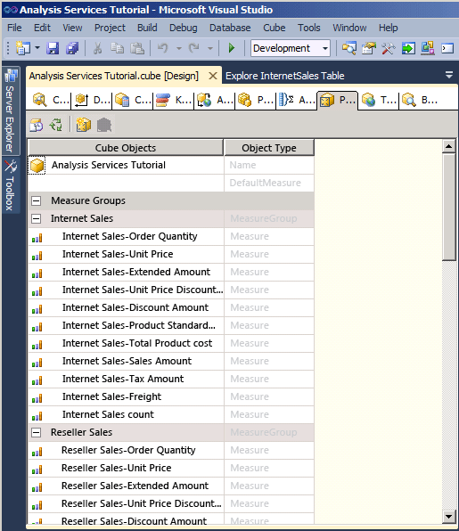
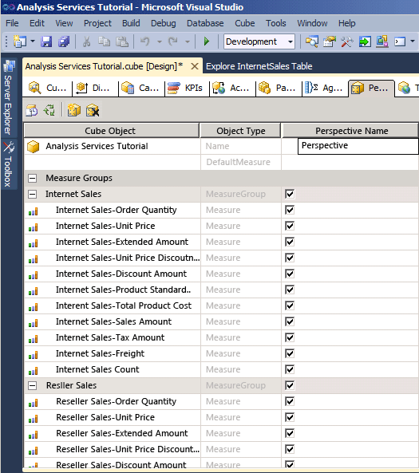
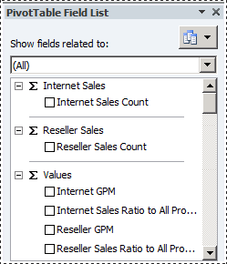

# Defining and Browsing Perspectives
  A perspective can simplify the view of a cube for specific purposes. By default, users can see all of the elements in a cube to which they have permissions. What users are viewing when they view an entire [!INCLUDE[ssASnoversion](../includes/ssasnoversion-md.md)] cube is the default perspective for the cube. A view of the whole cube can be very complex for users to navigate, especially for users who only need to interact with a small part of the cube to satisfy their business intelligence and reporting requirements.  
  
 To reduce the apparent complexity of a cube, you can create viewable subsets of the cube, called *perspectives*, which show users only a part of the measure groups, measures, dimensions, attributes, hierarchies, Key Performance Indicators (KPIs), actions, and calculated members in the cube. This can be particularly useful for working with client applications that were written for a previous release of [!INCLUDE[ssASnoversion](../includes/ssasnoversion-md.md)]. These clients have no concept of display folders or perspectives, for example, but a perspective appears to older clients as if it were a cube. For more information, see [Perspectives](multidimensional-models-olap-logical-cube-objects/perspectives.md), and [Perspectives in Multidimensional Models](multidimensional-models/perspectives-in-multidimensional-models.md).  
  
> [!NOTE]  
>  A perspective is not a security mechanism, but instead is a tool for providing a better user experience. All security for a perspective is inherited from the underlying cube.  
  
 In the tasks in this topic, you will define several different perspectives and then browse the cube through each of these new perspectives.  
  
## Defining an Internet Sales Perspective  
  
1.  Open Cube Designer for the [!INCLUDE[ssASnoversion](../includes/ssasnoversion-md.md)] Tutorial cube, and then click the **Perspectives** tab.  
  
     All the objects and their object types appear in the **Perspectives** pane, as shown in the following image.  
  
       
  
2.  On the toolbar of the **Perspectives** tab, click the **New Perspective** button.  
  
     A new perspective appears in the **Perspective Name** column with a default name of **Perspective**, as shown in the following image. Notice that the check box for every object is selected; until you clear the check box for an object, this perspective is identical to the default perspective of this cube.  
  
       
  
3.  Change the perspective name to `Internet Sales`.  
  
4.  On the next row, set the DefaultMeasure to **Internet Sales-Sales Amount**.  
  
     When users browse the cube by using this perspective, this will be the measure that the users see unless they specify some other measure.  
  
    > [!NOTE]  
    >  You can also set the default measure for the whole [!INCLUDE[ssASnoversion](../includes/ssasnoversion-md.md)] Tutorial cube in the Properties window on the **Cube Structure** tab for the cube.  
  
5.  Clear the check box for the following objects:  
  
    -   `Reseller Sales` measure group  
  
    -   **Sales Quotas** measure group  
  
    -   **Sales Quotas 1** measure group  
  
    -   **Reseller** cube dimension  
  
    -   **Reseller Geography** cube dimension  
  
    -   **Sales Territory** cube dimension  
  
    -   **Employee** cube dimension  
  
    -   **Promotion** cube dimension  
  
    -   **Reseller Revenue** KPI  
  
    -   **Large Resellers** named set  
  
    -   **Total Sales Amount** calculated member  
  
    -   **Total Product Cost** calculated member  
  
    -   **Reseller GPM** calculated member  
  
    -   **Total GPM** calculated member  
  
    -   **Reseller Sales Ratio to All Products** calculated member  
  
    -   **Total Sales Ratio to All Products** calculated member  
  
     These objects do not relate to Internet sales.  
  
    > [!NOTE]  
    >  Within each dimension, you can also individually select the user-defined hierarchies and attributes that you want to appear in a perspective.  
  
## Defining a Reseller Sales Perspective  
  
1.  On the toolbar of the **Perspectives** tab, click the **New Perspective** button.  
  
2.  Change the name of the new perspective to `Reseller Sales`.  
  
3.  Set **Reseller Sales-Sales Amount** as the default measure.  
  
     When users browse the cube by using this perspective, this measure will be the measure that the users will see unless they specify some other measure.  
  
4.  Clear the check box for the following objects:  
  
    -   `Internet Sales` measure group  
  
    -   **Internet Sales Reason** measure group  
  
    -   **Customer** cube dimension  
  
    -   **Internet Sales Order Details** cube dimension  
  
    -   **Sales Reason** cube dimension  
  
    -   **Internet Sales Details Drillthrough Action** drillthrough action  
  
    -   **Total Sales Amount** calculated member  
  
    -   **Total Product Cost** calculated member  
  
    -   **Internet GPM** calculated member  
  
    -   **Total GPM** calculated member  
  
    -   **Internet Sales Ratio to All Products** calculated member  
  
    -   **Total Sales Ratio to All Products** calculated member  
  
     These objects do not relate to resellers sales.  
  
## Defining a Sales Summary Perspective  
  
1.  On the toolbar of the **Perspectives** tab, click the **New Perspective** button.  
  
2.  Change the name of the new perspective to `Sales Summary`.  
  
    > [!NOTE]  
    >  You cannot specify a calculated measure as the default measure.  
  
3.  Clear the check box for the following objects:  
  
    -   `Internet Sales` measure group  
  
    -   `Reseller Sales` measure group  
  
    -   **Internet Sales Reason** measure group  
  
    -   **Sales Quotas** measure group  
  
    -   **Sales Quotas1** measure group  
  
    -   **Internet Sales Order Details** cube dimension  
  
    -   **Sales Reason** cube dimension  
  
    -   **Internet Sales Details Drillthrough Action** drillthrough action  
  
4.  Select the check box for the following objects:  
  
    -   **Internet Sales Count** measure  
  
    -   **Reseller Sales Count** measure  
  
## Browsing the Cube Through Each Perspective  
  
1.  On the **Build** menu, click **Deploy Analysis Services Tutorial**.  
  
2.  When deployment has successfully completed, switch to the **Browser** tab, and then click the **Reconnect** button.  
  
3.  Start Excel.  
  
4.  Analyze in Excel prompts you to choose which perspective to use when browsing the model in Excel, as shown in the following image.  
  
       
  
5.  Alternatively, you can start Excel from the Windows Start menu, define a connection to the Analysis Services Tutorial database on localhost, and choose a perspective in the Data Connection wizard, as shown in the following image.  
  
       
  
6.  Select `Internet Sales` in the **Perspective** list and then review the measures and dimensions in the metadata pane.  
  
     Notice that only those objects that are specified for the Internet Sales perspective appear.  
  
7.  In the metadata pane, expand **Measures**.  
  
     Notice that only the `Internet Sales` measure group appears, together with the **Internet GPM** and **Internet Sales Ratio to All Products** calculated members.  
  
8.  In the model, select Excel again. Select `Sales Summary`.  
  
     Notice that in each of these measure groups, only a single measure appears, as shown in the following image.  
  
       
  
## Next Task in Lesson  
 [Defining and Browsing Translations](../analysis-services/lesson-9-2-defining-and-browsing-translations.md)  
  
## See Also  
 [Perspectives](multidimensional-models-olap-logical-cube-objects/perspectives.md)   
 [Perspectives in Multidimensional Models](multidimensional-models/perspectives-in-multidimensional-models.md)  
  
  
