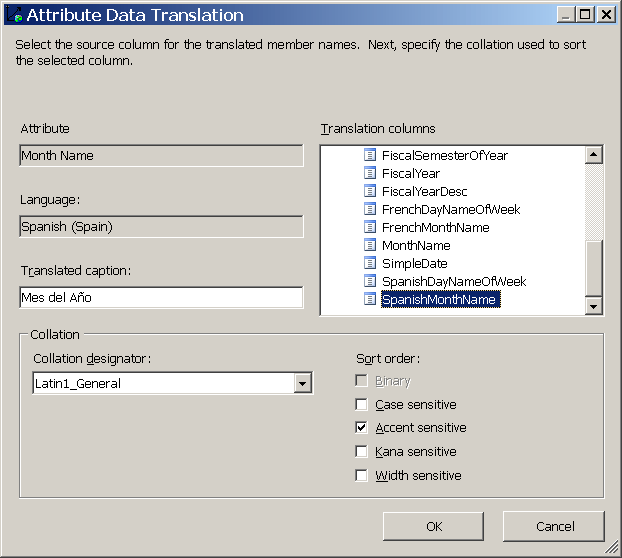
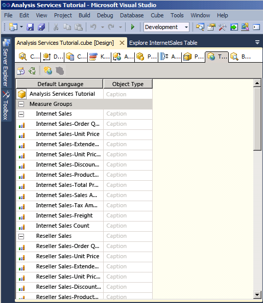
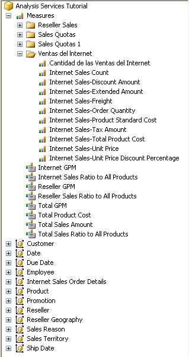

# Defining and Browsing Translations
  A translation is a representation of the names of [!INCLUDE[ssASnoversion](../includes/ssasnoversion-md.md)] objects in a specific language. Objects include measure groups, measures, dimensions, attributes, hierarchies, KPIs, actions, and calculated members. Translations provide server support for client applications that can support multiple languages. By using such a client, the client passes the locale identifier (LCID) to the instance of [!INCLUDE[ssASnoversion](../includes/ssasnoversion-md.md)], which uses the LCID to determine which set of translations to use when it provides metadata for [!INCLUDE[ssASnoversion](../includes/ssasnoversion-md.md)] objects. If an [!INCLUDE[ssASnoversion](../includes/ssasnoversion-md.md)] object does not contain a translation for that language, or does not contain a translation for a specified object, the default language is used in returning the object metadata back to the client. For example, if a business user in France accesses a cube from a workstation that has a French locale setting, the business user will see the member captions and member property values in French if a French translation exists. However, if a business user in Germany accesses the same cube from a workstation that has a German locale setting, the business user will see the captions names and member property values in German. For more information, see [Dimension Translations](multidimensional-models-olap-logical-dimension-objects/dimension-translations.md), [Cube Translations](multidimensional-models-olap-logical-cube-objects/cube-translations.md), [Translations &#40;Analysis Services&#41;](translations-analysis-services.md).  
  
 In the tasks in this topic, you define metadata translations for a limited set of dimension objects in the Date dimension and cube objects in the [!INCLUDE[ssASnoversion](../includes/ssasnoversion-md.md)] Tutorial cube. You will then browse these dimension and cube objects to examine the metadata translations.  
  
## Specifying Translations for the Date Dimension Metadata  
  
1.  Open Dimension Designer for the **Date** dimension, and then click the **Translations** tab.  
  
     The metadata in the default language for each dimension object appears. The default language in the [!INCLUDE[ssASnoversion](../includes/ssasnoversion-md.md)] Tutorial cube is English.  
  
2.  On the toolbar of the **Translations** tab, click the **New Translation** button.  
  
     A list of languages appears in the **Select Language** dialog box.  
  
3.  Click **Spanish (Spain)**, and then click **OK**.  
  
     A new column appears in which you will define the Spanish translations for the metadata objects you want to translate. In this tutorial, we will only translate a few objects just to illustrate the process.  
  
4.  On the toolbar of the **Translations** tab, click the **New Translation** button, click **French (France)** in the **Select Language** dialog box, and then click **OK**.  
  
     Another language column appears in which you will define French translations.  
  
5.  In the row for the **Caption** object for the **Date** dimension, type `Fecha` in the **Spanish (Spain)** translation column and `Temps` in the **French (France)** translation column.  
  
6.  In the row for the **Caption** object for the **Month Name** attribute, type `Mes del Año` in the **Spanish (Spain)** translation column and `Mois d'Année` in the **French (France)** translation column.  
  
     Notice that when you enter these translations, an ellipsis (**...**) appears. Clicking this ellipsis will enable you to specify a column in the underlying table that provides translations for each member of the attribute hierarchy.  
  
7.  Click the ellipsis (**...**) for the **Spanish (Spain)** translation for the **Month Name** attribute.  
  
     The **Attribute Data Translation** dialog box appears.  
  
8.  In the **Translation columns** list, select **SpanishMonthName**, as shown in the following image.  
  
       
  
9. Click **OK**, and then click the ellipsis (**...**) for the **French (France)** translation for the **Month Name** attribute.  
  
10. In the **Translation columns** list, select **FrenchMonthName**, and then click **OK**.  
  
     The steps in this procedure illustrate the process of defining metadata translations for dimension objects and members.  
  
## Specifying Translations for the Analysis Services Tutorial Cube Metadata  
  
1.  Switch to Cube Designer for the [!INCLUDE[ssASnoversion](../includes/ssasnoversion-md.md)] Tutorial cube, and then switch to the **Translations** tab.  
  
     The metadata in the default language for each cube object appears, as shown in the following image. The default language in the [!INCLUDE[ssASnoversion](../includes/ssasnoversion-md.md)] Tutorial cube is English.  
  
       
  
2.  On the toolbar of the **Translations** tab, click the **New Translation** button.  
  
     A list of languages appears in the **Select Language** dialog box.  
  
3.  Select **Spanish (Spain)**, and then click **OK**.  
  
     A new column appears in which you will define the Spanish translations for the metadata objects you want to translate. In this tutorial, we will only translate a few objects just to illustrate the process.  
  
4.  On the toolbar of the **Translations** tab, click the **New Translation** button, select **French (France)** in the **Select Language** dialog box, and then click **OK**.  
  
     Another language column appears in which you will define French translations.  
  
5.  In the row for the **Caption** object for the **Date** dimension, type `Fecha` in the **Spanish (Spain)** translation column and `Temps` in the **French (France)** translation column.  
  
6.  In the row for the **Caption** object for the **Internet Sales** measure group, type `Ventas del lnternet` in the **Spanish (Spain)** translation column and `Ventes D'Internet` in the **French (France)** translation column.  
  
7.  In the row for the **Caption** object for the Internet Sales-Sales Amount measure, type `Cantidad de las Ventas del Internet` in the **Spanish (Spain)** translation column and `Quantité de Ventes d'Internet` in the **French (France)** translation column.  
  
     The steps in this procedure illustrate the process of defining metadata translations for cube objects.  
  
## Browsing the Cube By Using Translations  
  
1.  On the **Build** menu, click **Deploy Analysis Services Tutorial**.  
  
2.  When deployment has successfully completed, switch to the **Browser** tab, and then click **Reconnect**.  
  
3.  Remove all hierarchies and measures from the **Data** pane and select [!INCLUDE[ssASnoversion](../includes/ssasnoversion-md.md)] Tutorial in the **Perspectives** list.  
  
4.  In the metadata pane, expand **Measures** and then expand **Internet Sales**.  
  
     Notice that the **Internet Sales-Sales Amount** measure appears in English in this measure group.  
  
5.  On the toolbar, select **Spanish (Spain)** in the **Language** list.  
  
     Notice that the items in the metadata pane are repopulated. After the items in the metadata pane are repopulated, notice that the Internet Sales-Sales Amount measure no longer appears in the Internet Sales display folder. Instead, it appears in Spanish in a new display folder named `Ventas del lnternet`, as shown in the following image.  
  
       
  
6.  In the metadata pane, right-click `Cantidad de las Ventas del Internet` and then select **Add to Query**.  
  
7.  In the metadata pane, expand `Fecha`, expand **Fecha.Calendar Date**, right-click **Fecha.Calendar Date**, and then select **Add to Filter**.  
  
8.  In the **Filter** pane, select **CY 2007** as the filter expression.  
  
9. In the metadata pane, right-click **Mes del Ano** and select **Add to Query**.  
  
     Notice that the month names appear in Spanish, as shown in the following image.  
  
       
  
10. On the toolbar, select **French (France)** in the **Language** list.  
  
     Notice that the month names now appear in French and that the measure name now also appears in French.  
  
## Next Lesson  
 [Lesson 10: Defining Administrative Roles](../analysis-services/lesson-10-defining-administrative-roles.md)  
  
## See Also  
 [Dimension Translations](multidimensional-models-olap-logical-dimension-objects/dimension-translations.md)   
 [Cube Translations](multidimensional-models-olap-logical-cube-objects/cube-translations.md)   
 [Translations &#40;Analysis Services&#41;](translations-analysis-services.md)  
  
  
