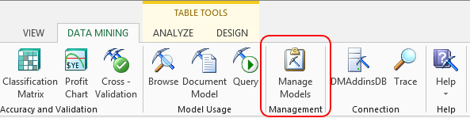

# Manage Models (SQL Server Data Mining Add-ins)
    
  
 The **Manage Models** dialog box enables you to interact with existing mining models and mining structures that are stored in the [!INCLUDE[ssASnoversion](../includes/ssasnoversion-md.md)] server to which you are currently connected. You can also view and manage temporary structures and models that have been created during the current session. If you have used both session models and models stored on a server, both are visible in the dialog box.  
  
## Using the Manage Models Wizard  
 When you click **Manage Models**, the **Manage Mining Structures and Models** dialog box opens, providing access to the following functionality for managing existing data mining models and structures:  
  
-   Rename a mining model or structure  
  
-   Delete a mining model or structure  
  
-   Clear a mining model or structure  
  
-   Process a mining structure, using either new or existing data  
  
-   Export or import a mining model or structure  
  
> [!NOTE]  
>  You cannot create queries or models by using this dialog box. To create a new mining structure, use one of the wizards provided in the Data Mining Client for Excel, or use the **Data Mining Query Advanced Editor**.  
  
### Requirements  
 To manage data mining models, you must first create a connection to an instance of [!INCLUDE[ssASnoversion](../includes/ssasnoversion-md.md)]. A connection is required even if you are working with session models stored in a temporary file. For more information about how to create or change a connection, see [Connect to Source Data &#40;Data Mining Client for Excel&#41;](connect-to-source-data-data-mining-client-for-excel.md).  
  
 If the instance of [!INCLUDE[ssASnoversion](../includes/ssasnoversion-md.md)] that you connect to does not contain any existing data mining structures or data mining models, you can create them by using the wizards and other tools provided by this add-in. You can also create new models by using the **Data Mining Model Advanced Editor**.  
  
## See Also  
 [Documenting Mining Models &#40;Data Mining Add-ins for Excel&#41;](documenting-mining-models-data-mining-add-ins-for-excel.md)   
 [Deploying and Scaling Mining Models &#40;Data Mining Add-ins for Excel&#41;](deploying-and-scaling-mining-models-data-mining-add-ins-for-excel.md)   

  
