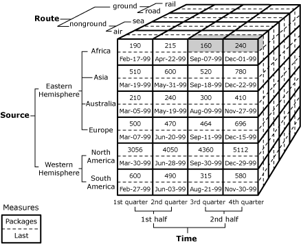
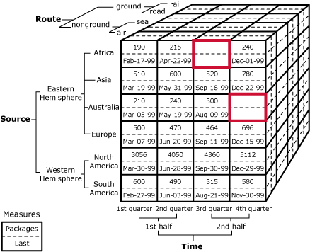

# Cube Cells (Analysis Services - Multidimensional Data)
  A cube is composed of cells, organized by measure groups and dimensions. A cell represents the unique logical intersection in a cube of one member from every dimension in the cube. For example, the cube described by the following diagram contains one measure group that has two measures, organized along three dimensions named Source, Route, and Time.  
  
   
  
 The single shaded cell in this diagram is the intersection of the following members:  
  
-   The air member of the Route dimension.  
  
-   The Africa member of the Source dimension.  
  
-   The 4th quarter member of the Time dimension.  
  
-   The Packages measure.  
  
## Leaf and Nonleaf Cells  
 The value for a cell in a cube can be obtained in one of several ways. In the previous example, the value in the cell can be directly retrieved from the fact table of the cube, because all the members used to identify that cell are *leaf members*. A leaf member has no child members, hierarchically speaking, and typically references a single record in a dimension table. This kind of cell is referred to as a *leaf cell*.  
  
 However, a cell can also be identified by using *nonleaf members*. A nonleaf member is a member that has one or more child members. In this case, the value of the cell is typically derived from the aggregation of child members associated with the nonleaf member. For example, the intersection of the following members and dimensions refers to a cell whose value is supplied by aggregation:  
  
-   The air member of the Route dimension.  
  
-   The Africa member of the Source dimension.  
  
-   The 2nd half member of the Time dimension.  
  
-   The Packages member.  
  
 The 2nd half member of the Time dimension is a nonleaf member. Therefore, all of values associated with it must be aggregated values, as shown in the following diagram.  
  
   
  
 Assuming the aggregations for the 3rd quarter and 4th quarter members are summations, the value of the specified cell is 400, which is the total of all of the leaf cells shaded in the previous diagram. Because the value of the cell is derived from the aggregation of other cells, the specified cell is considered a *nonleaf cell*.  
  
 The cell values derived for members that use custom rollups and member groups, in addition to custom members, are handled similarly. However, cell values derived for calculated members are based completely on the Multidimensional Expressions (MDX) expression used to define the calculated member; in some cases, there may be no actual cell data involved. For more information, see [Custom Rollup Operators in Parent-Child Dimensions](../multidimensional-models/parent-child-dimension-attributes-custom-rollup-operators.md), [Define Custom Member Formulas](../multidimensional-models/attribute-properties-define-custom-member-formulas.md), and [Calculations](../multidimensional-models-olap-logical-cube-objects/calculations.md).  
  
## Empty Cells  
 It is not required that every cell in a cube contain a value; there can be intersections in a cube that have no data. These intersections, called empty cells, frequently occur in cubes because not every intersection of a dimension attribute with a measure within a cube contains a corresponding record in a fact table. The ratio of empty cells in a cube to the total number of cells in a cube is frequently referred to as the *sparsity* of a cube.  
  
 For example, the structure of the cube shown in the following diagram is similar to other examples in this topic. However, in this example, there were no air shipments to Africa for the third quarter or to Australia for the fourth quarter. There is no data in the fact table to support the intersections of those dimensions and measures; therefore the cells at those intersections are empty.  
  
   
  
 In [!INCLUDE[ssNoVersion](../../includes/ssnoversion-md.md)] [!INCLUDE[ssASnoversion](../../includes/ssasnoversion-md.md)], an empty cell is a cell that has special qualities. Because empty cells can skew the results of crossjoins, counts, and so on, many MDX functions supply the ability to ignore empty cells for the purposes of calculation. For more information, see [Multidimensional Expressions &#40;MDX&#41; Reference](/sql/mdx/multidimensional-expressions-mdx-reference), and [Key Concepts in MDX &#40;Analysis Services&#41;](../multidimensional-models/key-concepts-in-mdx-analysis-services.md).  
  
## Security  
 Access to cell data is managed in [!INCLUDE[ssASnoversion](../../includes/ssasnoversion-md.md)] at the role level, and can be finely controlled by using MDX expressions. For more information, see [Grant custom access to dimension data &#40;Analysis Services&#41;](../multidimensional-models/grant-custom-access-to-dimension-data-analysis-services.md), and [Grant custom access to cell data &#40;Analysis Services&#41;](../multidimensional-models/grant-custom-access-to-cell-data-analysis-services.md).  
  
## See Also  
 [Cube Storage &#40;Analysis Services - Multidimensional Data&#41;](../multidimensional-models-olap-logical-cube-objects/cube-storage-analysis-services-multidimensional-data.md)   
 [Aggregations and Aggregation Designs](../multidimensional-models-olap-logical-cube-objects/aggregations-and-aggregation-designs.md)  
  
  
