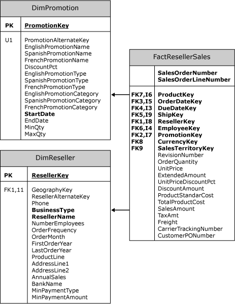
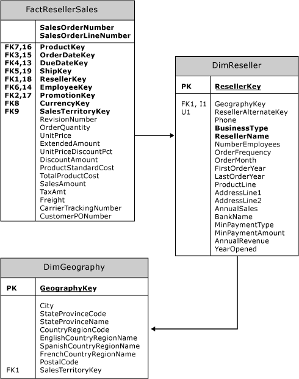

# Introduction to Dimensions (Analysis Services - Multidimensional Data)
  All Microsoft [!INCLUDE[ssNoVersion](../../includes/ssnoversion-md.md)] [!INCLUDE[ssASnoversion](../../includes/ssasnoversion-md.md)] dimensions are groups of attributes based on columns from tables or views in a data source view. Dimensions exist independent of a cube, can be used in multiple cubes, can be used multiple times in a single cube, and can be linked between [!INCLUDE[ssASnoversion](../../includes/ssasnoversion-md.md)].instances. A dimension that exists independent of a cube is called a database dimension and an instance of a database dimension within a cube is called a cube dimension.  
  
## Dimension based on a Star Schema Design  
 The structure of a dimension is largely driven by the structure of the underlying dimension table or tables. The simplest structure is called a star schema, where each dimension is based on a single dimension table that is directly linked to the fact table by a primary key - foreign key relationship.  
  
 The following diagram illustrates a subsection of the [!INCLUDE[ssSampleDBDWobject](../../includes/sssampledbdwobject-md.md)] sample database, in which the **FactResellerSales** fact table is related to two dimension tables, **DimReseller** and **DimPromotion**. The **ResellerKey** column in the **FactResellerSales** fact table defines a foreign key relationship to the **ResellerKey** primary key column in the **DimReseller** dimension table. Similarly, the **PromotionKey** column in the **FactResellerSales** fact table defines a foreign key relationship to the **PromotionKey** primary key column in the **DimPromotion** dimension table.  
  
   
  
## Dimension based on a Snowflake Schema Design  
 Frequently, a more complex structure is required because information from multiple tables is required to define the dimension. In this structure, called a snowflake schema, each dimension is based on attributes from columns in multiple tables linked to each other and ultimately to the fact table by primary key - foreign key relationships. For example, the following diagram illustrates the tables required to completely describe the Product dimension in the **AdventureWorksDW** sample project:  
  
   
  
 To completely describe a product, the product's category and subcategory must be included in the Product dimension. However, that information does not reside directly in the main table for the **DimProduct** dimension. A foreign key relationship from **DimProduct** to **DimProductSubcategory**, which in turn has a foreign key relationship to the **DimProductCategory** table, makes it possible to include the information for product categories and subcategories in the Product dimension.  
  
## Snowflake Schema versus Reference Relationship  
 Sometimes, you may have a choice between using a snowflake schema to define attributes in a dimension from multiple tables, or defining two separate dimensions and defining a reference dimension relationship between them. The following diagram illustrates such a scenario.  
  
   
  
 In the previous diagram, the **FactResellerSales** fact table does not have a foreign key relationship with the **DimGeography** dimension table. However, the **FactResellerSales** fact table does have a foreign key relationship with the **DimReseller** dimension table, which in turn has a foreign key relationship with the **DimGeography** dimension table. To define a Reseller dimension that contains geography information about each reseller, you would have to retrieve these attributes from the **DimGeography** and the **DimReseller** dimension tables. However, in [!INCLUDE[ssASnoversion](../../includes/ssasnoversion-md.md)], you can achieve the same result by creating two separate dimensions and linking them in a measure group by defining a reference dimension relationship between the two dimensions. For more information about reference dimension relationships, see [Dimension Relationships](../multidimensional-models-olap-logical-cube-objects/dimension-relationships.md).  
  
 One advantage of using reference dimension relationships in this scenario is that you could create a single geography dimension and then create multiple cube dimensions based on the geography dimension, without requiring any additional storage space. For example, you could link one of the geography cube dimensions to a reseller dimension and another of the geography cube dimensions to a customer dimension. **Related topics:**[Dimension Relationships](../multidimensional-models-olap-logical-cube-objects/dimension-relationships.md), [Define a Referenced Relationship and Referenced Relationship Properties](../multidimensional-models/define-a-referenced-relationship-and-referenced-relationship-properties.md)  
  
## Processing a Dimension  
 After you create a dimension, you must process the dimension before you can view the members of the attributes and hierarchies in the dimension. After the structure of a dimension is changed or the information in its underlying tables is updated, you have to process the dimension again before you can view the changes. When you process a dimension after structural changes, you must also process any cubes that include the dimension - or the cube will not be viewable.  
  
## Security  
 All the subordinate objects of a dimension, including hierarchies, levels, and members, are secured using roles in [!INCLUDE[ssASnoversion](../../includes/ssasnoversion-md.md)]. Dimension security can be applied for all the cubes in the database that use the dimension, or for only a specific cube. For more information about dimension security, see [Grant permissions on a dimension &#40;Analysis Services&#41;](../multidimensional-models/grant-permissions-on-a-dimension-analysis-services.md).  
  
## See Also  
 [Dimension Storage](../multidimensional-models-olap-logical-dimension-objects/dimensions-storage.md)   
 [Dimension Translations](../multidimensional-models-olap-logical-dimension-objects/dimension-translations.md)   
 [Write-Enabled Dimensions](../multidimensional-models-olap-logical-dimension-objects/write-enabled-dimensions.md)  
  
  
