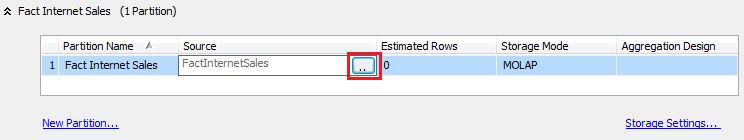

# Create and Manage a Local Partition (Analysis Services)
  You can create additional partitions for a measure group to improve processing performance. Having multiple partitions allows you to allocate fact data across a corresponding number of physical data files on local as well as remote servers. In Analysis Services, partitions can be processed independently and in parallel, giving you more control over processing workloads on the server.  
  
 Partitions can be created in [!INCLUDE[ssBIDevStudio](../../includes/ssbidevstudio-md.md)] during model design, or after the solution is deployed using [!INCLUDE[ssManStudioFull](../../includes/ssmanstudiofull-md.md)] or XMLA. We recommend that you choose one approach only. If you alternate between tools, you might find that changes made to a deployed database in [!INCLUDE[ssManStudioFull](../../includes/ssmanstudiofull-md.md)] are overwritten when you subsequently redeploy the solution from [!INCLUDE[ssBIDevStudio](../../includes/ssbidevstudio-md.md)].  
  
## Before you start  
 Check whether you have either the business intelligence edition or enterprise edition. Standard edition does not support multiple partitions. To check the edition, right-click the server node in [!INCLUDE[ssManStudioFull](../../includes/ssmanstudiofull-md.md)] and choose **Reports** | **General**. For more information about feature availability, see [Features Supported by the Editions of SQL Server 2014](../../getting-started/features-supported-by-the-editions-of-sql-server-2014.md).  
  
 From the outset, it's important to understand that partitions must share the same aggregation design if you want to merge them later. Partitions can be merged only if they have identical aggregation designs and storage modes.  
  
> [!TIP]  
>  Explore the data in Data Source View (DSV) to understand the range and depth of the data you are partitioning. For example, if partitioning by date, you can sort on a date column to determine the upper and lower bounds of each partition.  
  
## Choose an approach  
 The most important consideration when creating partitions is to segment the data so that there are no duplicate rows. Data must be stored in one, and only one, partition to avoid double counting any rows. As such, it's common to partition by DATE so that you can define clear boundaries between each partition.  
  
 You can use either technique to distribute the fact data across multiple partitions. The following techniques can be used to segment the data.  
  
|Technique|Recommendations|  
|---------------|---------------------|  
|Use SQL queries to segment fact data|Partitions can be sourced from SQL queries. During processing, the SQL query is to retrieve the data. The query's WHERE clause provides the filter that segments the data for each partition. Analysis Services generates the query for you, but you must fill in the WHERE clause to properly segment the data.   The primary advantage of this approach is the ease with which you can partition data from a single source table. If all of the source data originates from a large fact table, you can build queries that filter that data into discrete partitions, without having to create additional data structures in the Data Source View (DSV).   One disadvantage is that using queries will break the binding between the partition and the DSV. If you later update the DSV in the Analysis Services project, such as adding columns to the fact table, you must manually edit the queries for each partition to include the new column. The second approach, discussed next, does not have this disadvantage.|  
|Use tables in the DSV to segment fact data|You can bind a partition to a table, named query, or view in the DSV. As the basis of a partition, all three are functionally equivalent. The entire table, named query, or view provides all of the data to a single partition.   Using a table, view, or named query places all of the data selection logic in the DSV, which can be easier to manage and maintain over time. An important advantage to this approach is that table bindings are preserved. If you update the source table later, you do not have to modify the partitions that use it. Secondly, all of the tables, named queries and views exist in a common work space, making updates more convenient than having to open and edit partition queries individually.|  
  
## Option 1: Filter a Fact Table for Multiple Partitions  
 To create multiple partitions, you begin by modifying the **Source** property of the default partition. By default, a measure group is created using a single partition that is bound to a single table in the DSV. Before you can add more partitions, you must first modify the original partition to contain just a portion of the fact data. You can then proceed to create additional partitions for storing the remainder of the data.  
  
 Construct your filters such that data is not duplicated among the partitions. A partition's filter specifies which data in the fact table is used in the partition. It is important that the filters for all partitions in a cube extract mutually exclusive datasets from the fact table. The same fact data might be double-counted if it appears in multiple partitions.  
  
1.  In [!INCLUDE[ssBIDevStudio](../../includes/ssbidevstudio-md.md)], in Solution Explorer, double-click the cube to open it in Cube Designer, and then click the **Partitions** tab.  
  
2.  Expand the measure group for which are adding partitions. By default, each measure group has one partition, bound to a fact table in the DSV.  
  
3.  In the Source column, click the browse (. .) button to open the Partition Source dialog box.  
  
       
  
4.  In Binding Type, select **Query Binding**. The SQL query that selects the data appears automatically.  
  
5.  In the WHERE clause at the bottom, add a filter that segments data for this partition.  
  
     Examples of WHERE clause syntax include `WHERE OrderDateKey >= '20060101'` or `WHERE OrderDateKey BETWEEN '20051001' AND '20051201'`. For other examples, see [WHERE &#40;Transact-SQL&#41;](/sql/t-sql/queries/where-transact-sql).  
  
     Notice that the following filters are mutually exclusive within each set:  
  
    |||  
    |-|-|  
    |Set 1:|"SaleYear" = 2012   "SaleYear" = 2013|  
    |Set 2:|"Continent" = 'NorthAmerica'   "Continent" = 'Europe'   "Continent" = 'SouthAmerica'|  
    |Set 3:|"Country" = 'USA'   "Country" = 'Mexico'   ("Country" <> 'USA' AND "Country" <> 'Mexico')|  
  
6.  Click **Check** to check for syntax errors, and then click **OK**.  
  
7.  Repeat the previous steps to create the remaining partitions, modifying the WHERE clause each time to select the next data slice.  
  
8.  Deploy the solution or process the partition to load the data. Be sure to process all partitions.  
  
9. Browse the cube to verify the correct data is returned.  
  
 After you have a measure group that uses multiple measure groups, you can create additional partitions in [!INCLUDE[ssManStudioFull](../../includes/ssmanstudiofull-md.md)]. Under a measure group, right-click the Partitions folder and select **New Partitions** to start the wizard.  
  
> [!NOTE]  
>  Instead of filtering data in a partition, you can use the same query to create a name query in the DSV, and then base the partition on the named query.  
  
## Option 2: Use Tables, Views, or Named Queries  
 If the DSV already organizes facts into individual tables (for example, by year or quarter), you can create partitions based on an individual table, where each partition has its own data source table. This is essentially how measure groups are partitioned by default but in the case of multiple partitions, you break the original partition into multiple partitions, and map each new partition to the data source table providing the data.  
  
 Views and named queries are functional equivalent to tables, in that all three objects are defined in the DSV and bound to a partition using the Table Binding option in the Partition Source dialog box. You can create a view or named query to generate the data segment needed for each partition. For more information, see [Define Named Queries in a Data Source View &#40;Analysis Services&#41;](define-named-queries-in-a-data-source-view-analysis-services.md).  
  
> [!IMPORTANT]  
>  When you create mutually exclusive named queries for partitions in a DSV, ensure that the combined data for the partitions includes all data from a measure group that you want to include in the cube. Make sure that you do not leave a default partition based on the entire table for the measure group, or else the query based partitions will overlap the query based on the complete table.  
  
1.  Create one or more named queries to use as the partition source. For more information, see [Define Named Queries in a Data Source View &#40;Analysis Services&#41;](define-named-queries-in-a-data-source-view-analysis-services.md).  
  
     The named query must be based on the fact table associated with the measure group. For example, if you are partitioning the FactInternetSales measure group, the named queries in the DSV must specify the FactInternetSales table in the FROM statement.  
  
2.  In [!INCLUDE[ssBIDevStudio](../../includes/ssbidevstudio-md.md)], in Solution Explorer, double-click the cube to open it in Cube Designer, and then click the **Partitions** tab.  
  
3.  Expand the measure group for which are adding partitions.  
  
4.  Click **New Partition** to start the Partition Wizard. If you created the named queries using the fact table bound to the measure group, you should see each of the named queries you created in the previous step.  
  
5.  In Specify Source Information, choose one of the named queries you created in a previous step. If you do not see any named queries, go back to the DSV and check the FROM statement.  
  
6.  Click **Next** to accept the default values for each subsequent page.  
  
7.  On the last page, Completing the Wizard, give the partition a descriptive name.  
  
8.  Click **Finish**.  
  
9. Repeat the previous steps to create the remaining partitions, choosing a different named query each time to select the next data slice.  
  
10. Deploy the solution or process the partition to load the data. Be sure to process all partitions.  
  
11. Browse the cube to verify the correct data is returned.  
  
## Next Step  
 When you create mutually exclusive queries for partitions, ensure that the combined partition data includes all data you want to include in the cube.  
  
 As a final step, you normally want to remove the default partition that was based on the table itself (if it still exists), or else the query based partitions will overlap the query based on the complete table.  
  
## See Also  
 [Partitions &#40;Analysis Services - Multidimensional Data&#41;](../multidimensional-models-olap-logical-cube-objects/partitions-analysis-services-multidimensional-data.md)   
 [Remote Partitions](../multidimensional-models-olap-logical-cube-objects/partitions-remote-partitions.md)   
 [Merge Partitions in Analysis Services &#40;SSAS - Multidimensional&#41;](merge-partitions-in-analysis-services-ssas-multidimensional.md)  
  
  
