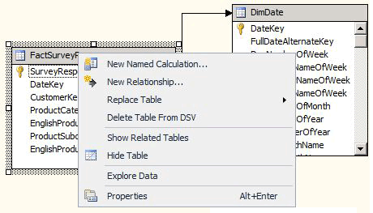

# Define Named Calculations in a Data Source View (Analysis Services)
  A named calculation is a SQL expression represented as a calculated column. This expression appears and behaves as a column in the table. A named calculation lets you extend the relational schema of existing tables or views in a data source view without modifying the tables or views in the underlying data source. Consider the following examples:  
  
-   Create a single named calculation that is derived from multiple columns in a fact table (for example, creating Tax Amount by multiplying a tax rate by a sales price).  
  
-   Construct a user friendly name for a dimension member.  
  
-   As a query performance enhancement, create a named calculation in the DSV instead of creating a calculated member in a cube. Named calculations are calculated during processing whereas calculated members are calculated at query time.  
  
## Creating Named Calculations  
  
> [!NOTE]  
>  You cannot add a named calculation to a named query, nor can you base a named query on a table that contains a named calculation.  
  
 When you create a named calculation, you specify a name, the SQL expression, and, optionally, a description of the calculation. The SQL expression can refer to other tables in the data source view. After the named calculation is defined, the expression in a named calculation is sent to the provider for the data source and validated as the following SQL statement in which `<Expression>` contains the expression that defines the named calculation.  
  
```  
SELECT   
   <Table Name in Data Source>.*,   
   <Expression> AS <Column Name>   
FROM   
   <Table Name in Data Source> AS <Table Name in Data Source View>  
```  
  
 The data type of the column is determined by the data type of the scalar value returned by the expression. If the provider does not find any errors in the expression, the column is added to the table.  
  
 Columns referenced in the expression should not be qualified or should be qualified by the table name only. For example, to refer to the SaleAmount column in a table, `SaleAmount` or `Sales.SaleAmount` is valid, but `dbo.Sales.SaleAmount` generates an error.  
  
 The expression is not automatically enclosed between parentheses. Therefore, if an expression, such as a SELECT statement, requires parentheses, you must type the parentheses in the **Expression** box. For example, the following expression is valid only if you type the parentheses.  
  
```  
(SELECT Description FROM Categories WHERE Categories.CategoryID = CategoryID)  
```  
  
## Add or Edit a Named Calculation  
  
1.  In [!INCLUDE[ssBIDevStudioFull](../../includes/ssbidevstudiofull-md.md)], open the project or connect to the database that contains the data source view in which you wish to define a named calculation.  
  
2.  In Solution Explorer, expand the **Data Source Views** folder, then double-click the data source view.  
  
3.  Right-click the table in which you wish to define the named calculation in either the **Tables** or the **Diagram** pane, and then click **New Named Calculation**. Be sure to right-click on the table name, and not on an attribute. The menu should look like the following:  
  
       
  
    > [!NOTE]  
    >  To locate a table or view, you can use the **Find Table** option by either clicking the **Data Source View** menu or right-clicking in an open area of the **Tables** or **Diagram** panes.  
  
4.  In the **Create Named Calculations** dialog box, do the following:  
  
    -   In the **Column name** text box, type the name of the new column.  
  
    -   In the **Description** text box type a description for the new column.  
  
    -   In the **Expression** text box, type the expression that yields the content of the new column in the SQL dialect appropriate for the data provider.  
  
5.  Click **OK**.  
  
     The named calculation column appears as the last column in the data source view table. A calculator symbol indicates that the column contains a named calculation.  
  
## Delete a Named Calculation  
 When you attempt to delete a named calculation, you are prompted with a list of the objects defined in the project or database that will be invalidated by the deletion. Review the list carefully before deleting the calculation.  
  
## See Also  
 [Define Named Queries in a Data Source View &#40;Analysis Services&#41;](define-named-queries-in-a-data-source-view-analysis-services.md)  
  
  
