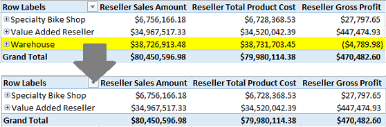

# Grant custom access to dimension data (Analysis Services)
  After enabling read access to a cube, you can set additional permissions that explicitly allow or deny access to dimension members (including measures contained in the Measures Dimension containing all of the measures used in a cube). For example, given multiple categories of resellers, you might want to set permissions to exclude data for a specific business type. The following illustration is a before-and-after effect of denying access to the Warehouse business type in the Reseller dimension.  
  
   
  
 By default, if you can read data from an [!INCLUDE[ssASnoversion](../../includes/ssasnoversion-md.md)] cube, you automatically have read permissions on all measures and dimension members associated with that cube. While this behavior might be sufficient for many scenarios, sometimes security requirements call for a more segmented authorization strategy, with varying levels of access for different users, on the same dimension.  
  
 You can restrict access by choosing which members to allow (AllowedSet) or deny (DeniedSet) access. You do this by either selecting or deselecting dimension members to include or exclude from the role.  
  
 Basic dimension security is the easiest; you simply select which dimension attributes and attribute hierarchies to include or exclude in the role. Advanced security is more complex and requires expertise in MDX scripting. Both approaches are described below.  
  
## Prerequisites  
 Not all measures or dimension members can be used in custom access scenarios. A connection will fail if a role restricts access to a default measure or member, or restricts access to measures that are part of measure expressions.  
  
 **Check for obstructions to dimension security: default measures, default members, and measures used in measure expressions**  
  
1.  In SQL Server Management Studio, right-click a cube and select **Script Cube as** | **ALTER To** | **New Query Editor Window**.  
  
2.  Search for `DefaultMeasure`. You should find one for the cube, and one for each perspective. When defining dimension security, avoid restricting access to default measures.  
  
3.  Next, search for `MeasureExpression`. A measure expression is a measure, based on a calculation, where the calculation often includes other measures. Verify that the measure you want to restrict is not used in an expression. Alternatively, go ahead and restrict access, just make sure to also exclude all references to that measure throughout the cube.  
  
4.  Finally, search for `DefaultMember`. Make a note of any attributes that serve as a default member of an attribute. Avoid putting restrictions on those attributes when setting up dimension security.  
  
## Basic dimension security  
  
1.  In [!INCLUDE[ssManStudioFull](../../includes/ssmanstudiofull-md.md)], connect to the instance of [!INCLUDE[ssASnoversion](../../includes/ssasnoversion-md.md)], expand **Roles** for the appropriate database in Object Explorer, and then click a database role (or create a new database role).  
  
     The role should already have read access to the cube. See [Grant cube or model permissions &#40;Analysis Services&#41;](grant-cube-or-model-permissions-analysis-services.md) if you need help with this step.  
  
2.  On **Dimension Data** | **Basic**, select the dimension for which you are setting permissions.  
  
3.  Choose the attribute hierarchy. Not all attributes will be available. Only those attributes having **AttributeHierarchyEnabled** appear in the **Attribute Hierarchy** list.  
  
4.  Choose which members to allow or deny access. Allowing access, through the **Select all members** option, is the default. We suggest you keep this default and then clear individual members that should not be visible to the Windows user and group accounts in the **Memberships** pane via this role. The advantage is that new members added in future processing operations are automatically available to people connecting through this role.  
  
     Alternatively, you can **Deselect all members** to revoke access overall, and then pick which members to allow. In future processing operations, new members are not visible until you manually edit dimension data security to allow access to them.  
  
5.  Optionally, click **Advanced** to enable `Visual Totals` for this attribute hierarchy. This option recalculates aggregations based on the members available through the role.  
  
    > [!NOTE]  
    >  When applying permissions that trim dimension members, aggregated totals are not recalculated automatically. Suppose the `All` member of an attribute hierarchy returns a count of 200 before permissions are applied. After applying permissions that deny access to some members, `All` still returns 200, even though the member values visible to the user are much less. To avoid confusing the consumers of your cube, you can configure the `All` member be the aggregate of just those members to which role members, rather than the aggregate of all of the members of the attribute hierarchy. To invoke this behavior, you can enable `Visual Totals` on the **Advanced** tab when configuring dimension security. Once enabled, the aggregate is calculated at query time rather than retrieved from pre-calculated aggregations. This can have a noticeable effect on query performance, so use it only when necessary.  
  
## Hiding measures  
 In [Grant custom access to cell data &#40;Analysis Services&#41;](grant-custom-access-to-cell-data-analysis-services.md), it was explained that fully hiding all visual aspects of a measure, and not just its cell data, requires permissions on dimension members. This section explains how to deny access to the object metadata of a measure.  
  
1.  On **Dimension Data** | **Basic**, scroll down the Dimension list until you reach cube dimensions, and then select **Measures Dimension**.  
  
2.  From the list of measures, clear the check box for measures that should not appear to users connecting via this role.  
  
> [!NOTE]  
>  Check the Prerequisites to learn how to identify measures that can break role security.  
  
## Advanced dimension security  
 If you have MDX expertise, another approach is to write MDX expressions that set the criteria for which members are allowed or denied access. Click **Create Role** | **Dimension Data** | **Advanced** to provide the script.  
  
 You can the MDX Builder to write the MDX statement. See [MDX Builder &#40;Analysis Services - Multidimensional Data&#41;](../mdx-builder-analysis-services-multidimensional-data.md) for details. The **Advanced** tab has the following options:  
  
 **Attribute**  
 Select the attribute for which you want to manage member security.  
  
 **Allowed member set**  
 The AllowedSet can resolve to no members (default), all members, or some members. If you allow access to an attribute and do not define any members of the allowed set, access to all members is granted. If you allow access to an attribute and define a specific set of attribute members, only the explicitly allowed members are visible.  
  
 Creating an AllowedSet has a ripple effect when the attribute participates in a multi-level hierarchy. For example, suppose a role allows access to Washington state (assume a scenario where the role is granting permissions to a company's Washington state sales division). For people connecting through this role, queries that include ancestors (United States) or descendants (Seattle and Redmond) will only see members in a chain including Washington state. Because other states are not explicitly allowed, the effect will be the same as if they were denied.  
  
> [!NOTE]  
>  If you define an empty set ({}) of attribute members, no members of the attribute will be visible to the database role. The absence of an allowed set is not interpreted as an empty set.  
  
 **Denied member set**  
 The DeniedSet property can resolve to no members, all members (default), or some attribute members. When the denied set contains only a specific set of attribute members, the database role is denied access only to those specific members, as well as descendants if the attribute is in a multi-level hierarchy. Consider the Washington state sales division example. If Washington is placed in the DeniedSet, people connecting through this role will see all other states except Washington and its descendent attributes.  
  
 Recall from the previous section that the denied set is a fixed collection. If processing subsequently introduces new members that should also be denied access, you will need to edit this role to add those members to the list.  
  
 **Default member**  
 The DefaultMember property determines the data set returned to a client when an attribute is not explicitly included in a query. When the attribute is not explicitly included, [!INCLUDE[ssASnoversion](../../includes/ssasnoversion-md.md)] uses one of the following default members for the attribute:  
  
-   If the database role defines a default member for the attribute, [!INCLUDE[ssASnoversion](../../includes/ssasnoversion-md.md)] uses this default member.  
  
-   If the database role does not define a default member for the attribute, [!INCLUDE[ssASnoversion](../../includes/ssasnoversion-md.md)] uses the default member that is defined for the attribute itself. The default member for an attribute, unless you specify otherwise, is the `All` member (unless the attribute is defined as non-aggregatable).  
  
 For example, suppose a database role specifies `Male` as the default member for the `Gender` attribute. Unless a query both explicitly includes the `Gender` attribute and specifies a different member for this attribute, [!INCLUDE[ssASnoversion](../../includes/ssasnoversion-md.md)] would return a data set that included only male customers. For more information about setting the default member, see [Define a Default Member](attribute-properties-define-a-default-member.md).  
  
 **Enable Visual Total**  
 The VisualTotals property indicates whether the aggregated cell values that are displayed are calculated according to all cell values or only according to the cell values that are visible to the database role.  
  
 By default, the VisualTotals property is disabled (set to `False`). This default setting maximizes performance because [!INCLUDE[ssASnoversion](../../includes/ssasnoversion-md.md)] can quickly calculate the total of all cell values, instead of having to spend time selecting which cells values to calculate.  
  
 However, having the VisualTotals property disabled could create a security issue if a user can use the aggregated cell values to deduce values for attribute members to which the user's database role does not have access. For example, [!INCLUDE[ssASnoversion](../../includes/ssasnoversion-md.md)] uses the values for three attribute members to calculate an aggregated cell value. The database role has access to view two of these three attribute members. Using the aggregated cell value, a member of this database role would be able to deduce the value for the third attribute member.  
  
 Setting VisualTotals property to `True` can eliminate this risk. When you enable the VisualTotals property, a database role can only view aggregated totals for dimension members to which the role has permission.  
  
 **Check**  
 Click to test the MDX syntax defined on this page.  
  
## See Also  
 [Grant cube or model permissions &#40;Analysis Services&#41;](grant-cube-or-model-permissions-analysis-services.md)   
 [Grant custom access to cell data &#40;Analysis Services&#41;](grant-custom-access-to-cell-data-analysis-services.md)   
 [Grant permissions on data mining structures and models &#40;Analysis Services&#41;](grant-permissions-on-data-mining-structures-and-models-analysis-services.md)   
 [Grant permissions on a data source object &#40;Analysis Services&#41;](grant-permissions-on-a-data-source-object-analysis-services.md)  
  
  
