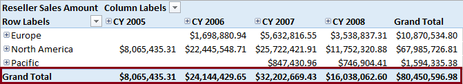
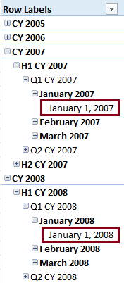
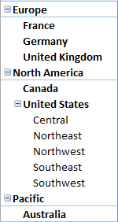
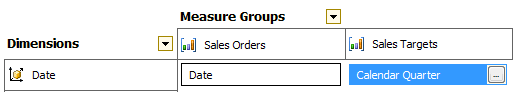

# Key Concepts in MDX (Analysis Services)
  Before you can use Multidimensional Expressions (MDX) to query multidimensional data or create MDX expressions within a cube, it helps to understand multidimensional concepts and terms.  
  
 The best place to start is with a data summarization example you already know, and then see how MDX relates to it. Here's a PivotTable created in Excel, populated with data from an Analysis Services sample cube.  
  
   
  
## Measures and Dimensions  
 An Analysis Services cube consists of measures, dimensions, and dimension attributes, all of which are evident in the PivotTable example.  
  
 **Measures** are numeric data values found in cells, aggregated as a sum, count, percentage, min, max, or average. Measure values are dynamic, calculated in real time, in response to user navigation and interaction with the PivotTable. In this example, the cells show Reseller Sales Amounts that increase or decrease based on whether you expand or collapse the axes. For any combination of Date (year, quarter, month, or date) and Sales Territory (Country group, Country, Region) you can get a Reseller Sales Amount, summed for that particular context. Other terms that are synonymous with measures are facts (in data warehouses) and calculated fields (in tabular and Excel data models).  
  
 **Dimensions** are on the column and row axes of a PivotTable, providing the meaning behind the measure. Dimensions are analogous to Tables in a relational data model. Common examples of a dimension include Time, Geography, Products, Customers, Employees, and so on. This example has two dimensions, Sales Territory on the rows, and Date across the top, but you could easily drag and drop other dimensions associated with Reseller Sales, such as Promotions or Products, to view sales performance along those dimensions. Your ability to explore data in interesting ways depends on the dimensions you create, and whether they are related to fact tables in your data source.  
  
 **Dimension attributes** are the named items within a dimension, similar to columns in a table. In this example, the Sales Territory dimension attributes consist of Country Group (Europe, North America, Pacific), Country (Canada, United States), and Region (Central, Northeast, Northwest, Southeast, Southwest).  
  
 Each attribute has a collection of data values, or members, associated with it. In our example, members of the Country Group attribute are Europe, North America, and Pacific. **Members** refers to the actual data values that belong to an attribute.  
  
> [!NOTE]  
>  One aspect of data modeling is to formalize the patterns and relationships that already exist within the data itself. When working with data that falls into a natural hierarchy, as is the case with countries-regions-cities, you can formalize that relationship by creating an **attribute relationship**. An attribute relationship is a one-to-many relationship between attributes, for example a relationship between a state and a city - a state has many cities, but a city belongs to just one state. Creating attribute relationships in the model speeds up query performance, so it's a best practice to create them if the data supports it. You can create an attribute relationship in Dimension Designer in SQL Server Data Tools. See [Define Attribute Relationships](attribute-relationships-define.md).  
  
 Inside Excel, model metadata shows up in the PivotTable field list.  Compare the PivotTable above to the field list below. Notice that the field list contains Sales Territory, Group, Country, Region (metadata), whereas the PivotTable contains just the members (data values). Knowing what the icons look like can help you easily relate the parts of a multidimensional model to a PivotTable in Excel.  
  
   
  
## Attribute Hierarchies  
 Almost without having to think about it, you know that values in a PivotTable go up or down as you expand and collapse the levels along each axis, but what makes this so? The answer lies in attribute hierarchies.  
  
 Collapse all the levels and notice the grand totals for each Country Group and Calendar Year. This value is derived from something called the **(All) member** within a hierarchy. The (All) member is the calculated value of all members in an attribute hierarchy.  
  
-   The (All) member for all Country Groups and Dates combined is $80,450,596.98  
  
-   The (All) member for CY2008 is $16,038,062.60  
  
-   The (All) member for Pacific is $1,594,335.38  
  
 Aggregations like this are pre-computed and stored in advance, which is part of the secret to fast query performance of Analysis Services.  
  
   
  
 Expand the hierarchy, and eventually you get to the lowest level. This is called the **leaf member**. A leaf member is a member of a hierarchy that has no children. In this example, Australia is the leaf member.  
  
   
  
 Anything above it is called a **parent member**. Pacific is the parent of Australia.  
  
 **Components of an attribute hierarchy**  
  
 Together, all these concepts build towards the concept of an **attribute hierarchy**. An attribute hierarchy is a tree of attribute members containing the following levels:  
  
-   A leaf level that contains each distinct attribute member, with each member of the leaf level also known as a **leaf member**.  
  
-   Intermediate levels if the attribute hierarchy is a parent-child hierarchy (more on that later).  
  
-   An (All) member that contains the aggregated value of all the child attributes. Optionally, you can hide or turn off the (All) level when it doesn't make sense for the data. For example, although Product Code is numeric, it wouldn't make sense to sum or average or otherwise aggregate all of the Product Codes.  
  
> [!NOTE]  
>  BI developers often set properties on the attribute hierarchy to achieve certain behaviors in client applications, or gain certain performance benefits. For example, you would set AttributeHierarchyEnabled=False on attributes for which the (All) member doesn't make sense. Alternatively, perhaps you simply want to hide the (All) member, in which case you would set AttributeHierarchyVisible=False. See [Dimension Attribute Properties Reference](dimension-attribute-properties-reference.md) for more details about properties.  
  
## Navigation Hierarchies  
 Within the PivotTable (at least in this example), row and column axes expand to show lower levels of attributes. An expandable tree is achieved through navigation hierarchies that you create in a model.  In the AdventureWorks sample model, the Sales Territory dimension has a multi-level hierarchy that begins with a Country Group, followed by Country, followed by Region.  
  
 As you can see, hierarchies are used to provide a navigation path in a PivotTable or other data summarization objects. There are two basic types: balanced and unbalanced.  
  
 **Balanced Hierarchies**  
  
|||  
|-|-|  
||A **balanced hierarchy** is a hierarchy in which the same number of levels exists between the top level and any leaf member.   A **natural hierarchy** is one that emerges naturally from the underlying data. A common example is Country-Region-State or Year-Month-Date or Category-Subcategory-Model, where each subordinate level flows predictably from the parent.   In a multidimensional model, most hierarchies are balanced hierarchies, and many of them are also natural hierarchies.   Another related modeling term is a `user-defined hierarchy`, often used as a contrast with attribute hierarchies. It simply means a hierarchy created by the BI developer, as opposed to attribute hierarchies that are automatically generated by Analysis Services when you define an attribute.|  
  
 **Unbalanced Hierarchies**  
  
|||  
|-|-|  
||A **ragged hierarchy** or **unbalanced hierarchy** is a hierarchy in which different numbers of levels exist between the top level and the leaf members. Again, it's a hierarchy created by the BI developer, but in this case there are gaps in the data.   In the AdventureWorks sample model, Sales Territory illustrates a ragged hierarchy because the United States has an additional level (Regions) that does not exist for other countries in this example.   Ragged hierarchies are a challenge to BI developers if the client application does not handle ragged hierarchies in an elegant manner. In Analysis Services model, you can build a **parent-child hierarchy** that explicitly defines a relationship among multi-level data, eliminating any ambiguity as to how one level relates to the next. See [Parent-Child Hierarchy](parent-child-dimension.md) for details.|  
  
## Key Attributes  
 Models are a collection of related objects that rely on keys and indexes to make the associations. Analysis Services models are no different. For each dimension (recall it is equivalent to a table in a relational model), there is a key attribute. The **key attribute** is used in foreign key relationships to the fact table (measure group). All non-key attributes in the dimension are linked (directly or indirectly) to the key attribute.  
  
 Often, but not always, the key attribute is also the **Granularity Attribute**. Granularity refers to the level of detail or precision within the data. Again, a common example offers the quickest path to understanding. Consider date values: For daily sales, you need date values specified to the day; for quotas, quarterly might be sufficient, but if your analytical data consists of race results from a sporting event, the grain might very well need to be milliseconds. The level of precision in your data values is the grain.  
  
 Currency is another example: a financial application might track monetary values out to many decimal places, whereas your local school's fund raiser might only need values to the nearest dollar. Understanding grain is important because you want to avoid storing unnecessary data. Trimming milliseconds from a timestamp, or pennies from a sales amount, can save storage and processing time when that level of detail is not relevant to your analysis.  
  
 To set the granularity attribute, use the Dimension Usage tab in Cube Designer in SQL Server Data Tools. In the AdventureWorks sample model, the key attribute of the Date dimension is the Date key. For Sales Orders, the granularity attribute is equivalent to the key attribute. For Sales Targets, the level of granularity is quarterly, and so the granularity attribute is set to Calendar Quarter, accordingly.  
  
   
  
> [!NOTE]  
>  If the granularity attribute and the key attribute are different, all non-key attributes must be linked, directly or indirectly, to the granularity attribute. Within a cube, the granularity attribute defines a dimension's granularity.  
  
## Query Scope (Cube Space)  
 Scope of a query refers to the boundaries within which data is being selected. It can range from the entire cube (a cube is the largest query object) to a cell.  
  
 **Cube space** is the product of the members of a cube's attribute hierarchies with the cube's measures.  
  
 **Subcube** is a subset of a cube that represents a filtered view of the cube. Subcubes can be defined with a Scope statement in the MDX calculation script, or in a subselect clause in an MDX query or as a session cube.  
  
 **Cell** refers to the space at the intersection of a member of the measures dimension member and a member from each attribute hierarchy in a cube.  
  
## Other Modeling Terms  
 This section is a collection of concepts and terms that don't fit easily into other sections, but you still need to know about.  
  
 **Calculated member** is a dimension member that is defined and calculated at query time. A calculated member can be defined in a user query or in the MDX calculation script and stored on the server. A calculated member corresponds to rows in the dimension table of the dimension in which it is defined.  
  
 **Distinct Count** is a special type of measure used for data items that should only be counted once. The AdventureWorks sample model includes distinct count measures for Internet Orders, Reseller Orders, and Sales Orders.  
  
 **Measure groups** are a collection of one or more measures. Mostly these are user-defined, and you use them to keep related measures together. Distinct count measures are an exception. These are always placed in a dedicated measure group that contains only the distinct measure. You can't see the measure group in the PivotTable example illustration, but it does appear in a PivotTable field list, as a named collection of measures.  
  
 **Measures dimension** is the dimension that contains all of the measures in a cube. It's not exposed in a multidimensional model that you build in SQL Server Data Tools, but it exists just the same. Because it contains measures, all of the members of a measures dimension are typically aggregated (generally by sum or by count).  
  
 **Database Dimensions and Cube Dimensions**. Within a model, you can define standalone dimensions that are then included in any number of cubes in the same model. When you add a dimension to a cube, it's called a cube dimension. By itself within a project, as a standalone item in Object Explorer, it's called a database dimension. Why make the distinction? Because you can set properties on them independently. In product documentation, you'll see both terms used, so it's worthwhile to understand what they mean.  
  
## Next Steps  
 Now that you have a grasp of important concepts and terminology, you can continue on to these additional topics that further explain fundamental concepts in Analysis Services:  
  
-   [The Basic MDX Query &#40;MDX&#41;](mdx/mdx-query-the-basic-query.md)  
  
-   [The Basic MDX Script &#40;MDX&#41;](mdx/the-basic-mdx-script-mdx.md)  
  
-   [Multidimensional Modeling &#40;Adventure Works Tutorial&#41;](../multidimensional-modeling-adventure-works-tutorial.md)  
  
## See Also  
 [Cube Space](mdx/cube-space.md)   
 [Tuples](mdx/tuples.md)   
 [Autoexists](mdx/autoexists.md)   
 [Working with Members, Tuples, and Sets &#40;MDX&#41;](mdx/working-with-members-tuples-and-sets-mdx.md)   
 [Visual Totals and Non Visual Totals](mdx/visual-totals-and-non-visual-totals.md)   
 [MDX Query Fundamentals &#40;Analysis Services&#41;](mdx/mdx-query-fundamentals-analysis-services.md)   
 [MDX Scripting Fundamentals &#40;Analysis Services&#41;](mdx/mdx-scripting-fundamentals-analysis-services.md)   
 [MDX Language Reference &#40;MDX&#41;](/sql/mdx/mdx-language-reference-mdx)   
 [Multidimensional Expressions &#40;MDX&#41; Reference](/sql/mdx/multidimensional-expressions-mdx-reference)  
  
  
