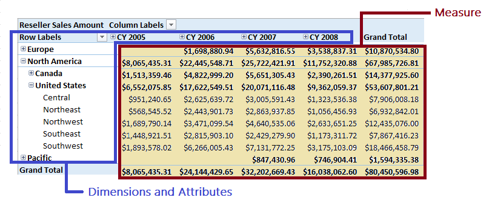
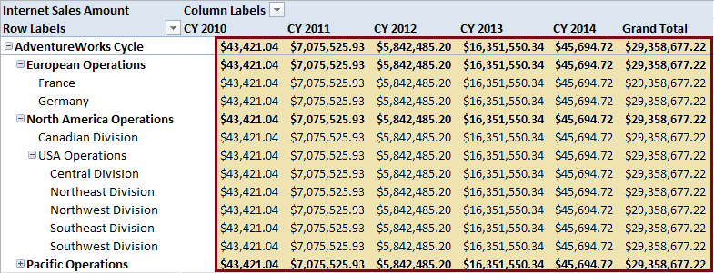

# Measures and Measure Groups
  A cube includes *measures* in *measure groups*, business logic, plus a collection of dimensions that give context for evaluating the numerical data that a measure provides. Both measures and measure groups are an essential component of a cube. A cube cannot exist without at least one of each.  
  
 This topic describes [Measures](#bkmk_measure) and [Measure Groups](#bkmk_mg). It also contains the following table, with links to procedural steps for creating and configuring measures and measure groups.  
  
|**Link**|**Description**|  
|--------------|---------------------|  
|[Create Measures and Measure Groups in Multidimensional Models](create-measures-and-measure-groups-in-multidimensional-models.md)|Choose from one of several approaches for creating measures and measure groups.|  
|[Configure Measure Properties](configure-measure-properties.md)|If you used the Cube Wizard to start your cube, you might need to change the aggregation method, apply a data format, set the visibility of the measure in client applications, or possibly add a measure expression to manipulate the data before values are aggregated.|  
|[Configure Measure Group Properties](configure-measure-group-properties.md)|In a multidimensional model, a measure group equates to a fact table in the source data warehouse. Properties on a measure group allow you to specify caching behaviors, storage, and processing directives that operate collectively at the measure group level. Partition configuration is partly determined by the properties you set on measure group objects.|  
|[Use Aggregate Functions](use-aggregate-functions.md)|Understand the aggregation methods that can be assigned to a measure.|  
|[Define Semiadditive Behavior](define-semiadditive-behavior.md)|Semiadditive behavior refers to aggregations that are valid for some dimensions but not others. A common example is a bank account balance. You might want to aggregate balances by customer and region, but not time. For example, you would not want to add balances from the same account over consecutive days. To define semiadditive behavior,   use the Add Business Intelligence Wizard.|  
|[Linked Measure Groups](linked-measure-groups.md)|Repurpose an existing measure group in other cubes in the same database or in different Analysis Services databases.|  
  
##   Measures  
 A measure represents a column that contains quantifiable data, usually numeric, that can be aggregated. Measures represent some aspect of organizational activity, expressed in monetary terms (such as revenue, margins, or costs) or as counts (inventory levels, number of employees, customers, or orders), or as a more complex calculation that incorporates business logic.  
  
 Every cube must have at least one measure, but most have many, sometimes numbering in the hundreds. Structurally, a measure is often mapped to a source column in a fact table, with the column providing the values used to load the measure. Alternatively, you can also define a measure using MDX.  
  
 Measures are context-sensitive, operating on numeric data in a context that is determined by whichever dimension members happen to be included in the query. For example, a measure that calculates **Reseller Sales** will be backed by a `Sum` operator, and it will add the sales amounts for each dimension member included in the query. Whether the query specifies individual products, rolls up to a category, or is sliced by time or geography, the measure should produce an operation that is valid for the dimensions included in the query.  
  
 In this example **Reseller Sales** aggregates to various levels along the **Sales Territory** hierarchy.  
  
   
  
 Measures produce valid results when the fact table that contains the numeric source data also contains pointers to dimension tables that are used in the query. Using the Reseller Sales example, if each row storing a sales amount also stores a pointer to a product table, a date table, or a sales territory table, then queries that include members from those dimension will resolve correctly.  
  
 What happens if the measure is unrelated to the dimensions used in query? Typically, Analysis Services will show the default measure, and the value will be the same for all members. In this example, **Internet Sales**, which measure direct sales placed by customers using the online catalog, has no relationship to the sales organization.  
  
   
  
 To minimize the chances of encountering these behaviors in a client application, you could build multiple cubes or perspectives within the same database, and ensure that each cube or perspective contains only related objects. The relationships you need to check are between the measure group (mapped to the fact table) and the dimensions.  
  
##   Measure Groups  
 In a cube, measures are grouped by their underlying fact tables into measure groups. Measure groups are used to associate dimensions with measures. Measure groups are also used for measures that have distinct count as their aggregation behavior. Placing each distinct count measure into its own measure group optimizes aggregation processing.  
  
 A simple <xref:Microsoft.AnalysisServices.MeasureGroup> object is composed of basic information like the group name, storage mode, and processing mode. It also contains its constituent parts; the measures, dimensions, and partitions that form the composition of the measure group.  
  
## See Also  
 [Cubes in Multidimensional Models](cubes-in-multidimensional-models.md)   
 [Create Measures and Measure Groups in Multidimensional Models](create-measures-and-measure-groups-in-multidimensional-models.md)  
  
  
