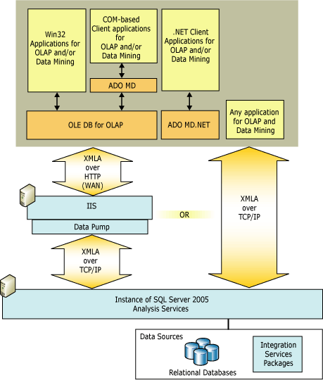
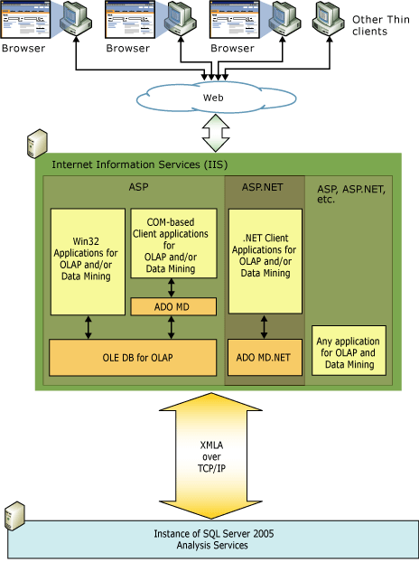

# Client Architecture Requirements for Analysis Services Development
  [!INCLUDE[msCoName](../../../includes/msconame-md.md)] [!INCLUDE[ssNoVersion](../../../includes/ssnoversion-md.md)] [!INCLUDE[ssASnoversion](../../../includes/ssasnoversion-md.md)] supports a thin-client architecture. The [!INCLUDE[ssASnoversion](../../../includes/ssasnoversion-md.md)] calculation engine is entirely server-based, so all queries are resolved on the server. As a result, only a single round trip between the client and the server is required for each query, resulting in scalable performance as queries increase in complexity.  
  
 The native protocol for [!INCLUDE[ssASnoversion](../../../includes/ssasnoversion-md.md)] is XML for Analysis (XML/A). [!INCLUDE[ssASnoversion](../../../includes/ssasnoversion-md.md)] provides several data access interfaces for client applications, but all of these components communicate with an instance of [!INCLUDE[ssASnoversion](../../../includes/ssasnoversion-md.md)] using XML for Analysis.  
  
 Several different providers are provided with [!INCLUDE[ssASnoversion](../../../includes/ssasnoversion-md.md)] to support different programming languages. A provider communicates with an [!INCLUDE[ssASnoversion](../../../includes/ssasnoversion-md.md)] server by sending and receiving XML for Analysis in SOAP packets over TCP/IP or over HTTP through Internet Information Services (IIS). An HTTP connection uses a COM object instantiated by IIS, called a data pump, which acts as a conduit for [!INCLUDE[ssASnoversion](../../../includes/ssasnoversion-md.md)] data. The data pump does not examine the underlying data contained in the HTTP stream in any way, nor are any of the underlying data structures available to any of the code in the data library itself.  
  
   
  
 Win32 client applications can connect to an [!INCLUDE[ssASnoversion](../../../includes/ssasnoversion-md.md)] server using OLE DB for OLAP interfaces or the Microsoft® ActiveX® Data Objects (ADO) object model for Component Object Model (COM) automation languages, such as Microsoft Visual Basic®. Applications coded with .NET languages can connect to an [!INCLUDE[ssASnoversion](../../../includes/ssasnoversion-md.md)] server using ADOMD.NET.  
  
 Existing applications can communicate with [!INCLUDE[ssASnoversion](../../../includes/ssasnoversion-md.md)] without modification simply by using one of the [!INCLUDE[ssASnoversion](../../../includes/ssasnoversion-md.md)] providers.  
  
|Programming Language|Data Access Interface|  
|--------------------------|---------------------------|  
|C++|OLE DB for OLAP|  
|Visual Basic 6|ADO MD|  
|.NET languages|ADO MD.NET|  
|Any language that supports SOAP|XML for Analysis|  
  
 [!INCLUDE[ssASnoversion](../../../includes/ssasnoversion-md.md)] has a Web architecture with a fully scalable middle tier for deployment by both small and large organizations. [!INCLUDE[ssASnoversion](../../../includes/ssasnoversion-md.md)] provides broad middle tier support for Web services. ASP applications are supported by OLE DB for OLAP and ADO MD, ASP.NET applications are supported by ADOMD.NET. The middle tier, illustrated in the following figure, is scalable to many concurrent users.  
  
   
  
 Both client and middle tier applications can communicate directly with [!INCLUDE[ssASnoversion](../../../includes/ssasnoversion-md.md)] without using a provider. Client and middle tier applications may send XML for Analysis in SOAP packets over TCP/IP, HTTP, or HTTPS. The client may be coded using any language that supports SOAP. Communication in this case is most easily managed by Internet Information Services (IIS) using HTTP, although a direct connection to the server using TCP/IP may also be coded. This is the thinnest possible client solution for [!INCLUDE[ssASnoversion](../../../includes/ssasnoversion-md.md)].  
  
## Analysis Services in Tabular or SharePoint Mode  
 In [!INCLUDE[ssCurrent](../../../includes/sscurrent-md.md)], the server can be started in xVelocity in-memory analytics engine (VertiPaq) mode for tabular databases and for [!INCLUDE[ssGemini](../../../includes/ssgemini-md.md)] workbooks that have been published to a SharePoint site.  
  
 [!INCLUDE[ssGeminiClient](../../../includes/ssgeminiclient-md.md)] and [!INCLUDE[ssBIDevStudioFull](../../../includes/ssbidevstudiofull-md.md)] are the only client environments that are supported for creating and querying in-memory databases that use SharePoint or Tabular mode, respectively. The embedded PowerPivot database that you create by using the Excel and [!INCLUDE[ssGemini](../../../includes/ssgemini-md.md)] tools is contained within the Excel workbook, and is saved as part of the Excel .xlsx file.  
  
 However, a [!INCLUDE[ssGemini](../../../includes/ssgemini-md.md)] workbook can use data that is stored in a traditional cube if you import the cube data into the workbook. You can also import data from another [!INCLUDE[ssGemini](../../../includes/ssgemini-md.md)] workbook if it has been published to a SharePoint site.  
  
> [!NOTE]  
>  When you use a cube as a data source for a [!INCLUDE[ssGemini](../../../includes/ssgemini-md.md)] workbook, the data that you get from the cube is defined as an MDX query; however, the data is imported as a flattened snapshot. You cannot interactively work with the data or refresh the data from the cube.  
  
### Interfaces for PowerPivot Client  
 [!INCLUDE[ssGemini](../../../includes/ssgemini-md.md)] interacts with the xVelocity in-memory analytics engine (VertiPaq) storage engine within the workbook by using the established interfaces and languages for Analysis Services: AMO and ADOMD.NET, and MDX and XMLA. Within the add-in, measures are defined by using a formula language similar to Excel, Data Analysis Expressions (DAX). DAX expressions are embedded within the XMLA messages that are sent to the in-process server.  
  
### Providers  
 Communications between [!INCLUDE[ssGemini](../../../includes/ssgemini-md.md)] and Excel use the MSOLAP OLEDB provider (version 11.0). Within the MSOLAP provider, there are four different modules, or transports, that can be used for sending messages between the client and server.  
  
 **TCP/IP** Used for normal client-server connections.  
  
 **HTTP** Used for HTTP connections via the SSAS data pump service, or by a call to the SharePoint PowerPivot Web Service (WS) component.  
  
 **INPROC** Used for connections to the in-process engine.  
  
 **CHANNEL** Reserved for communications with the PowerPivot System Service in the SharePoint farm.  
  
## See Also  
 [OLAP Engine Server Components](olap-engine-server-components.md)  
  
  
