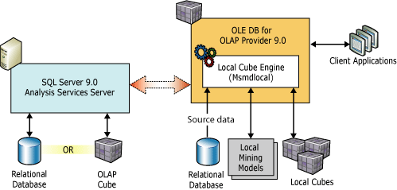

# Local Cubes (Analysis Services - Multidimensional Data)
  To create, update or delete local cubes, you must write and execute either an ASSL script or an AMO program.  
  
 Local cubes and local mining models allow analysis on a client workstation while it is disconnected from the network. For example, a client application might call the OLE DB for OLAP 9.0 Provider (MSOLAP.3), which loads the local cube engine to create and query local cubes, as shown in the following illustration:  
  
   
  
 ADMOD.NET and Analysis Management Objects (AMO) also load the local cube engine when interacting with local cubes. Only a single process can access a local cube file, because the local cube engine exclusively locks a local cube file when it establishes a connection to the local cube. With a process, up to five simultaneous connections are permitted.  
  
 A .cub file may contain more than one cube or data mining model. Queries to the local cubes and data mining models are handled by the local cube engine and do not require a connection to an [!INCLUDE[ssASnoversion](../../../includes/ssasnoversion-md.md)] instance.  
  
> [!NOTE]  
>  The use of [!INCLUDE[ssManStudioFull](../../../includes/ssmanstudiofull-md.md)] and [!INCLUDE[ssBIDevStudioFull](../../../includes/ssbidevstudiofull-md.md)] to manage local cubes is not supported.  
  
## Local Cubes  
 A local cube can be created and populated from either an existing cube in an [!INCLUDE[ssASnoversion](../../../includes/ssasnoversion-md.md)] instance or from a relational data source.  
  
|Source for data for local cube|Creation method|  
|------------------------------------|---------------------|  
|Server-based cube|You can use either the CREATE GLOBAL CUBE statement or an [!INCLUDE[ssASnoversion](../../../includes/ssasnoversion-md.md)] Scripting Language (ASSL) script to create and populate a cube from a server-based cube. For more information, see [CREATE GLOBAL CUBE Statement  &#40;MDX&#41;](/sql/mdx/mdx-data-definition-create-global-cube) or [Analysis Services Scripting Language &#40;ASSL&#41; Reference](https://docs.microsoft.com/bi-reference/assl/analysis-services-scripting-language-assl-for-xmla).|  
|Relational data source|You use an ASSL script to create and populate a cube from an OLE DB relational database. To create a local cube using ASSL, you simply connect to a local cube file (*.cub) and execute the ASSL script in the same manner as executing an ASSL script against an [!INCLUDE[ssASnoversion](../../../includes/ssasnoversion-md.md)] instance to create a server cube. For more information, see [Analysis Services Scripting Language &#40;ASSL&#41; Reference](https://docs.microsoft.com/bi-reference/assl/analysis-services-scripting-language-assl-for-xmla).|  
  
 Use the REFRESH CUBE statement to rebuild a local cube and update its data. For more information, see [REFRESH CUBE Statement &#40;MDX&#41;](/sql/mdx/mdx-data-definition-refresh-cube).  
  
### Local Cubes Created from Server-based Cubes  
 When creating local cubes created from server-based cubes, the following considerations apply:  
  
-   Distinct count measures are not supported.  
  
-   When you add a measure, you must also include at least one dimension that is related to the measure being added. For more information about dimension relationships to measure groups, see [Dimension Relationships](../../multidimensional-models-olap-logical-cube-objects/dimension-relationships.md).  
  
-   When you add a parent-child hierarchy, levels and filters on a parent-child hierarchy are ignored and the entire parent-child hierarchy is included.  
  
-   Member properties are not created.  
  
-   When you include a semi-additive measure, no slices are permitted on either the Account or the Time dimension.  
  
-   Reference dimensions are always materialized.  
  
-   When you include a many-to-many dimension, the following rules apply:  
  
    -   You cannot slice the many-to-many dimension.  
  
    -   You must add a measure from the intermediary measure group.  
  
    -   You cannot slice any of the dimensions common to the two measure groups involved in the many-to-may relationship.  
  
-   Only those calculated members, named sets, and assignments that rely upon measures and dimensions added to the local cube will appear in the local cube. Invalid calculated members, named sets, and assignments will be automatically excluded.  
  
### Security  
 In order for a user to create a local cube from a server cube, the user must be granted **Drillthrough and Local Cube** permissions on the server cube. For more information, see [Grant cube or model permissions &#40;Analysis Services&#41;](../../multidimensional-models/grant-cube-or-model-permissions-analysis-services.md).  
  
 Local cubes are not secured using roles like server cubes. Anyone with file-level access to a local cube file can query cubes in it. You can use the `Encryption Password` connection property on a local cube file to set a password on the local cube file. Setting a password on a local cube file requires all future connections to the local cube file to use this password in order to query the file.  
  
## See Also  
 [CREATE GLOBAL CUBE Statement  &#40;MDX&#41;](/sql/mdx/mdx-data-definition-create-global-cube)   
 [Developing with Analysis Services Scripting Language &#40;ASSL&#41;](../scripting-language-assl/developing-with-analysis-services-scripting-language-assl.md)   
 [REFRESH CUBE Statement &#40;MDX&#41;](/sql/mdx/mdx-data-definition-refresh-cube)  
  
  
