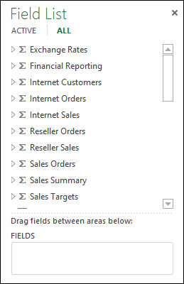
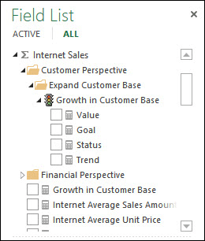
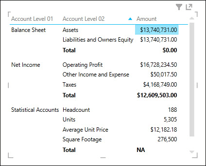
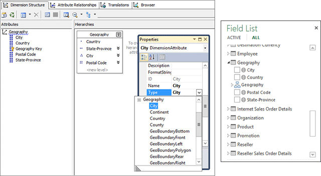
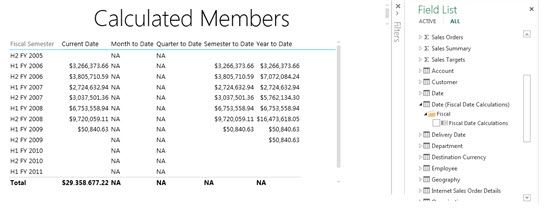
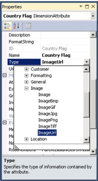
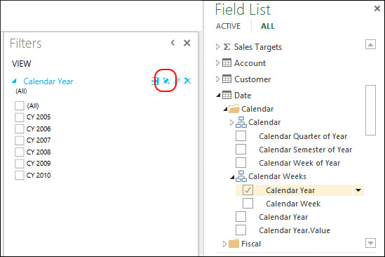

# Understanding Power View for Multidimensional Models
  This article describes the Power View for Multidimensional Models feature in Microsoft SQL Server 2014, and provides important information for BI professionals and administrators who intend to implement Power View for Multidimensional Models in their organization.  
  
 Multidimensional models provide industry leading OLAP data modeling, storage, and analysis solutions. Multidimensional models in SQL Server 2014 support ad-hoc data analysis, exploration, and visualization by using Microsoft Power View.  
  
 Power View is a thin web client that launches in the browser from a shared Report Data Source (.rsds) file in a SharePoint library. The Report Data Source acts as a bridge between the client and the back-end data source. The back-end data source can be a PowerPivot workbook in SharePoint, a Tabular model on an Analysis Services server running in Tabular mode, or a Multidimensional model on an Analysis Services server running in Multidimensional mode. Power View reports can then be saved to a SharePoint library or gallery and shared with other members in your organization.  
  
 **Power View for Multidimensional Models architecture**  
  
   
  
## Prerequisites  
 **Server Requirements**  
  
-   SQL Server 2014 Enterprise or Business Intelligence edition with Analysis Services running in Multidimensional mode.  
  
-   SQL Server 2014 Reporting Services Add-in for Microsoft SharePoint Server 2010 or 2013 Enterprise Edition.  
  
 **Client Requirements**  
  
-   Power View client functionality requires Microsoft Silverlight 5. For more information, see [Planning for Reporting Services and Power View Browser Support &#40;Reporting Services 2014&#41;](../../reporting-services/browser-support-for-reporting-services-and-power-view.md).  
  
## Features  
 **Native support for Power View**  
  
 With this release, multidimensional models support analysis and visualization by using Power View in SharePoint mode. No special configuration of your multidimensional models is necessary. There are however some differences in how multidimensional model objects are displayed in Power View compared to other client tools such as Microsoft Excel and Microsoft Performance Point. This release does not support analysis and visualization of multidimensional models by using Power View in Excel 2013.  
  
 **Native support for DAX queries**  
  
 With this release, multidimensional models support DAX queries and functions in addition to more traditional MDX queries. Some DAX functions, such as PATH, are not applicable in multidimensional modeling. For a better understanding of DAX and how it compares to MDX, see [Data Analysis Expressions and MDX](https://msdn.microsoft.com/library/ff487170\(SQL.105\).aspx).  
  
## Multidimensional to tabular object mapping  
 Analysis Services provides a tabular model metadata representation of a multidimensional model. Objects in a multidimensional model are represented as tabular objects in Power View and in CSDL out with BI annotations.  
  
 **Object mapping summary**  
  
|Multidimensional Object|Tabular Object|  
|-----------------------------|--------------------|  
|Cube|Model|  
|Cube Dimension|Table|  
|Dimension Attributes (Key(s), Name)|Column|  
|Measure Group|Table|  
|Measure|Measure|  
|Measure without Measure Group|In a table named Measures|  
|Measure Group Cube Dimension Relationship|Relationship|  
|Perspective|Perspective|  
|KPI|KPI|  
|User/Parent-Child Hierarchies|Hierarchy|  
|Display Folder|Display Folder|  
  
## Measures, measure groups, and KPIs  
  
> [!NOTE]  
>  Some images and text in this article refer to the Adventure Works Multidimensional Model for SQL Server 2012 sample database.  
  
 Measure groups in a multidimensional cube are seen in the Power View Field List as tables with the sigma (∑) sign.  
  
 **Measure groups in the Power View Field List**  
  
   
  
 Measures within a measure group appear as measures. If there are calculated measures that do not have an associated measure group, they will be grouped under a special table called Measures.  
  
 To help simplify more complex multidimensional models, model authors can define a set of measures or KPIs in a cube to be located within a display folder. Power View can show display folders and the measures and KPIs in them.  
  
 **Measures and KPIs in a measure group**  
  
   
  
### Measures as variants  
 Measures in multidimensional models are variants. This means the measures are not strongly typed and can have different data types. For example, in the image below, the Amount measure in the Financial Reporting table by default is Currency data type, but also has a string value "NA" for the sub-total of "Statistical Accounts", which is String data type. Power View recognizes certain measures as variants and shows the correct values and formatting in the different visualizations.  
  
 **Measure as variant**  
  
   
  
### Implicit measures  
 Tabular models provide users the ability to create *implicit* measures such as count, sum, or average on fields. For multidimensional models, because dimension attribute data is stored is stored differently, querying implicit measures can take a long time. Because of this, implicit measures are not available in Power View.  
  
## Dimensions, attributes, and hierarchies  
 Cube dimensions are exposed as tables in tabular metadata. In the Power View Field List, dimension attributes are shown as columns within display folders.  The dimension attributes that have the AttributeHierarchyEnabled property set to false; for example: Birth Date attribute in Customer dimension, or AttributeHierarchyVisible property set to false will not appear in the Power View Field List. Multi-level hierarchies or user hierarchies; for example Customer Geography in the Customer dimension, are exposed as hierarchies in the Power View Field List. Hidden UnknownMembers of a dimension attribute are exposed in DAX Queries and in Power View.  
  
 **Dimension, attributes and hierarchies in SQL Server Data Tools (SSDT) and Power View Field List**  
  
   
  
### Dimension attribute type  
 Multidimensional models support associating dimension attributes with specific dimension attribute types. The image below shows the Geography dimension where the City, State-Province, Country and Postal Code dimension attributes have geography types associated with them. These are exposed in the tabular metadata. Power View recognizes the metadata enabling users to create map visualizations. This is indicated by the map icon next to the City, Country, Postal Code and State-Province columns in the Geography table in the Power View Field List.  
  
 **Dimension attribute geography types in SSDT and Power View Field List**  
  
   
  
### Dimension calculated members  
 Multidimensional models support calculated members for child of All with a single real member. Additional constraints while exposing this type of calculated member are:  
  
-   Must be a single real member when the dimension has more than one attribute.  
  
-   An attribute containing calculated members cannot be the key attribute of the dimension unless it is the only attribute.  
  
-   An attribute containing calculated members cannot be a parent-child attribute.  
  
 Calculated members of user hierarchies are not exposed in Power View; however, end-users will still be able to connect to a cube containing calculated members on user hierarchies.  
  
 The image below shows a Power View report for a cube that contains time-intelligence calculated members on dimension attribute "Fiscal Date Calculations" in the Date dimension.  
  
 **Power View report with calculated members**  
  
   
  
### Default members  
 Multidimensional models support default members for dimension attributes. The default member is used by Analysis Services when aggregating data for a query. The default member of a dimension attribute is exposed as default value or filter for the corresponding column in the tabular metadata.  
  
 Power View behaves much the same as Excel PivotTables when attributes are applied. When a user adds a column to a Power View visualization (table, matrix, or chart) that contains a default value, the default value will not be applied and all available values are shown. If the user adds the column to Filters, the default value will be applied.  
  
### Dimension security  
 Multidimensional models support dimension and cell level security through roles. A user connecting to a cube by using Power View is authenticated and evaluated for appropriate permissions. When dimension security is applied, the respective dimension members will not be seen by the user in Power View; however if a user has a cell security permission defined where certain cells are restricted, then that user cannot connect to the cube with Power View. In some cases, users can see aggregate data when portions of that data are calculated from secured data.  
  
### Non-aggregatable attributes/hierarchies  
 In a multidimensional model, attributes of a dimension can have the IsAggregatable property set to false. This means the model author has specified client applications should not aggregate the data across hierarchies (attribute or multi-level) when they query the data. In Power View, this dimension attribute is exposed as a column for which sub-totals are not available. In the image below, you can see an example of a non-aggregatable hierarchy: Accounts. The top-most level of the Accounts parent-child hierarchy is non-aggregatable while other levels are aggregatable. In a matrix visualization of the Accounts hierarchy (first two levels), you see sub-totals for Account Level 02 but not for the top-most level, Account Level 01.  
  
 **Non-aggregatable hierarchy in Power View**  
  
   
  
## Images  
 Power View provides the ability to render images. In multidimensional models, one of the ways you can provide images to Power View is to expose columns containing URLs (Uniform Resource Locator) of the images. With this release, Analysis Services supports tagging dimension attributes as type ImageURL. This data type is then provided to Power View in the tabular metadata. Power View can then download and display the images specified in the URLs within visualizations.  
  
 **ImageURL dimension attribute type in SSDT**  
  
   
  
## Parent-child hierarchies  
 Multidimensional models support parent-child hierarchies, which are exposed as a hierarchy in the tabular metadata. Each level of the parent-child hierarchy is exposed as a hidden column. The key attribute of the parent-child dimension is not exposed in the tabular metadata.  
  
 **Parent-child hierarchies in Power View**  
  
   
  
## Perspectives and translations  
 Perspectives are views of cubes where only certain dimensions or measure groups are visible in client tools. You can specify a perspective name as a value to the Cube connection string property. For example, in the following connection string, 'Direct Sales' is a perspective in the multidimensional model:  
  
 `Data Source=localost;Initial Catalog=AdventureWorksDW-MD;Cube='Direct Sales'`  
  
 Cubes can have metadata and data translations specified for various Languages within the model. In order to see the translations (data and metadata) you need to add the optional "Locale Identifier" property to the connection string in the RSDS file as shown below.  
  
 `Data Source=localost;Initial Catalog=AdventureWorksDW-MD;Cube='Adventure Works'; Locale Identifier=3084`  
  
 When Power View connects to a multidimensional model with an .rsds file that has a Locale Identifier, and if a corresponding translation is contained in the cube, users will see the translations in Power View.  
  
 For more information, see [Create a Report Data Source](create-a-report-data-source.md).  
  
## Power View pinned filters  
 Power View reports can contain multiple views. With this release, the *Pin Filter* feature for both tabular and multidimensional models provides the ability to create filters that apply across all views in a report. The image below shows the Pin filter toggle button for a view filter. By default, a view filter is unpinned and applies only to that view. Pinning a view filter applies it to all views; unpinning it removes it from other views.  
  
 **Pinned Filters**  
  
   
  
## Unsupported features  
 **Power View in Excel 2013** - does not support connecting to and creating reports for multidimensional models. Power View for multidimensional models supports browser based Power View clients only.  
  
 **Actions** - are not supported in Power View reports or in DAX queries against a multidimensional model.  
  
 **Named sets** - in multidimensional models, are not supported in Power View or in DAX queries against a multidimensional model.  
  
> [!NOTE]  
>  Unsupported Actions and Named sets do not prevent users from connecting to and exploring multidimensional models using Power View.  
  
 **Cell level security** - is not supported in Power View reports.  
  
## CSDLBI Annotations  
 Multidimensional cube metadata is exposed as an Entity Data Model (EDM) based conceptual model by Conceptual Schema Definition Language with Business Intelligence annotations (CSDLBI).  
  
 Multidimensional metadata is represented as a tabular model namespace in a CSDLBI document, or CSDL out, when a DISCOVER_CSDL_METADATA request is sent to the Analysis Services instance.  
  
 **Sample DISCOVER_CSDL_METADATA request**  
  
```  
<Envelopexmlns="http://schemas.xmlsoap.org/soap/envelope/">  
   <Body>  
      <Discoverxmlns="urn:schemas-microsoft-com:xml-analysis">  
         <RequestType>DISCOVER_CSDL_METADATA</RequestType>  
         <Restrictions>  
            <RestrictionList>  
              <CATALOG_NAME>"catalogname"<CATALOG_NAME>  
            </RestrictionList>  
         </Restrictions>  
         <Properties>  
            <PropertyList>  
            </PropertyList>  
         </Properties>  
      </Discover>  
   </Body>  
</Envelope>  
  
```  
  
 DISCOVER_CSDL_METADATA request has the following restrictions:  
  
|Name|Required|Description|  
|----------|--------------|-----------------|  
|CATALOG_NAME|Yes|The catalog\database name.|  
|PERSPECTIVE_NAME|Yes, if the cube contains more than one perspective. Optional if there is only one cube or there is a default perspective.|The cube name or perspective name in the multidimensional database.|  
|VERSION|Yes|CSDL version requested by client. Multidimensional features and constructs are supported in version 2.0.|  
  
 The return CSDL out document represents the model as a namespace, containing entities, associations, and properties.  
  
 For more detailed information about CSDLBI annotations for tabular models, see [Technical Reference for BI Annotations to CSDL](https://docs.microsoft.com/bi-reference/csdl/technical-reference-for-bi-annotations-to-csdl) on MSDN, and [\[MS-CSDLBI\]: Conceptual Schema Definitions File Format with Business Intelligence Annotations](https://msdn.microsoft.com/library/jj161299\(SQL.105\).aspx).  
  
## Client Help on Office.com  
 The following articles are provided on Office.com to help users learn about how Multidimensional Model objects appear in Power View and how to create a sample report:  
  
 [Understanding Multidimensional Model Objects in Power View](http://office.microsoft.com/excel-help/understanding-multidimensional-model-objects-in-power-view-HA104018589.aspx)  
  
 [Explore the Adventure Works Multidimensional Model by using Power View](http://office.microsoft.com/excel-help/explore-the-adventure-works-multidimensional-model-by-using-power-view-HA104046830.aspx)  
  
  
