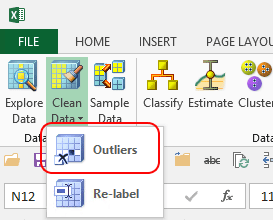

# Outliers (SQL Server Data Mining Add-ins)
    
  
 An *outlier* means a data value that is problematic for any one of the following reasons:  
  
-   Value is outside the expected range.  
  
-   Data might have been entered incorrectly.  
  
-   Value is missing.  
  
-   Data consists of a space or other null string.  
  
-   Value is accurate, but is so far outside the distribution that it can significantly affect the model.  
  
 The Data Mining Client for Excel helps you detect this data, and then update the values or suppress them. For example, you can replace outliers with an arithmetic mean, or you can delete rows that contain potentially wrong values.  
  
## Handling Outliers  
 The **Remove Outliers** wizard gives you several tools to handle outliers appropriately:  
  
-   First, you can explore the data to better understand the distribution of values and the relationship of the outliers to other data.  
  
     For example, you can use the **Explore Data** task to review and fix the values. The **Remove Outliers** wizard also displays a graph, either a line or a bar chart, to help you understand the distribution of all values.  
  
-   Next, you can use the **Outliers** wizard to remove or change outliers. The method that you use depends on whether the values are discrete or continuous.  
  
     The wizard displays discrete values in a bar chart, where each bar represents a specific value, and the height of the bar indicates the number of cases for each value. By sliding the threshold control on the chart, you can cut off bars that represent groups of extreme or potentially bad values.  
  
-   The wizard displays continuous values either on a bar chart or line chart. On the line chart, the value is represented on the x-axis and the count of values on the y-axis.  
  
     You can control whether to remove or keep values at the low and high ends of the chart by changing the **Minimum** and **Maximum** values, or sliding the bars. As you change the minimum and maximum value settings, the data that will be suppressed is shown by shading in the graph.  
  
 After you have selected which outliers to work with, you tell the wizard how to handle the outliers. You can either delete the rows that contain the outlier values, or you can specify a replacement value, such as a mean, a null, or another value of your choice.  
  
 Finally, the wizard gives you some options for displaying the new data. You can replace the original data with the new values, add a new column to the table that contains the new values, or create a new worksheet that contains the updated data.  
  
### Using the Outlier Wizard  
  
1.  In the **Data Mining** ribbon, click **Clean Data**, and select **Outliers**.  
  
2.  In the **Select Source Data** dialog box, select an Excel data table, or a range of cells, and click **Next**.  
  
    > [!WARNING]  
    >  You cannot use the **Outliers** wizard on external data, unless you copy it to Excel first.  
  
3.  In the **Select Column** dialog box, select a **single** column.  
  
     Click **Next**.  
  
4.  In the **Specify Thresholds** dialog box, review the distribution of data.  
  
    -   If the column contains discrete values, the wizard displays a histogram containing the count for each discrete value.  
  
         Assuming that outliers are rare values, you can filter them out by changing the **Minimum** value.  
  
    -   If the column contains numeric data, you can click the **View as Discrete** button or the **View as Numeric** button to toggle between viewing the values in a bar chart or line chart.  
  
5.  In the **Specify Thresholds** dialog box, choose the range of data you want to keep by typing a minimum and maximum value, or by dragging the slider bars. Click **Next**.  
  
6.  In the **Outlier Handling** dialog box, specify whether you want the values to be deleted or replaced, and click **Next**.  
  
7.  In the **Select Destination** dialog box, specify where you want the new data to be saved.  
  
### Related Options  
 The wizard provides these options:  
  
|**Options**|**Comment**|  
|-----------------|-----------------|  
|**Select Column**|You can work with only one column at a time.|  
|**Specify Thresholds Handling**|Set a threshold using **Minimum** to exclude values that are found in fewer rows than the threshold value.   Initially the value in **Minimum** is equal to the value with the fewest rows, and you cannot make the minimum lower than that value.|  
|**Outlier Handling**|If you decide to delete outliers, you can either change the data in the current worksheet, or create a copy of the data in a new worksheet.|  
  
## See Also  
 [Explore Data &#40;SQL Server Data Mining Add-ins&#41;](explore-data-sql-server-data-mining-add-ins.md)  
  
  
