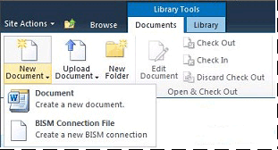

# Add a BI Semantic Model Connection Content Type to a Library (PowerPivot for SharePoint)
  A BI semantic model connection is created in SharePoint and provides redirection to business intelligence semantic model data in a PowerPivot workbook or Analysis Services tabular model database on a network server. Before you can create a BI semantic model connection in SharePoint, you must extend a document library to allow the creation of a .bism file. This step only needs to be performed once for each library, but you will need to repeat it for any library from which you want to create .bism files. Best practices recommend that you create a centralized library for storing .bism files so that you can manage permissions in one place.  
  
> [!NOTE]  
>  If you already use SharePoint Data Connection Libraries, the BI Semantic Model Connection content type is automatically added to that library template. You can skip the steps in this section if you use a data connection library that already lets you create new BI semantic model connection documents.  
  
##   Add the content type to a document library  
 You must have at least the Manage Lists permission to add and configure a content type. This permission is built into the Design permission level and above.  
  
 The site that contains the document library must have feature activation for PowerPivot for SharePoint. For more information, see [Activate PowerPivot Feature Integration for Site Collections in Central Administration](activate-power-pivot-integration-for-site-collections-in-ca.md).  
  
1.  Open the document library for which you want to enable the BI Semantic Model Connection content type.  
  
2.  On the SharePoint ribbon, in Library Tools, click **Library**.  
  
3.  Click **Library Settings**.  
  
4.  In General Settings, click **Advanced settings**.  
  
5.  In Content Types, in the "Allow management of content types?" section, click **Yes**.  
  
6.  Click **OK**.  
  
7.  In the Content Types section, click **Add from existing site content types**. If you do not see this page, go back to the site, click **Library** in Library Tools, and then click **Library Settings**.  
  
8.  In Content Types, click **Add from existing site content types**.  
  
9. In Select site content types from:, select **Business Intelligence**.  
  
10. In Available Site Content Types, click **BI Semantic Model Connection File**, and then click **Add** to move the selected content type to the Content types to add list.  
  
11. Click **OK**.  
  
12. To verify you added the content type, go back to the library and click **New Document** on the Documents area of the library ribbon. You should see **BI Semantic Model Connection File** in the New Documents list.  
  
       
  
 After you enable the BI semantic model connection content type for a library, you can create a connection that provides redirection to business semantic model data that can be used by Excel or [!INCLUDE[ssCrescent](../../includes/sscrescent-md.md)] reports. Choose from the following links to learn more about this next step:  
  
 [Create a BI Semantic Model Connection to a PowerPivot Workbook](create-a-bi-semantic-model-connection-to-a-power-pivot-workbook.md)  
  
 [Create a BI Semantic Model Connection to a Tabular Model Database](create-a-bi-semantic-model-connection-to-a-tabular-model-database.md)  
  
## See Also  
 [PowerPivot BI Semantic Model Connection &#40;.bism&#41;](power-pivot-bi-semantic-model-connection-bism.md)   
 [Use a BI Semantic Model Connection in Excel or Reporting Services](use-a-bi-semantic-model-connection-in-excel-or-reporting-services.md)  
  
  
