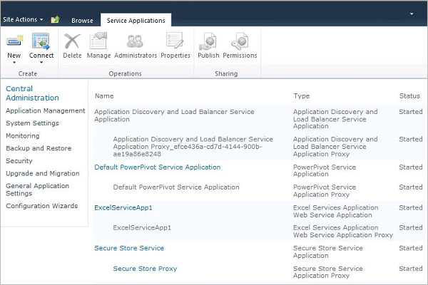

# PowerPivot Health Rules - Configure
  PowerPivot for SharePoint includes SharePoint health rules that help you monitor and remedy server availability and configuration problems. Health rules that apply to PowerPivot for SharePoint appear in the Review rule definitions page.  
  
 Health rules provide early detection of server problems that could eventually result in service disruptions. PowerPivot for SharePoint provides a number of rules to help you identify and fix problems before they impact your users. You can customize many of these rules to fit the unique characteristics of your deployment. For example, if you want more time to address warnings about disk space, you could raise the available disk space percentage from 5% to 10% so that you get the warning earlier.  
  
 Rules that can be customized are those that report on resource consumption or server availability. Customization is helpful in these areas because underlying system capacity varies widely across different servers and deployment topologies. In contrast, no customization is available for rules that identify server configuration or security issues. Those rules are intended to be applied uniformly across all installations.  
  
||  
|-|  
|**[!INCLUDE[applies](../../includes/applies-md.md)]**  SharePoint 2013 &#124; SharePoint 2010|  
  
 **Note:** Health rule settings are configured separately for the SQL Server Analysis Services instance and the PowerPivot service application. Use the instructions in this topic to configure health rules for each service. For a SharePoint 2013 deployment, [!INCLUDE[ssGeminiShort](../../includes/ssgeminishort-md.md)] only uses the service application. Therefore [!INCLUDE[ssGeminiShort](../../includes/ssgeminishort-md.md)] installs different sets of health rules for different versions of SharePoint. See the "version" column in the topic [Health Rules Reference &#40;PowerPivot for SharePoint&#41;](health-rules-reference-power-pivot-for-sharepoint.md), or you can run the following Windows PowerShell command to see the installed rules.  
  
```  
Get-SPHealthAnalysisRule | select name, enabled, summary | where {$_.summary -like "*power*"}  | format-table -property * -autosize | out-default  
```  
  
 **In this topic:**  
  
 [View PowerPivot health rules](#bkmk_view)  
  
 [Configure health rules used to evaluate server stability (SQL Server Analysis Services)](#bkmk_HR_SSAS)  
  
 [Configure health rules used to evaluate application stability (PowerPivot Service Application)](#bkmk_evaluate_application_stability)  
  
## Prerequisites  
 You must be a service application administrator to change configuration properties of the Analysis Services instance and of the PowerPivot service application.  
  
##  <a name="bkmk_view"></a> View PowerPivot health rules  
  
1.  In SharePoint Central Administration, click **Monitoring**, and in the **Health Analyzer** section, click **Review rule definitions**.  
  
2.  In the Configuration section, find the rules that have the **PowerPivot:** prefix. All PowerPivot-related health rules have this prefix to help you distinguish them from the built-in SharePoint rules.  
  
 These rules will appear in the **Review problems and solutions** page when problems are detected.  
  
 If you suspect a problem that you want to investigate immediately, you can run a rule check manually to find out if there is an issue.  
  
 To do this, click the rule to open its rule definition, and then click **Run Now** in the ribbon. Click **Close** to go back to the **Review problems and solutions** page to view the report. If the rule detected a problem, a warning or error will be reported on the page. In some cases, it can take a few minutes before the error or warning will appear.  
  
##  <a name="bkmk_HR_SSAS"></a> Configure health rules used to evaluate server stability (SQL Server Analysis Services)  
 The Analysis Services instance includes health rules that detect problems at the system level (CPU, memory, and disk space used for caching purposes). Use the following instructions to modify thresholds that trigger specific health rules.  
  
1.  In SharePoint Central Administration, in the **System Settings** section, click **Manage services on server**.  
  
2.  At the top of the page, select the server in your SharePoint farm that has an instance of Analysis Services (in the following illustration, the server name is AW-SRV033). **SQL Server Analysis Services** will appear in the list of services.  
  
       
  
3.  Click **SQL Server Analysis Services**.  
  
4.  In the service property pages, in Health Rule Settings, modify the following settings:  
  
     Insufficient CPU Resource Allocation (default is 80%)  
     This health rule is triggered if the CPU resources used by Analysis Services server process (msmdsrv.exe) remains at or above 80% over a 4 hour period (as specified through the Data Collection Interval setting).  
  
     This configuration setting corresponds to the following rule definition on the **Review problems and solutions** page: **PowerPivot: Analysis Services does not have sufficient CPU resources to perform requested operations.**  
  
     Insufficient CPU Resources on the System (default is 90%)  
     This health rule is triggered if CPU resources for the server remain at or above 90% over a 4 hour period (as specified through the Data Collection Interval setting). Overall CPU utilization is measured as part of the health-based load balancing algorithm that monitors CPU usage as a measure of server health.  
  
     This configuration setting corresponds to the following rule definition on the **Review problems and solutions** page: **PowerPivot: Overall CPU usage is too high.**  
  
     Insufficient Memory Threshold (default is 5%)  
     On a SharePoint application server, a SQL Server Analysis Services instance should always have a small amount of memory in reserve that is always unused. Because the server is memory-bound for the majority of its operations, the server runs best if it does not run all the way to the upper limit. The 5% of unused memory is calculated as a percentage of memory allocated to Analysis Services. For example, if you have 200 GB of total memory, and Analysis Services is allocated 80% of that (or 160 GB), then the 5% of unused memory is 5% of 160 GB (or 8 GB).  
  
     This configuration setting corresponds to the following rule definition on the **Review problems and solutions** page: **PowerPivot: Analysis Services does not have sufficient memory to perform requested operations.**  
  
     Maximum Number of Connections (default is 100)  
     This health rule is triggered if the number of connections to the Analysis Services instance remains at or above 100 connections over a 4 hour period (as specified through the Data Collection Interval setting). This default value is arbitrary (it is not based on the hardware specifications of your server or on user activity) so you might raise or lower the value depending on the server capacity and user activity in your environment.  
  
     This configuration setting corresponds to the following rule definition on the **Review problems and solutions** page: **PowerPivot: The high number of connections indicates that more servers should be deployed to handle the current load.**  
  
     Insufficient Disk Space (default is 5%)  
     Disk space is used to cache PowerPivot data each time a database is requested. This rule lets you know when disk space is running low. By default, this health rule is triggered when disk space is less than 5% on the disk drive where the backup folder is located. For more information about disk usage, see [Configure Disk Space Usage &#40;PowerPivot for SharePoint&#41;](configure-disk-space-usage-power-pivot-for-sharepoint.md).  
  
     This configuration setting corresponds to the following rule definition on the **Review problems and solutions** page: **PowerPivot: Disk space is running low on the drive where PowerPivot data is cached.**  
  
     Data Collection Interval (in hours)  
     You can specify the data collection period used for calculating the numbers used for triggering health rules. Although the system is monitored constantly, the thresholds used to trigger health rule warnings are calculated using data that was generated over a predefined interval. The default interval is 4 hours. The server retrieves system and usage data collected over the previous 4 hours to evaluate the number of user connections, disk space usage, and CPU and memory utilization rates.  
  
##  <a name="bkmk_evaluate_application_stability"></a> Configure health rules used to evaluate application stability (PowerPivot Service Application)  
  
1.  In Central Administration, in Application Management, click **Manage service applications**.  
  
2.  In the Service Applications page, click **Default PowerPivot Service Application**.  
  
       
  
3.  The PowerPivot Management Dashboard appears. Click the **Configure service application settings** in the **Actions** list to open the service application settings page.  
  
       
  
4.  In Health Rule Settings, modify the following settings:  
  
     Load to Connection Ratio (default is 20%)  
     This health rule is triggered if the number of load events is high relative to the number of connection events, signaling that the server might be unloading databases too quickly, or that cache reduction settings are too aggressive.  
  
     This configuration setting corresponds to the following rule definition on the **Review problems and solutions** page: **PowerPivot: The ratio of load events to connections is too high.**  
  
     Data Collection Interval (default is 4 hours)  
     You can specify the data collection period used for calculating the numbers used for triggering health rules. Although the system is monitored constantly, the thresholds used to trigger health rule warnings are calculated using data that was generated over a predefined interval. The default interval is 4 hours. The server retrieves system and usage data collected over the previous 4 hours to evaluate the load to collection ratio.  
  
     Check for Updates to PowerPivot Management Dashboard.xlsx (default is 5 days)  
     The PowerPivot Management Dashboard.xlsx file is a data source used by reports in PowerPivot Management Dashboard. In a default server configuration, the .xlsx file is refreshed daily, using usage data collected by SharePoint and the PowerPivot System Service. In event the file is not updated, a health rule reports it as a problem. By default, the rule is triggered if the timestamp of the file has not changed for 5 days.  
  
     For more information about usage data collection, see [Configure Usage Data Collection for &#40;PowerPivot for SharePoint](configure-usage-data-collection-for-power-pivot-for-sharepoint.md).  
  
     This configuration setting corresponds to the following rule definition on the **Review problems and solutions** page: **PowerPivot: Usage data is not getting updated at the expected frequency.**  
  
## See Also  
 [Configure Disk Space Usage &#40;PowerPivot for SharePoint&#41;](configure-disk-space-usage-power-pivot-for-sharepoint.md)   
 [PowerPivot Management Dashboard and Usage Data](power-pivot-management-dashboard-and-usage-data.md)  
  
  
