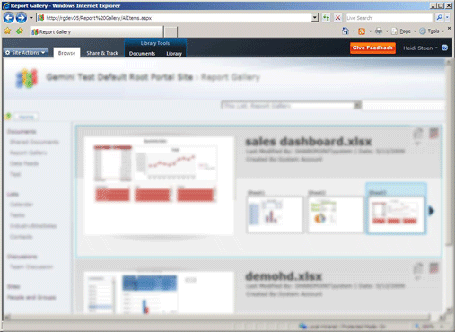

# Create and Customize PowerPivot Gallery
  PowerPivot Gallery is a special type of SharePoint document library that provides rich preview and document management for published Excel workbooks and Reporting Services reports that contain PowerPivot data.  
  
##   In this topic  
  
-   [Prerequisites](#prereq)  
  
-   [Overview](#overview)  
  
-   [Create the PowerPivot Gallery](#createlib)  
  
-   [Customize a PowerPivot Gallery Library](#customize)  
  
-   [Disable or Hide the Refresh Button](#bkmk_hide_refresh_button)  
  
-   [Switch to Theater View or Gallery View](#switch)  
  
##   Prerequisites  
  
-   You must have Silverlight. Silverlight can be downloaded and installed through Microsoft Update. If you view a [!INCLUDE[ssGemini](../../includes/ssgemini-md.md)] Gallery library using a browser that does not have Silverlight, click the link on the page to install it. You must close and reopen the browser after you install it.  
  
    > [!NOTE]  
    >  The Power Pivot Gallery requires Microsoft Silverlight.  The Microsoft Edge browser does not support Silverlight.   
    > To view the library contents in Edge, click the **Library** tab in  Power Pivot gallery, and then change the document library view to **All Documents**.    
    > To change  the default view , click  the **Library** tab and then click  Modify View. Click  "Make this the default view" and then click OK to save the  default view.  
    >  For more information on what Edge supports, see the Windows blog, [A break from the past, part 2: Saying goodbye to ActiveX, VBScript...](http://blogs.windows.com/msedgedev/2015/05/06/a-break-from-the-past-part-2-saying-goodbye-to-activex-vbscript-attachevent/)  
  
-   You must be a site owner to create a library.  
  
-   You must have Contribute permissions or above to publish or upload a file.  
  
-   [!INCLUDE[ssGemini](../../includes/ssgemini-md.md)] Gallery cannot be in a restricted site. The parent site that contains [!INCLUDE[ssGemini](../../includes/ssgemini-md.md)] Gallery must be added to either the trusted site or Local intranet zone.  
  
-   The [!INCLUDE[ssGemini](../../includes/ssgemini-md.md)] web application solution must have been deployed for your application, and the [!INCLUDE[ssGemini](../../includes/ssgemini-md.md)] feature must have been activated for the site collection. For more information, see [Deploy PowerPivot Solutions to SharePoint](deploy-power-pivot-solutions-to-sharepoint.md) and[Activate PowerPivot Feature Integration for Site Collections in Central Administration](activate-power-pivot-integration-for-site-collections-in-ca.md).  
  
-   To view or create a Reporting Services report that is based on a [!INCLUDE[ssGemini](../../includes/ssgemini-md.md)] workbook, both the workbook and the report must be in the same [!INCLUDE[ssGemini](../../includes/ssgemini-md.md)] Gallery. The report must either use a [!INCLUDE[ssGemini](../../includes/ssgemini-md.md)] workbook that contains embedded data, or the workbook must contain at most one external data source that is a [!INCLUDE[ssGemini](../../includes/ssgemini-md.md)] workbook.  
  
##   Overview  
 [!INCLUDE[ssGemini](../../includes/ssgemini-md.md)] Gallery is a library template that is available when you install [!INCLUDE[ssGeminiLong](../../includes/ssgeminilong-md.md)] on a SharePoint server. The [!INCLUDE[ssGemini](../../includes/ssgemini-md.md)] Gallery combines an accurate preview of the file contents with facts about document origin. You can see immediately who created the document and when it was last modified. To create preview images, [!INCLUDE[ssGemini](../../includes/ssgemini-md.md)] Gallery uses a snapshot service that can read [!INCLUDE[ssGemini](../../includes/ssgemini-md.md)] workbooks and Reporting Services reports that contain PowerPivot data. If you publish a file that the snapshot service cannot read, no preview image will be available for that file.  
  
 Preview images are based on how the workbook is rendered by Excel Services. The representation in [!INCLUDE[ssGemini](../../includes/ssgemini-md.md)] Gallery should be identical to what you see when you view a [!INCLUDE[ssGemini](../../includes/ssgemini-md.md)] workbook in a browser. However, preview has a limited surface area. Portions of a workbook or report might be trimmed to fit the available space. You might need to open a workbook or report to view the document in its entirety.  
  
 Refreshing [!INCLUDE[ssGemini](../../includes/ssgemini-md.md)] workbook data from external data sources is fully supported in [!INCLUDE[ssGemini](../../includes/ssgemini-md.md)] Gallery, but it requires additional configuration. A farm or service administrator must add the [!INCLUDE[ssGemini](../../includes/ssgemini-md.md)] Gallery as an Excel Services trusted location. For more information, see [Create a trusted location for PowerPivot sites in Central Administration](create-a-trusted-location-for-power-pivot-sites-in-central-administration.md).  
  
##   Create the PowerPivot Gallery  
 [!INCLUDE[ssGemini](../../includes/ssgemini-md.md)] Gallery is created for you when you install [!INCLUDE[ssGeminiLong](../../includes/ssgeminilong-md.md)] using the New Server installation option. If you added [!INCLUDE[ssGeminiShort](../../includes/ssgeminishort-md.md)] to an existing farm or if you want an additional library, you can create a new one for your application or site.  
  
1.  1.  **SharePoint 2010**: Click **Site Actions** at the top left corner of your site's home page.  
  
    2.  Click **More Options**.  
  
    3.  Under Libraries, click **PowerPivot Gallery**.  
  
    1.  **SharePoint 2013**: Click the settings icon . Click **Site Contents**  
  
    2.  Click **add an app**.  
  
    3.  Click **PowerPivot Gallery**.  
  
2.  Type a name for the library. Be sure to include descriptive information that helps users identify this library as rich preview for PowerPivot workbooks and Reporting Services reports.  
  
3.  Click **Create**.  
  
4.  Ask a farm or service administrator to add the [!INCLUDE[ssGemini](../../includes/ssgemini-md.md)] Gallery as a trusted location for Excel Services. This step is necessary to avoid errors if a user configures a workbook for [!INCLUDE[ssGemini](../../includes/ssgemini-md.md)] data refresh. For more information about this task, see [Create a trusted location for PowerPivot sites in Central Administration](create-a-trusted-location-for-power-pivot-sites-in-central-administration.md).  
  
 A link to the [!INCLUDE[ssGemini](../../includes/ssgemini-md.md)] Gallery library will appear in the navigation Quick Launch pane for the current site.  
  
 You can create additional [!INCLUDE[ssGemini](../../includes/ssgemini-md.md)] Gallery libraries if you are enforcing different permissions for different site collections or individual sites.  
  
##   Customize a PowerPivot Gallery Library  
 [!INCLUDE[ssGemini](../../includes/ssgemini-md.md)] Gallery is a SharePoint document library. Therefore, you can use standard library tools in SharePoint to change library settings or work with individual documents in the library. Each library that you create can be independently customized to use a different view or library settings.  
  
 Sort order and filters can be modified to change where workbooks appear in the list. By default, documents are listed in the order in which they were added, where the last document published appears at the bottom of the list. Once a document is published, it retains its place in the list. Updating and republishing the document updates it in place in the list.  
  
 You cannot enable or disable preview for specific documents. The snapshot service will generate preview images for all PowerPivot workbooks and for Reporting Services reports that are based on PowerPivot workbooks that are stored in the same library. These images can be viewed by all users who have View permissions on the document.  
  
 You cannot extend [!INCLUDE[ssGemini](../../includes/ssgemini-md.md)] Gallery to provide preview for other document types. Preview is supported only for Excel 2010 workbooks or SQL Server 2008 R2 Reporting Services reports that contain [!INCLUDE[ssGemini](../../includes/ssgemini-md.md)] data.  
  
 You cannot change the settings that control document origin information. Facts that appear about individual documents, such as who added or last modified the workbook, are determined by a fixed set of columns that cannot be modified.  
  
#### Change sort order, add filters, or limit the number of documents  
 [!INCLUDE[ssGemini](../../includes/ssgemini-md.md)] Gallery always shows 'Last modified' and 'Created by' values. You cannot disable these columns. You cannot enable other columns for the library.Use the following instructions to change the sort order, add a filter, or limit the number of documents that are visible.  
  
1.  In a SharePoint site, open [!INCLUDE[ssGemini](../../includes/ssgemini-md.md)] Gallery.  
  
2.  In the ribbon, click **Library**.  
  
3.  **SharePoint 2010:** In Custom Views, click **Modify this View**.  
  
     **SharePoint 2013:** In **Manage Views**, click **Modify View**.  
  
4.  In Sort, specify the criteria that will be used to determine how workbooks appear in the list. By default, documents are listed in the order in which they were added.  
  
5.  In Filter, specify criteria that will be used to show or hide workbooks based on conditional values set on columns. For example, you might want to hide all workbooks created prior to a certain date.  
  
6.  In Item Limit, specify options that are useful for [!INCLUDE[ssGemini](../../includes/ssgemini-md.md)] Gallery libraries that contain a very large number of documents. You can limit the actual number of items that appear in the list, or display items in batches.  
  
7.  Click **OK** to save your changes.  
  
####   Disable or Hide the Refresh Button  
 You cannot hide the **Manage Data Refresh** button. However the button is disabled if the user does not sufficient permissions.  
  
   
  
 Workbook owners or authors must have **Contribute** permission to schedule data refresh on a workbook. Users with Contribute permissions can open and edit the workbook's data refresh configuration page to specify the credentials and schedule information used to refresh the data.  
  
 So, users that only have **View** or **Read** permission levels, will not be able to access the refresh button. The refresh button is visible but disabled. For more information, see [User permissions and permission levels in SharePoint 2013](https://technet.microsoft.com/library/cc721640.aspx).  
  
##   Switch to Theater View or Gallery View  
 Preview varies depending on how you configure the view for the library. In Gallery view, you can hover the mouse pointer over individual worksheets in the workbook to bring a sheet into focus in the preview area.  
  
   
  
 The following table describes the different layouts for presenting thumbnail sketches of each previewed page:  
  
|View|Description|  
|----------|-----------------|  
|Gallery View (default)|Gallery is the default view for a [!INCLUDE[ssGemini](../../includes/ssgemini-md.md)] Gallery. The preview appears to the left. Smaller thumbnails of each worksheet appear next to it in a sequential left-to-right order.|  
|All Documents|This is the standard layout for document libraries. You can choose this view to manage individual documents or view library contents in a list format.   Use this view to edit properties, delete, or move individual documents.   If you enabled versioning, you must use this view to check documents in or out of the library.|  
|Theatre View and Carousel View|These are specialized views that work best if you are showcasing a small number of related documents. The full rotation of thumbnails includes all pages in all documents in the library. If you have a large number of documents, these views might be impractical for users who want to find or open a specific [!INCLUDE[ssGemini](../../includes/ssgemini-md.md)] workbook.   Theatre view: The preview area is centered. Smaller thumbnails of each worksheet appear lower on the page, on either side.   Carousel view: The preview area is centered. The thumbnails that immediately precede and follow the current thumbnail are adjacent to the preview area.|  
  
### Switch to a different view  
  
1.  In a SharePoint site, open [!INCLUDE[ssGemini](../../includes/ssgemini-md.md)] Gallery.  
  
2.  In the ribbon, click **Library**.  
  
3.  In Manage Views, in Current View, select the view you want to use from the list. Predesigned views include Gallery, Theater, and Carousel. Alternatively, you can choose All Documents if you want to move, delete, or manage documents in the library.  
  
## See Also  
 [Troubleshoot a PowerPivot for SharePoint Installation](../../sql-server/install/troubleshoot-a-powerpivot-for-sharepoint-installation.md)   
 [Use PowerPivot Gallery](use-power-pivot-gallery.md)   
 [Create a trusted location for PowerPivot sites in Central Administration](create-a-trusted-location-for-power-pivot-sites-in-central-administration.md)   
 [Delete PowerPivot Gallery](delete-power-pivot-gallery.md)  
  
  
