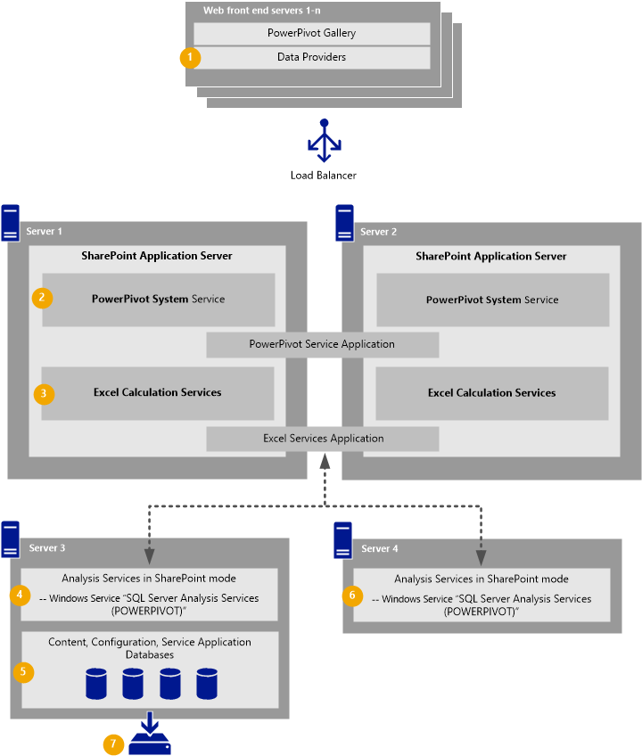

# PowerPivot Availability and Disaster Recovery (SQL Server 2014)
  Availability and disaster recovery plans for [!INCLUDE[ssGeminiShort](../../includes/ssgeminishort-md.md)] depend primarily on the design of your SharePoint farm, the amount of downtime acceptable for different components, and the tools and best practices you implement for SharePoint availability. This topic summarizes technologies and includes example topology diagrams to consider when planning availability and disaster recovery for a [!INCLUDE[ssSQL14](../../includes/sssql14-md.md)] [!INCLUDE[ssGeminiShort](../../includes/ssgeminishort-md.md)] deployment.  
  
||  
|-|  
|**[!INCLUDE[applies](../../includes/applies-md.md)]**  SharePoint 2013 &#124; SharePoint 2010|  
  
 **In this topic:**  
  
-   [Example SharePoint 2013 topology for PowerPivot high availability](#bkmk_sharepoint2013)  
  
-   [Example SharePoint 2010 topology for PowerPivot high availability](#bkmk_sharepoint2010)  
  
-   [PowerPivot service application database and SQL Server availability and recovery technologies](#bkmk_sql_server_technologies)  
  
-   [Links to more information](#bkmk_more_resources)  
  
##   Example SharePoint 2013 topology for PowerPivot high availability  
 In a [!INCLUDE[ssGeminiShort](../../includes/ssgeminishort-md.md)] 2013 deployment there is more flexibility in how you design [!INCLUDE[ssGemini](../../includes/ssgemini-md.md)] availability. In SharePoint 2013, the [!INCLUDE[ssASnoversion](../../includes/ssasnoversion-md.md)] instance deployed in SharePoint mode, also referred to as the [!INCLUDE[ssGeminiShort](../../includes/ssgeminishort-md.md)] server, runs outside the SharePoint farm and can be installed on separate servers. Each instance of [!INCLUDE[ssASnoversion](../../includes/ssasnoversion-md.md)] in SharePoint mode is registered with Excel Services. The [!INCLUDE[ssGemini](../../includes/ssgemini-md.md)] shared service and service application run on SharePoint application servers.  
  
 The following diagram illustrates an example [!INCLUDE[ssGeminiShort](../../includes/ssgeminishort-md.md)] 2013 deployment. This example supports good availability of the [!INCLUDE[ssGeminiShort](../../includes/ssgeminishort-md.md)] services and assumes the databases are backed up on a regular basis.  
  
   
  
-   **(1)** The Web front-end servers. Use the [!INCLUDE[ssGeminiShort](../../includes/ssgeminishort-md.md)] 2013 Add-in to install the data providers on each server. For more information, see [Install or Uninstall the PowerPivot for SharePoint Add-in &#40;SharePoint 2013&#41;](../instances/install-windows/install-or-uninstall-the-power-pivot-for-sharepoint-add-in-sharepoint-2013.md).  
  
-   **(2)** The [!INCLUDE[ssGemini](../../includes/ssgemini-md.md)] shared service runs **on each** application server and allows the service application to run **across** application servers. Therefore if a single application server goes offline, the [!INCLUDE[ssGeminiShort](../../includes/ssgeminishort-md.md)] application will still be available.  
  
-   **(3)** Excel Calculation Services runs one each application server and allows the service application to run across application servers. Therefore if a single application server goes offline, Excel Calculation Services will still be available.  
  
-   **(4)** and **(6)** Instances of [!INCLUDE[ssASnoversion](../../includes/ssasnoversion-md.md)] ins SharePoint mode run on servers outside the SharePoint farm, this includes the Windows Service **SQL Server Analysis Services (POWERPIVOT)**. Each of these instances is registered with Excel Services **(3)**. Excel Services manages load balancing of requests to the [!INCLUDE[ssGeminiShort](../../includes/ssgeminishort-md.md)] servers. The [!INCLUDE[ssGeminiShort](../../includes/ssgeminishort-md.md)] 2013 architecture enables you to have multiple servers for [!INCLUDE[ssGeminiShort](../../includes/ssgeminishort-md.md)] so you can easily add more instances as needed. For more information, see [Manage Excel Services data model settings (SharePoint Server 2013)](https://technet.microsoft.com/library/jj219780\(v=office.15\).aspx).  
  
-   **(5)** The SQL Server databases used for content, configuration, and application databases. This includes the [!INCLUDE[ssGemini](../../includes/ssgemini-md.md)] service application database. Your DR plan should include the database layer. In this design the databases run on the same server as **(4)** one of the [!INCLUDE[ssGeminiShort](../../includes/ssgeminishort-md.md)] instances. **(4)** and **(5)** could also be on different servers.  
  
-   **(7)** Some form of SQL Server database backup or redundancy.  
  
##   Example SharePoint 2010 topology for PowerPivot high availability  
 The [!INCLUDE[ssGeminiShort](../../includes/ssgeminishort-md.md)] 2010 architecture requires all [!INCLUDE[ssGemini](../../includes/ssgemini-md.md)] components run on the same SharePoint application servers. This includes the [!INCLUDE[ssASnoversion](../../includes/ssasnoversion-md.md)] instance deployed in SharePoint mode and two shared services compared to only one in a SharePoint 2013 deployment.  
  
 The following diagram illustrates an example [!INCLUDE[ssGeminiShort](../../includes/ssgeminishort-md.md)] 2010 deployment. This example supports good availability of the [!INCLUDE[ssGeminiShort](../../includes/ssgeminishort-md.md)] services and assumes the databases are backed up on a regular basis.  
  
   
  
-   **(1)** The Web front-end servers. Install the data providers on each server. For more information, see [Install the Analysis Services OLE DB Provider on SharePoint Servers](../../sql-server/install/install-the-analysis-services-ole-db-provider-on-sharepoint-servers.md).  
  
-   **(2)** The two [!INCLUDE[ssGemini](../../includes/ssgemini-md.md)] shared services and **(4)** the Windows Service **SQL Server Analysis Services (POWERPIVOT)** are installed on the SharePoint application servers.  
  
     The [!INCLUDE[ssGemini](../../includes/ssgemini-md.md)] System Service runs **on each** application server and allows the service application to run **across** application servers. If a single application server goes offline, the [!INCLUDE[ssGeminiShort](../../includes/ssgeminishort-md.md)] service application will still be available.  
  
     To increase [!INCLUDE[ssGemini](../../includes/ssgemini-md.md)] capacity in a SharePoint 2010, deploy more SharePoint application servers running the [!INCLUDE[ssGemini](../../includes/ssgemini-md.md)] System Service.  
  
-   **(3)** Excel Calculation Services runs on each application server and allows the service application to run across application servers. Therefore if a single application server goes offline, Excel Calculation Services will still be available.  
  
-   **(5)** The SQL Server databases used for content, configuration, and application databases. This includes the [!INCLUDE[ssGemini](../../includes/ssgemini-md.md)] service application database. Your DR plan should include the database layer.  
  
-   **(6)** Some form of SQL Server database backup or redundancy.  
  
##   PowerPivot service application database and SQL Server availability and recovery technologies  
 Include the [!INCLUDE[ssGeminiShort](../../includes/ssgeminishort-md.md)] service application database in you SharePoint high availability planning. The default name of the database is `DefaultPowerPivotServiceApplicationDB-<GUID>`. The following is a summary of [!INCLUDE[ssNoVersion](../../includes/ssnoversion-md.md)] availability technologies and recommendations when used with the [!INCLUDE[ssGeminiShort](../../includes/ssgeminishort-md.md)] database. For more information, see [Supported high availability and disaster recovery options for SharePoint databases (SharePoint 2013)](https://technet.microsoft.com/library/jj841106.aspx).  
  
||Comments|  
|-|--------------|  
|[!INCLUDE[ssKilimanjaro](../../includes/sskilimanjaro-md.md)] and [!INCLUDE[ssSQL11](../../includes/sssql11-md.md)] synchronous mirroring in a farm for availability.|Supported but not recommended. The recommendation is to use AlwaysOn in Synchronous - commit mode.|  
|[!INCLUDE[ssNoVersion](../../includes/ssnoversion-md.md)] [!INCLUDE[ssHADR](../../includes/sshadr-md.md)] in Synchronous-Commit mode|Supported and recommended.|  
|[!INCLUDE[ssKilimanjaro](../../includes/sskilimanjaro-md.md)] asynchronous mirroring or log-shipping to another farm for disaster recovery.|Supported.|  
|[!INCLUDE[ssNoVersion](../../includes/ssnoversion-md.md)] [!INCLUDE[ssHADR](../../includes/sshadr-md.md)] with asynchronous-commit for disaster recovery|Supported|  
  
-   [!INCLUDE[ssHADR](../../includes/sshadr-md.md)]  
  
-   [!INCLUDE[ssNoVersion](../../includes/ssnoversion-md.md)] Log Shipping  
  
 For more information on how to plan a cold standby scenario with [!INCLUDE[ssGeminiShort](../../includes/ssgeminishort-md.md)], see [PowerPivot Disaster Recovery](https://social.technet.microsoft.com/wiki/contents/articles/22137.sharepoint-powerpivot-disaster-recovery.aspx).  
  
## Verification  
 For guidance and scripts to help you verify a [!INCLUDE[ssGeminiShort](../../includes/ssgeminishort-md.md)] deployment before and after a disaster recovery cycle, see [CheckList: Use PowerShell to Verify PowerPivot for SharePoint](../instances/install-windows/checklist-use-powershell-to-verify-power-pivot-for-sharepoint.md).  
  
##   Links to more information  
  
-   [Supported high availability and disaster recovery options for SharePoint databases (SharePoint 2013)](https://technet.microsoft.com/library/jj841106.aspx)  
  
-   [Plan for disaster recovery (SharePoint Server 2010)](https://technet.microsoft.com/library/ff628971\(v=office.14\).aspx)  
  
-   [SQL Server Cloud backup and recovery white paper](https://www.microsoft.com/server-cloud/solutions/cloud-backup-recovery.aspx?WT.srch=1&WT.mc_ID=SEM_BING_USEvergreenSearch_Unassigned&CR_CC=Unassigned#fbid=RjU2Nbzu2dT)  
  
-   [Microsoft® SQL Server Backup to Microsoft Windows® Azure®Tool](https://www.microsoft.com/download/details.aspx?id=40740)  
  
 **Community content**  
  
-   [Managing Service Instances on SharePoint 2013](http://www.petri.co.il/manage-service-instances-sharepoint-2013.htm)  
  
-   [Backup Database SQL Server Script](http://megaupl0ad.net/free/backup%20database%20sql%20server%20script)  
  
  
