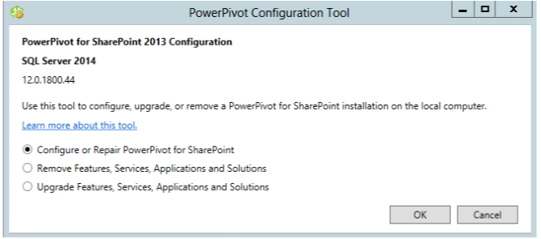

# PowerPivot Configuration Tools
  Configure, repair, or remove a [!INCLUDE[ssCurrent](../../includes/sscurrent-md.md)] [!INCLUDE[ssGeminiShort](../../includes/ssgeminishort-md.md)] with the PowerPivot Configuration Tools.  
  
 The [!INCLUDE[ssCurrent](../../includes/sscurrent-md.md)] Setup Wizard installs the [!INCLUDE[ssGemini](../../includes/ssgemini-md.md)] Configuration Tool for SharePoint 2010 as well as a [!INCLUDE[ssGemini](../../includes/ssgemini-md.md)] Configuration Tool for SharePoint 2013. This topic describes the general use of the two tools and the differences between them.  
  
 **[!INCLUDE[applies](../../includes/applies-md.md)]**  SharePoint 2013 | SharePoint 2010  
  
 **In this Topic:**  
  
-   [Requirements for Using the Configuration Tools](#bkmk_requirements)  
  
-   [Two Versions of the Configuration Tool](#bkmk_twoversions)  
  
-   [Overview of Using a PowerPivot Configuration Tool](#bkmk_overview)  
  
-   [Start One of the PowerPivot Configuration Tools](#bmkm_start_tool)  
  
##   Requirements for Using the Configuration Tools  
  
-   You must be a farm administrator.  
  
-   You must be a server administrator on the Analysis Services instance (SharePoint 2010 only).  
  
-   You must be db_owner on the farm's configuration database.  
  
-   There are no TCP/IP port requirements for using the configuration tools and therefore you should not have to configure your firewall to accommodate the configuration tools. The configuration tool expects the web applications and shared services are available as part of the SharePoint platform. You may need to configure your firewall for the [!INCLUDE[ssASnoversion](../../includes/ssasnoversion-md.md)] server. For more information, see [Configure the Windows Firewall to Allow Analysis Services Access](../instances/configure-the-windows-firewall-to-allow-analysis-services-access.md).  
  
##   Two Versions of the Configuration Tool  
 The [!INCLUDE[ssCurrent](../../includes/sscurrent-md.md)] Setup Wizard installs the PowerPivot Configuration Tool for SharePoint 2010 as well as a PowerPivot Configuration Tool for SharePoint 2013.  
  
 The tools can only be used with a [!INCLUDE[ssCurrent](../../includes/sscurrent-md.md)] or [!INCLUDE[ssSQL11SP1](../../includes/sssql11sp1-md.md)] instance of [!INCLUDE[ssGeminiShort](../../includes/ssgeminishort-md.md)]. Do not use them with [!INCLUDE[ssKilimanjaro](../../includes/sskilimanjaro-md.md)] installations.  
  
|Name|Supported version of SharePoint|Detailed Configuration|  
|----------|-------------------------------------|----------------------------|  
|PowerPivot for SharePoint 2013 Configuration|SharePoint 2013|[Configure or Repair PowerPivot for SharePoint 2013 &#40;PowerPivot Configuration Tool&#41;](configure-or-repair-power-pivot-for-sharepoint-2013.md)|  
|PowerPivot Configuration Tool|SharePoint 2010 with SharePoint 2010|[Configure or Repair PowerPivot for SharePoint 2010 &#40;PowerPivot Configuration Tool&#41;](../configure-repair-powerpivot-sharepoint-2010.md)|  
  
###   How the Two Configuration Tools are Different  
 The two versions of the Configuration tool are similar but there are differences in the configuration steps the two tools run. The differences are due to changes between SharePoint 2010 and SharePoint 2013 as well as the architecture differences between the SQL Server 2012 SP1 version of PowerPivot for SharePoint and the previous versions of PowerPivot for SharePoint.  
  
 The following table describes new and changed features in the **PowerPivot for SharePoint 2013 Configuration** tool. The table also describes features in the **PowerPivot Configuration Tool** that are not in the PowerPivot for SharePoint 2013 Configuration tool. The rows in the table are in the same order as the tabs in the configuration tools.  
  
|PowerPivot for SharePoint 2013 Configuration|PowerPivot Configuration Tool|  
|--------------------------------------------------|-----------------------------------|  
|The main page has a new option for **PowerPivot Server for Excel Services**. The option supports the new architecture with [!INCLUDE[ssASnoversion](../../includes/ssasnoversion-md.md)] running outside of the SharePoint farm. You configure Excel Services to use one or more [!INCLUDE[ssASnoversion](../../includes/ssasnoversion-md.md)] servers that are running in SharePoint mode.   ||  
||The 2010 tool includes the page **Register SQL Server Analysis Services (PowerPivot) on Local Server** to configure a local instance of [!INCLUDE[ssASnoversion](../../includes/ssasnoversion-md.md)]. This page is not part of the 2013 tool because there is no local instance of [!INCLUDE[ssASnoversion](../../includes/ssasnoversion-md.md)].   |  
||The page **Create PowerPivot Service Application** has an extra option of **Upgrade Workbooks to enable data refresh**. This option is not available in the 2013 tool.   |  
|The 2013 tool has a new page **Configure PowerPivot Servers**. This page supports the new architecture of [!INCLUDE[ssASnoversion](../../includes/ssasnoversion-md.md)] running outside the SharePoint farm. By default, the server name that was typed on the main page in the text box **PowerPivot Server for Excel Services**, is also be listed on the **Configure PowerPivot Servers**.   ||  
|The 2013 tool has a new page **Register PowerPivot addin as Excel Services Usage Tracker**. SharePoint 2010 Excel Services does not track usage data for PowerPivot.||  
||The 2010 tool includes the page **Add MSOLAP.5 as a trusted Provider** to register MSOLAP so that Excel Services in SharePoint 2010 can load PowerPivot models. This page is not part of the 2013 tool. SharePoint 2013 Excel Services does not use the MSOLAP provider to load models.|  
  
##   Overview of Using a PowerPivot Configuration Tool  
 When you start one of the PowerPivot Configuration Tools, the tool evaluates the existing installation to determine which operations are applicable. On a new installation, only the configuration task is available. After the server is configured, the remove task appears. If you started with a [!INCLUDE[ssKilimanjaro](../../includes/sskilimanjaro-md.md)] instance, upgrade will also be enabled in the list of available tasks.  
  
 If you are not familiar with Central Administration or Windows PowerShell, you can run the configuration tool as an alternative to complete a [!INCLUDE[ssGeminiShort](../../includes/ssgeminishort-md.md)] installation.  
  
 Additionally, the tool can detect whether the farm is configured or required features are missing. If the SharePoint program files are installed but the farm is not configured, the tool provides actions for configuring both the farm and the [!INCLUDE[ssGeminiShort](../../includes/ssgeminishort-md.md)] installation.  
  
 You can review the **Script** tab to learn and understand how to configure PowerPivot and SharePoint using Windows PowerShell. For more information, see the following:  
  
-   [PowerPivot Configuration using Windows PowerShell](power-pivot-configuration-using-windows-powershell.md)  
  
-   [PowerShell Reference for PowerPivot for SharePoint](/sql/analysis-services/powershell/powershell-reference-for-power-pivot-for-sharepoint)  
  
> [!NOTE]
>  The tool does not configure Reporting Services. If you are adding Reporting Services to your SharePoint environment, you need to install and configure Reporting Services separately. For more information, see the following:  
> 
>  -   [Install Reporting Services SharePoint Mode for SharePoint 2013](../../sql-server/install/install-reporting-services-sharepoint-mode-for-sharepoint-2013.md).  
> -   [Install Reporting Services SharePoint Mode for SharePoint 2010](../../sql-server/install/install-reporting-services-sharepoint-mode-for-sharepoint-2010.md).  
  
##   Start One of the PowerPivot Configuration Tools  
  
1.  On the **Start** screen, type `powerpivot`  
  
     On the **Start** screen, type `powerpivot` or on the **Start** menu, click **All Programs**, click [!INCLUDE[ssCurrentUI](../../includes/sscurrentui-md.md)], click **Configuration Tools**, and then click one of the following:  
  
    -   **PowerPivot Configuration Tool**.  
  
    -   **OR**  
  
    -   **PowerPivot for SharePoint 2013 Configuration**.  
  
       
  
     **Note:** The tools are available only when [!INCLUDE[ssGeminiShort](../../includes/ssgeminishort-md.md)] is installed on the local server.  
  
2.  At startup, the configuration tools check the status of your installation and provide tasks that are valid for your installation.  
  
3.  Depending on the current state of your installation, one or more of the following tasks can be performed:  
  
    1.  Click **Configure or Repair PowerPivot for SharePoint** to complete post-installation tasks, or to repair an installation.  
  
    2.  Click **Remove Features, Services, Applications and Solutions** to remove features and solutions from the farm.  
  
    3.  Click **Upgrade Features, Services, Applications and Solutions** to upgrade features and solutions that were installed using a previous version of [!INCLUDE[ssGeminiShort](../../includes/ssgeminishort-md.md)].  
  
     For example, the image shows the startup page of the PowerPivot Configuration for SharePoint 2013 tool.  
  
       
  
 Each task is composed of individual actions that address some aspect of server configuration. For example, the configuration task includes actions for deploying solutions, creating a PowerPivot service application, activating features, and configuring data refresh. The list of actions will vary based on the current state of your installation. If an action is not needed, the tool excludes it from the task list.  
  
 When you click Run , the tool processes all actions in batch mode. Although each action appears as a separate item in the task list, all actions that are included in the task process together. Only actions that pass a validation check are processed. You might need to add or change some of the input values to pass the validation check.  
  
## Related Content  
 [Upgrade PowerPivot for SharePoint](../../database-engine/install-windows/upgrade-power-pivot-for-sharepoint.md) Describes the workflow that upgrades an existing installation that is already in a farm.  
  
 [Uninstall PowerPivot for SharePoint](../../sql-server/install/uninstall-power-pivot-for-sharepoint.md) Describes the workflow that removes PowerPivot for SharePoint services, solutions, and application pages from a farm.  
  
 [PowerPivot Configuration using Windows PowerShell](power-pivot-configuration-using-windows-powershell.md)  
  
 [PowerPivot Server Administration and Configuration in Central Administration](power-pivot-server-administration-and-configuration-in-central-administration.md)  
  
  
