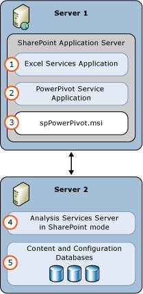
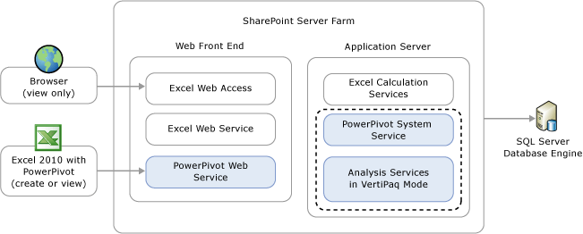

# PowerPivot for SharePoint (SSAS)
  PowerPivot for SharePoint is a [!INCLUDE[ssASnoversion](../../includes/ssasnoversion-md.md)] server running in SharePoint mode. PowerPivot for SharePoint provides server hosting of PowerPivot data in a SharePoint farm. PowerPivot data is an analytical data model that you build using one of the following:  
  
-   The PowerPivot for Excel 2010 add-in  
  
-   Excel 2013  
  
 **[!INCLUDE[applies](../../includes/applies-md.md)]**  [!INCLUDE[ssGeminiShort](../../includes/ssgeminishort-md.md)] 2013 | [!INCLUDE[ssGeminiShort](../../includes/ssgeminishort-md.md)] 2010  
  
 Server hosting of that data requires SharePoint, Excel Services, and an installation of PowerPivot for SharePoint. Data is loaded on PowerPivot for SharePoint instances where it can be refreshed at scheduled intervals using the PowerPivot data refresh capability that the server provides for Excel 2010 workbooks or that SharePoint 2013 Excel Services provides for Excel 2013 workbooks.  
  
## PowerPivot for SharePoint 2013  
 [!INCLUDE[ssCurrent](../../includes/sscurrent-md.md)] [!INCLUDE[ssGeminiShort](../../includes/ssgeminishort-md.md)] supports [!INCLUDE[msCoName](../../includes/msconame-md.md)] SharePoint 2013 Excel Services usage of Excel workbooks containing data models and [!INCLUDE[ssRSnoversion](../../includes/ssrsnoversion-md.md)] Power View reports.  
  
 Excel Services in SharePoint 2013 includes data model functionality to enable interaction with a PowerPivot workbook in the browser. You do not need to deploy the PowerPivot for SharePoint 2013 add-in into the farm. You only need to install an [!INCLUDE[ssASnoversion](../../includes/ssasnoversion-md.md)] server in SharePoint mode and register the server within the Excel Services **Data Model** settings.  
  
 Deploying the PowerPivot for SharePoint 2013 add-in enables additional functionality and features in your SharePoint farm. The additional features include PowerPivot Gallery, Schedule Data Refresh, and the PowerPivot Management Dashboard.  
  
   
  
## PowerPivot for SharePoint 2010  
 PowerPivot for SharePoint 2010 provides server hosting of PowerPivot data in a SharePoint 2010 farm. PowerPivot data is an analytical data model that you build in Excel using the PowerPivot for Excel add-in. Server hosting of that data requires SharePoint 2010, Excel Services, and an installation of PowerPivot for SharePoint. Data is loaded on PowerPivot for SharePoint instances in the farm, where it can be refreshed at scheduled intervals using the PowerPivot data refresh capability that the server provides.  
  
### Components of PowerPivot for SharePoint 2010  
 PowerPivot for SharePoint is implemented as a shared service, which means that the built-in features and infrastructure can be used to administer, secure, and use a PowerPivot service application. Server and database discovery, redirection, and connection management is all managed at the farm level. Central Administration provides the administrative interface to the services used to manage server identity, server state, and configuration properties.  
  
 A complete deployment of PowerPivot for SharePoint includes client and server components that integrate with Excel and Excel Services in a SharePoint farm. The PowerPivot data inside an Excel workbook is an Analysis Services database that requires an Analysis Services xVelocity in-memory analytics engine (VertiPaq) to load and query the data. On a client workstation, the xVelocity engine runs in-process within Excel. On a SharePoint farm, Analysis Services runs on an application server where it is paired with related services that handle requests for PowerPivot data. The following diagram illustrates PowerPivot client and server components:  
  
   
  
 PowerPivot Web service runs on a web application server. It redirects requests from the web application to a PowerPivot System Service instance in the farm.  
  
 PowerPivot System Service issues load requests to the Analysis Services server and manages ongoing connections to data that is already loaded in memory, caching or unloading data if it is no longer used or when there is contention for system resources. It also tracks user activity. Server health data and other usage data is gathered and presented in reports to indicate how well the system is performing.  
  
 An Analysis Service server instance in SharePoint integrated mode completes the deployment. It loads, queries, and unloads data. It also processes data if the workbook is configured for PowerPivot data refresh.  Each instance is tightly coupled with the local PowerPivot System Service that is part of the same installation.  
  
##   In This Section  
 [PowerPivot Server Administration and Configuration in Central Administration](power-pivot-server-administration-and-configuration-in-central-administration.md)  
  
 [PowerPivot Configuration using Windows PowerShell](power-pivot-configuration-using-windows-powershell.md)  
  
 [PowerPivot Configuration Tools](power-pivot-configuration-tools.md)  
  
 [PowerPivot Authentication and Authorization](power-pivot-authentication-and-authorization.md)  
  
 [PowerPivot Health Rules - Configure](configure-power-pivot-health-rules.md)  
  
 [PowerPivot Management Dashboard and Usage Data](power-pivot-management-dashboard-and-usage-data.md)  
  
 [PowerPivot Gallery](../../2014-toc/books-online-for-sql-server-2014.md)  
  
 [PowerPivot Data Access](power-pivot-data-access.md)  
  
 [PowerPivot Data Refresh](power-pivot-data-refresh.md)  
  
 [PowerPivot Data Feeds](power-pivot-data-feeds.md)  
  
 [PowerPivot BI Semantic Model Connection &#40;.bism&#41;](power-pivot-bi-semantic-model-connection-bism.md)  
  
 **In other sections**  
  
## Additional topics  
 [Upgrade PowerPivot for SharePoint](../../database-engine/install-windows/upgrade-power-pivot-for-sharepoint.md)  
  
 [PowerPivot for SharePoint 2013 Installation](../instances/install-windows/install-analysis-services-in-power-pivot-mode.md)  
  
 [PowerShell Reference for PowerPivot for SharePoint](/sql/analysis-services/powershell/powershell-reference-for-power-pivot-for-sharepoint)  
  
 [Example License Topologies and Costs  for SQL Server 2014 Self-Service Business Intelligence](../../sql-server/install/example-license-topologies-costs-self-service-business-intelligence.md)  
  
## See Also  
 [PowerPivot Planning and Deployment](https://go.microsoft.com/fwlink/?linkID=220972)   
 [Disaster Recovery for PowerPivot for SharePoint](https://go.microsoft.com/fwlink/p/?LinkId=389570)  
  
  
