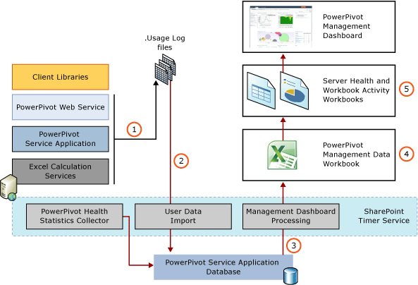

# PowerPivot Usage Data Collection
  Usage data collection is a farm-level SharePoint feature. PowerPivot for SharePoint uses and extends this system to provide reports in the PowerPivot Management Dashboard that show how PowerPivot data and services are used. Depending on how you install SharePoint, usage data collection might be turned off for the farm. A farm administrator must enable usage logging to create the usage data that appears in the PowerPivot Management Dashboard. For more information on how to enable and configure usage data collection for PowerPivot events see [Configure Usage Data Collection for &#40;PowerPivot for SharePoint](configure-usage-data-collection-for-power-pivot-for-sharepoint.md).  
  
 For information on usage data in the PowerPivot Management Dashboard, see [PowerPivot Management Dashboard and Usage Data](power-pivot-management-dashboard-and-usage-data.md).  
  
 **In this topic:**  
  
 [Usage Data Collection and Reporting Architecture](#usagearch)  
  
 [Sources of Usage Data](#sources)  
  
 [Services and Timer Jobs](#servicesjobs)  
  
 [Reporting on Usage Data](#reporting)  
  
##   Usage Data Collection and Reporting Architecture  
 PowerPivot usage data is collected, stored, and managed using a combination of features from the SharePoint infrastructure and PowerPivot server components. SharePoint infrastructure provides a centralized usage service and built-in timer jobs. PowerPivot for SharePoint adds longer term storage for PowerPivot usage data and reports that you view in SharePoint Central Administration.  
  
 In the usage data collection system, event information enters the usage collection system on the application server or Web front end. Usage data moves through the system in response to timer jobs that cause data to move from temporary data files on the physical server to persistent storage on a database server. The following diagram illustrates the components and processes that move usage data through the data collection and reporting system.  
  
 **Note:** Verify usage data collection is enabled. To verify, go to **Monitoring** in SharePoint Central Administration. For more information, see [Configure Usage Data Collection for &#40;PowerPivot for SharePoint](configure-usage-data-collection-for-power-pivot-for-sharepoint.md).  
  
   
  
|Phase|Description|  
|-----------|-----------------|  
|1|Usage data collection is triggered by events that are generated by PowerPivot components and [!INCLUDE[ssASnoversion](../../includes/ssasnoversion-md.md)] data providers in SharePoint deployments. Configurable events that can be turned on or off include connection requests, load and unload requests, and query response timing events that are monitored by the PowerPivot service on the application server. Other events that are managed solely by the server and cannot be turned off. These include data refresh and server health events.   Initially, usage data is collected and stored in local log files using the data collection features of the SharePoint system. The files and their location are part of the standard usage data collection system in SharePoint. The location of the files is the same on every server in the farm. To view or change the location of the logging directory, go to **Monitoring** in SharePoint Central Administration, and then click **Configure usage and health data collection**.|  
|2|At scheduled intervals (every hour by default) the Microsoft SharePoint Foundation Usage Data Import timer job moves usage data from the local files to the PowerPivot service application database. If you have multiple PowerPivot service applications in a farm, each one will have its own database. Events include internal information that identifies which PowerPivot service application produced the event. The application identifiers ensure that usage data is bound to the application that created it.|  
|3|Data is copied to an internal reporting database that is available to the PowerPivot Management Dashboard in Central Administration.|  
|4|The data source is a PowerPivot workbook that you can access to create custom reports in Excel. There is only one instance of the source workbook. The localized reports are all based on the same source workbook.|  
|5|Usage data is presented in reports for PowerPivot service applications for administrators who manage server performance and availability. Localized instances of the workbooks are created for the supported SharePoint languages.   For more information, see [Reporting on Usage Data](#reporting) in this topic.|  
  
##   Sources of Usage Data  
 When usage data collection is enabled, data is generated for the following server events.  
  
|Event|Description|Configurable|  
|-----------|-----------------|------------------|  
|Connections|Server connections made on behalf of a user who is querying PowerPivot data in an Excel workbook. Connection events identify who opened a connection to a PowerPivot workbook. In reports, this information is used to identify the most frequent users, the PowerPivot data sources that are accessed by the same users, and trends in connections over time.|You can enable and disable [Configure Usage Data Collection for &#40;PowerPivot for SharePoint](configure-usage-data-collection-for-power-pivot-for-sharepoint.md).|  
|Query response times|Query response statistics that categorize queries based on how long they take to complete. Query response statistics show patterns in how long it takes the server to respond to query requests.|You can enable and disable [Configure Usage Data Collection for &#40;PowerPivot for SharePoint](configure-usage-data-collection-for-power-pivot-for-sharepoint.md).|  
|Data load|Data load operations by the [!INCLUDE[ssGeminiSrv](../../includes/ssgeminisrv-md.md)]. Data load events identify which data sources are used most often.|You can enable and disable [Configure Usage Data Collection for &#40;PowerPivot for SharePoint](configure-usage-data-collection-for-power-pivot-for-sharepoint.md).|  
|Data unload|Data unload operations by PowerPivot service applications. An [!INCLUDE[ssGeminiSrv](../../includes/ssgeminisrv-md.md)] unloads inactive PowerPivot data sources if it is not being used, or when the server is under memory pressure or needs additional memory to run data refresh jobs.|You can enable and disable [Configure Usage Data Collection for &#40;PowerPivot for SharePoint](configure-usage-data-collection-for-power-pivot-for-sharepoint.md).|  
|Server health|Server operations that indicate server health, measured in CPU and memory utilization. This data is historical. It does not provide real time information about the current processing load on the server.|No. Usage data is always collected for this event.|  
|Data refresh|Data refresh operations initiated by the PowerPivot service for scheduled data updates. Usage history for data refresh is collected at the application level for operational reports, and is reflected in the Manage Data Refresh pages for individual workbooks.   **Note:** For [!INCLUDE[ssSQL11SP1](../../includes/sssql11sp1-md.md)] and SharePoint 2013 deployments, data refresh is managed by Excel Services and not the Analysis Services Server.|No. Data refresh usage data is always collected if you enable data refresh for the PowerPivot service application.|  
  
##   Services and Timer Jobs  
 The following table describes the services and data collection stores in the usage data collection system. For instructions on how to override the timer job schedules to force a data refresh of server health and usage data in PowerPivot Management Dashboard reports, see [PowerPivot Data Refresh with SharePoint 2010](../powerpivot-data-refresh-with-sharepoint-2010.md). You can see the timer jobs in SharePoint central Administration. Go to **Monitoring**, then click **Check Job Status**. Click **Review Job Definitions**.  
  
|Component|Default schedule|Description|  
|---------------|----------------------|-----------------|  
|SharePoint Timer Service (SPTimerV4)||This Windows service runs locally on every member computer in the farm and processes all timer jobs that are defined at the farm level.|  
|Microsoft SharePoint Foundation Usage Data Import|Every 30 minutes in SharePoint 2010. Every 5 minutes in SharePoint 2013.|This timer job is configured globally at the farm level. It moves usage data from local usage log files to the central usage data collection database. You can run this timer job manually to force a data import operation.|  
|Microsoft SharePoint Foundation Usage Data Processing timer job|Daily at 3:00 A.M.|**(\*)** Starting with SQL Server 2012 PowerPivot for SharePoint, this Time job is supported for upgrade or migration scenarios where you may have older usage data still in the SharePoint usage databases. Starting with SQL Server 2012 PowerPivot for SharePoint, the SharePoint usage database is not used for PowerPivot usage collection and Management dashboard workflow. The time job can be manually run to move any remaining PowerPivot related data in the SharePoint usage database to the PowerPivot service application databases.   This timer job is configured globally at the farm level. It checks for expired usage data in the central usage data collection database (that is, any records that are older than 30 days). For PowerPivot servers in the farm, this timer job performs an additional check for PowerPivot usage data. When PowerPivot usage data is detected, the timer job moves the data to a service application database using an application identifier to find the correct database.   You can run this timer job manually to force a check on expired data, or to force a data import of PowerPivot usage data to a PowerPivot service application database.|  
|PowerPivot Management Dashboard Processing timer job|Daily at 3:00 A.M.|This timer job updates the internal PowerPivot workbook that provides administrative data to the PowerPivot Management Dashboard. It gets updated information that is managed by SharePoint, including server names, user names, application names, and file names that appear in dashboard reports or web parts.|  
  
##   Reporting on Usage Data  
 To view usage data on PowerPivot data, you can view built-in reports in the PowerPivot Management Dashboard. The built-in reports consolidate usage data that is retrieved from reporting data structures in the service application database. Because the underlying report data is updated on a daily basis, the built-in usage reports will show updated information only after the Microsoft SharePoint Foundation Usage Data Processing timer job copies data to a PowerPivot service application database. By default, this occurs once a day.  
  
 For more information about how to view reports, see [PowerPivot Management Dashboard and Usage Data](power-pivot-management-dashboard-and-usage-data.md).  
  
## See Also  
 [PowerPivot Management Dashboard and Usage Data](power-pivot-management-dashboard-and-usage-data.md)   
 [Configuration Setting Reference &#40;PowerPivot for SharePoint&#41;](configuration-setting-reference-power-pivot-for-sharepoint.md)   
 [Configure Usage Data Collection for &#40;PowerPivot for SharePoint](configure-usage-data-collection-for-power-pivot-for-sharepoint.md)  
  
  
