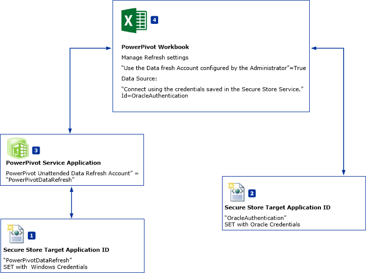
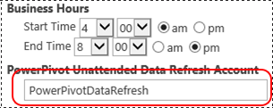

# Schedule Data Refresh and Data Sources That Do Not Support Windows Authentication (PowerPivot for SharePoint)
  This topic describes a workflow of PowerPivot for SharePoint schedule data fresh that can use data sources that do **NOT** support Windows Authentication. For example Oracle or IDM DB2 data sources. The illustrations and steps in this topic reference Oracle data sources but the same workflow applies to other data sources.  
  
||  
|-|  
|**[!INCLUDE[applies](../../includes/applies-md.md)]**  SharePoint 2010 &#124; SharePoint 2013.|  
  
 **Overview:** Create two Secure Store Target Applications. Configure the first target application (PowerPivotDataRefresh) to use Windows credentials. Configure the second target application with the credentials for a data source that does not support windows authentication, for example, an Oracle database. The second target application also uses the first target application for the unattended data refresh account.  
  
   
  
-   **(1) PowerPivotDatarefresh:** A Secure Store Target Application ID that is set with windows authentication.  
  
-   **(2) OracleAuthentication:** A Secure Store Target Application ID that is set with Oracle credentials.  
  
-   **(3)** The PowerPivot Service application is configure to use the target application "PowerPivotDataRefresh" for the **Unattended Data Refresh Account**.  
  
-   **(4)** PowerePivot Workbook uses Oracle data. The workbook refresh settings specify the data source connection to use the target application **(2)** for credentials.  
  
## Prerequisites  
  
-   A PowerPivot Service Application exists.  
  
-   A Secure Store Service Application exists.  
  
-   An Excel workbook with a PowerPivot data model exists.  
  
## To Create a Target Application ID that uses Windows Authentication  
  
1.  In SharePoint Central administration, click **Manage Service Applications**.  
  
2.  Click the name of your secure store service application.  
  
3.  On the **Manage** page, click **New**.   
  
4.  On the **Create New Secure Store Target Application** page, configure the following values:  
  
    -   **Target Application ID:** PowerPivotDataRefresh.  
  
    -   **Display Name:** PowerPivotDataRefresh.  
  
    -   **Contact E-mail:** ?  
  
    -   **Target Application Type:** Group.  
  
    -   **Target Application Page URL:** None.  
  
5.  Click **Next**.  
  
6.  On the Credentials page, leave the two default field names and field types for **Windows User Name** and **Windows Password**.  
  
7.  Click **Next**.  
  
8.  On the **Membership Settings** page, add at least one **Target Application Administrator** and then add members that need access to the target application.  
  
9. Click **OK**.  
  
10. The new Target Application ID is added to the list. Select the Target application ID and click **Set Credentials**.  
  
11. Type the Windows User Name and Windows Password and then click **OK**.  
  
## To Create a Target Application ID that uses Oracle credentials  
  
1.  In SharePoint Central administration, click **Manage Service Applications**.  
  
2.  Click the name of your Secure Store Service application.  
  
3.  On the **Manage** page, click **New**.  
  
4.  On the **Create New Secure Store Target Application** page, configure the following values:  
  
    -   **Target Application ID:** OracleAuthentication.  
  
    -   **Display Name:** OracleAuthentication.  
  
    -   **Contact E-mail:** ?  
  
    -   **Target Application Type:** Group.  
  
    -   **Target Application Page URL:** None.  
  
5.  Click **Next**.  
  
6.  On the **Credentials** page, change the first field name to `Oracle User ID` and change the **Field Type** to `User Name`.  
  
     Change the second field name to `Oracle Password` and the **Field Type** to `Password`.  
  
7.  Click **Next**.  
  
8.  On the **Membership Settings** page, add at least one **Target Application Administrator** and then add members that need access to the target application.  
  
9. Click **OK**.  
  
10. The new Target Application ID is added to the list. Select the Target application ID and click **Set Credentials**.  
  
11. Type the Oracle User ID and Oracle Password and then click **OK**.  
  
 For more information, see section "To Create a target application for SQL Server Authentication" in [Use Secure Store with SQL Server Authentication (SharePoint Server 2013)](https://technet.microsoft.com/library/gg298949.aspx) (https://technet.microsoft.com/library/gg298949.aspx).  
  
## To Configure the PowerPivot Service Application  
  
1.  In SharePoint central administration, click Manage Service Applications.  
  
2.  Click the name of your PowerPivot Service Application, for example "Default PowerPivot Service Application".  
  
3.  Click **Configure service application settings** in the Actions section.  
  
4.  In the **Data Refresh** section, set the **PowerPivot Unattended Data Refresh Account**to`PowerPivotDataRefresh` and then click **OK**.  
  
       
  
## To configure the workbook  
  
1.  Browse to your workbook in the PowerPivot Gallery and click **Manage Data Refresh**.  
  
2.  If you see the **Data Refresh History** page, click **Configure Schedule**.  
  
3.  Click **Enable**.  
  
4.  Click **Also Refresh as soon as possible**.  
  
5.  In the **Credentials** section, click **Use the Data refresh account configured by the administrator**.  
  
6.  Clear **All data sources**.  
  
7.  Select **Refresh** for the data source that uses the Oracle data. The name of the data source name can be changed in Microsoft Excel in the **Data**, **Connections**, **Properties** menu.  
  
8.  Under your data source, Select **Use Default Schedule**.  
  
9. Select **Connect using the credentials saved in Secure Store Service (SSS) to log on to the data source. Enter the ID used to look up the credentials in the SSS ID box**.  
  
10. In the **ID:** box, type `OracleAuthentication`.  
  
11. Click **OK**.  
  
     If you see an error message similar to: `The provided Secure Store target application is either incorrectly configured or does not exist`.  
  
     The two common solutions are:  
  
    -   Verify that the Target Application ID is correct.  
  
    -   Verify that you set credentials for the Target Application.  
  
## To Verify Data Refresh with the new authentication  
 When you click **ok**, you see the **Refresh History** page. Within a few minutes, you should see a new item in the refresh history because in the previous steps you selected **Also Refresh as soon as possible**. The default value for the timer job **PowerPivot Data Refresh Timer Job** is 1 minute. If you do not see a new item in the refresh history, wait a few minutes and refresh your browser. If you still do not see the new item, verify the current value of the timer job.  
  
## More Information  
  
-   [Configure the Secure Store Service in SharePoint 2013](https://technet.microsoft.com/library/ee806866.aspx).  
  
-   See the "Scheduled Data Refresh" section of [PowerPivot Data Refresh with SharePoint 2013 and SQL Server 2012 SP1 (Analysis Services)](https://msdn.microsoft.com/library/jj879294.aspx#bkmk_windows_auth_interactive_data_refresh).  
  
  
