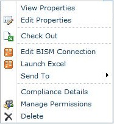

# Use a BI Semantic Model Connection in Excel or Reporting Services
  This topic explains how to use the BI semantic model connections you created using instructions in other topics. If you have not yet created a BI semantic model, see [Create a BI Semantic Model Connection to a PowerPivot Workbook](create-a-bi-semantic-model-connection-to-a-power-pivot-workbook.md) and [Create a BI Semantic Model Connection to a Tabular Model Database](create-a-bi-semantic-model-connection-to-a-tabular-model-database.md).  
  
##   Connect from Excel  
 You can specify a BI semantic model connection as a data source in Excel or any other business application that uses Analysis Services tabular model data. This section explains the two approaches for connecting to BI semantic model data using Excel.  
  
 BI semantic model connections from Excel require that you have Excel 2010 and the MSOLAP.5 OLE DB provider installed on your workstation. Additional information about connection requirements is provided further on in this section.  
  
 **Starting from SharePoint**  
  
-   Right-click a BI semantic model connection in a library and select **Launch Excel**.  
  
   
  
 Click **Enable** when prompted to enable data connections. Excel opens a workbook that contains a PivotTable field list populated with fields from the underlying data source.  
  
 **Starting from Excel**  
  
1.  Start Excel and open a workbook. On the Data tab, in Get External Data, click **From Other Sources**.  
  
2.  Click **From Analysis Services** and use the Data Connection Wizard to import the data.  
  
3.  Enter the SharePoint URL of the BI semantic model connection file (for example, **http://mysharepoint/shared documents/myData.bism**). Accept the default log on credentials option, **Use Windows Authentication**. Click **Next**.  
  
4.  On the next page, click **Next** again. Although you are prompted to select a database, you can only use the one database that is specified in the BI semantic model connection.  
  
5.  On the last page, you can provide a friendly name and description. Click **Finish**, and then click **OK** on the Import Data dialog box to import the data.  
  
 For connections to succeed you must have Excel 2010 and the MSOLAP.5.dll installed on the client computer. You can get the provider by installing the version of PowerPivot for Excel that is current for this release or you can download just the Analysis Services OLE DB provider from the [Feature Pack download page](https://go.microsoft.com/fwlink/?linkid=214066).  
  
 To confirm that MSOLAP.5.dll is the current version, check `HKEY_CLASSES_ROOT\MSOLAP` in the registry. `CurVer` should be set to MSOLAP.5.  
  
 You must also have Read permissions on the BI semantic model file in SharePoint. Read permissions include download rights. Excel downloads the BI semantic model connection information from SharePoint and opens a direct connection to the database via `HTTP Get`. Connection requests do not flow through SharePoint once BI semantic model connection information is stored locally.  
  
 If you are connecting to a tabular model database that runs on an Analysis Services server, SharePoint permissions are not sufficient. You must also have database read permissions on the server. This step should have been performed when you created the BI semantic model connection. For more information, see [Create a BI Semantic Model Connection to a Tabular Model Database](create-a-bi-semantic-model-connection-to-a-tabular-model-database.md).  
  
##   Connect from Reporting Services in SharePoint  
 You can use a BI semantic model connection the same way you use most data sources, by specifying the file as a data source in the document or tool that uses the data. Although a BI semantic model connection points to a physical database on another server, you use the connection file as if it were the data source. The SharePoint URL of the BI semantic model connection is a valid data source location for [!INCLUDE[ssCrescent](../../includes/sscrescent-md.md)] reports that use BI semantic model data.  
  
 For ad hoc report design in SharePoint, the user who creates the report must have SharePoint permissions on the BI semantic model connection (.bism) file and on the business intelligence semantic model database. The security context of the connection is the interactive user who is creating the report.  
  
  
