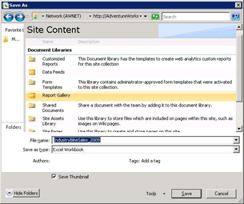

# Use PowerPivot Gallery
  [!INCLUDE[ssGemini](../../includes/ssgemini-md.md)] Gallery is a special-purpose SharePoint document library that provides rich preview and document management for published Excel workbooks and Reporting Services reports that contain PowerPivot data.  
  
> [!NOTE]  
>  Depending on how your server is configured, you might see warning or error messages in the preview area for specific documents. Messages can appear when an Excel workbook is set to automatically refresh its data whenever it is opened. Data refresh warning messages will appear as the preview image if Excel Services is configured to show Warn on data refresh error messages. Farm or service administrators can modify configuration settings to allow a preview of the actual worksheet to appear. For more information, see [Create a trusted location for PowerPivot sites in Central Administration](create-a-trusted-location-for-power-pivot-sites-in-central-administration.md).  
  
##   In this topic  
  
-   [Icons in PowerPivot Gallery](#icons)  
  
-   [Save an Excel Workbook to PowerPivot Gallery](#add)  
  
-   [Create new reports or workbooks based on a published PowerPivot workbook](#newdocs)  
  
-   [Open a workbook or report in full page mode](#view)  
  
-   [Schedule data refresh for PowerPivot workbooks in PowerPivot Gallery](#newdr)  
  
-   [Delete a workbook or report in PowerPivot Gallery](#delete)  
  
-   [Refresh a thumbnail image](#image)  
  
-   [Known Issues](#bkmk_known_issues)  
  
 [Prerequisites](#prereq)  
  
##   Prerequisites  
  
> [!NOTE]  
>  The Power Pivot Gallery requires Microsoft Silverlight.  The Microsoft Edge browser does not support Silverlight.   
> To view the library contents in Edge, click the **Library** tab in  Power Pivot gallery, and then change the document library view to **All Documents**.    
> To change  the default view , click  the **Library** tab and then click  Modify View. Click  "Make this the default view" and then click OK to save the  default view.  
>  For more information on what Edge supports, see the Windows blog, [A break from the past, part 2: Saying goodbye to ActiveX, VBScript...](http://blogs.windows.com/msedgedev/2015/05/06/a-break-from-the-past-part-2-saying-goodbye-to-activex-vbscript-attachevent/)  
  
 For a complete list of prerequisites, see [Create and Customize PowerPivot Gallery](create-and-customize-power-pivot-gallery.md).  
  
##   Icons in PowerPivot Gallery  
 Icons provide a visual indicator on content availability and status.  
  
|Icon|Description|  
|----------|-----------------|  
||The hourglass icon appears when a thumbnail image of each page in the document is being generated. Refresh the page to display the update the image.|  
||The pages icon appears when a workbook or report has more pages than can be displayed in PowerPivot Gallery. To view all the pages, you must use a client application.|  
||The error icon appears when a thumbnail image could not be rendered for the document. The document is published to the library, but it cannot be rendered in the custom PowerPivot Gallery views. You should be able to view the document in a client application, such as the PowerPivot for Excel add-in.|  
||The unavailable content icon appears when the document you uploaded cannot be rendered in PowerPivot Gallery. Supported document types include PowerPivot workbooks and reports created in SQL Server 2008 R2 Reporting Services Report Builder.   This icon also appears if you recycle a document from Recycle Bin.   If you are getting this icon for a document that previously presented a valid preview image, you can refresh the image by editing a document property and then saving your changes.|  
||The locked content icon appears when thumbnail images are purposely disabled for this document. PowerPivot Gallery does not generate thumbnail images for Excel workbooks that contain no PowerPivot data, or for PowerPivot workbooks or Reporting Services reports that do not meet the requirements for snapshot generation. For more information, see the Prerequisites section in this topic.|  
  
##   Save an Excel Workbook to PowerPivot Gallery  
 You can publish [!INCLUDE[ssGemini](../../includes/ssgemini-md.md)] workbooks to the library using all of the sharing techniques that Excel 2010 provides. For example, in Excel 2010, you can use Save As to specify all or part of a SharePoint path to a library.  
  
1.  Save the file.  
  
2.  1.  **Excel 2010:** In the File menu, click **Save & Send**.  
  
    2.  Click **Save to SharePoint**.  
  
    3.  Click **Publish Options** if you want to use Excel Services Options to select individual sheets or parameters that you want to publish. For example, the Parameters tab in Excel Services Options lets you choose which slicers appear in the published workbook.  
  
    1.  **Excel 2013:**  In the File menu, click **Save**.  
  
    2.  Click **Browser View Options** if you want to use Excel Services Options to select individual sheets or parameters that you want to publish. For example, the Parameters tab in Excel Services Options lets you choose which slicers appear in the published workbook.  
  
3.  In the Save As dialog box, in File name, enter a full or partial URL to [!INCLUDE[ssGemini](../../includes/ssgemini-md.md)] Gallery. If you enter a portion of the URL address, such as the server name, you can browse the site to find the [!INCLUDE[ssGemini](../../includes/ssgemini-md.md)] Gallery. To do this, click **Save** to open a connection to the server you specified.  
  
       
  
1.  Using the Save As dialog box, select [!INCLUDE[ssGemini](../../includes/ssgemini-md.md)] Gallery on your site.  
  
2.  Click **Open** to open the library.  
  
3.  Click **Save** to publish the workbook to the library.  
  
 In a browser window, verify that the document appears in [!INCLUDE[ssGemini](../../includes/ssgemini-md.md)] Gallery. Newly published documents will appear in the list. Library settings determine where the document appears (for example, sorted in ascending order by date, or alphabetically by name). You might need to refresh the browser window to view the most recent additions.  
  
#### Upload a workbook into PowerPivot Gallery  
 You can also upload a workbook if you want to start from SharePoint and select from your computer which file to publish.  
  
1.  In a SharePoint site, open [!INCLUDE[ssGemini](../../includes/ssgemini-md.md)] Gallery.  
  
2.  In Library ribbon, click **Documents**.  
  
3.  In **Upload Document**, select an upload option and then enter the name and location of the file you want to upload. Library settings determine where the document appears. You might need to refresh the browser window to view the latest addition.  
  
##   Create new reports or workbooks based on a published PowerPivot workbook  
 For [!INCLUDE[ssGemini](../../includes/ssgemini-md.md)] workbooks that you publish to [!INCLUDE[ssGemini](../../includes/ssgemini-md.md)] Gallery, you can create additional workbooks or Reporting Services reports that use the published workbook as a connected data source.  
  
|||  
|-|-|  
||Click the downward arrow portion of the New Report button to launch Report Builder or Excel 2010. PowerPivot Gallery must use one of the predesigned views (Theater, Gallery, or Carousel) in order for the New Report button to be available.|  
  
#### Create Report Builder Report  
 Creating a new report based on an existing PowerPivot workbook in the library requires that Reporting Services is configured for SharePoint integration for the same sites that contain PowerPivot Gallery. When you select the Create Report Builder Report option, Report Builder is downloaded from the report server and installed on the local workstation on first use. A placeholder report file is created for the new report and saved to PowerPivot Gallery. Connection information to the PowerPivot workbook is created for you as a new data source in the report. As a next step, you can build the datasets and report layout in the design workspace. As you use Report Builder to assemble your report, you can save your changes and the final result to the report document in the gallery. To avoid data disconnections later, be sure to keep the report and workbook files together in the same library.  
  
#### Open New Excel Workbook  
 To create a new Excel workbook from an existing workbook, you must already have Excel and [!INCLUDE[ssGeminiClient](../../includes/ssgeminiclient-md.md)] on the local computer. Choosing Open New Excel Workbook starts Excel, opens a blank workbook (.xlsx) file, and loads [!INCLUDE[ssGemini](../../includes/ssgemini-md.md)] data in the background as a connected data source. Only the data from the PowerPivot window in the original workbook is used in the new workbook. PivotTables or PivotCharts from the original workbook are excluded. The new workbook links to data in the original workbook. The data is not copied to the new workbook itself.  
  
##   Open a workbook or report in full page mode  
 Click on any visible thumbnail image of the previewed document to open it in full page mode independent of [!INCLUDE[ssGemini](../../includes/ssgemini-md.md)] Gallery preview. [!INCLUDE[ssGemini](../../includes/ssgemini-md.md)] workbooks will open in a browser. Reporting Services reports will open in the ReportViewer web part that is part of Reporting Services deployment on a SharePoint server.  
  
 An alternative approach to viewing the workbook in a browser is to open it in Excel on a client workstation. You must have Excel 2013 or Excel 2010 and the [!INCLUDE[ssGeminiClient](../../includes/ssgeminiclient-md.md)] add-in to view the file. You can use Excel 2007 to open the file but you cannot use it to pivot on the data. For this reason, Excel 2013 or Excel 2010 are recommended for both viewing and creating PowerPivot data. If you do not have the required applications, you must use a browser to view the workbook from SharePoint.  
  
##   Schedule data refresh for PowerPivot workbooks in PowerPivot Gallery  
 [!INCLUDE[ssGemini](../../includes/ssgemini-md.md)] data in a published Excel workbook can be refreshed at scheduled intervals.  
  
|||  
|-|-|  
||Click the Manage Data refresh button to create or view a schedule that retrieves updated data from connected data sources. For instructions on how to create a schedule, see [Schedule a Data Refresh &#40;PowerPivot for SharePoint&#41;](../schedule-a-data-refresh-powerpivot-for-sharepoint.md).|  
  
##   Delete a workbook or report in PowerPivot Gallery  
 To delete a document from the library, switch to the All Documents view first.  
  
1.  In a SharePoint site, open [!INCLUDE[ssGemini](../../includes/ssgemini-md.md)] Gallery.  
  
2.  In the ribbon, click **Library**.  
  
3.  In Manage Views, in the Current View list, click the down arrow and select All Documents.  
  
4.  Select the workbook or report you want to delete.  
  
5.  In Documents (Files), in Manage, click the **Delete Document** button.  
  
##   Refresh a thumbnail image  
 Use the following steps to regenerate a thumbnail image for a document in PowerPivot Gallery.  
  
1.  Switch PowerPivot Gallery to All Documents view. To do this, click **Library** in the ribbon and change the **Current View** to **All Documents**.  
  
2.  Select the workbook or report for which you want to refresh the thumbnail image..  
  
3.  Click the down arrow to the right, and then select **Edit Properties**.  
  
4.  Click **Save**. Saving the document forces the snapshot service to regenerate the preview image.  
  
##   Known Issues  
  
### Document Type is Not Supported  
 The **PowerPivot Gallery Document** content type is not supported. If you enable the **PowerPivot Gallery Document** content type for a document library, and attempt to create a new document of that type, you will see an error message similar to one of the following:  
  
-   'New Document' requires a Microsoft Sharepoint Foundation-compatible application and web browser. To add a document to this document library, click the 'Upload Document' button.  
  
-   "The Internet address 'http://[server name]/testSite/PowerPivot Gallery/ReportGallery/Forms/Template.xlsx' is not valid.""Microsoft Excel cannot access the file 'http://[server name]/testSite/PowerPivot Gallery/ReportGallery/Forms/Template.xlsx'. There are several possible reasons:  
  
 The **PowerPivot Gallery Document** content type is not automatically added to document libraries,  You will not encounter this issue unless you manually enable the unsupported content type.  
  
## See Also  
 [Create a trusted location for PowerPivot sites in Central Administration](create-a-trusted-location-for-power-pivot-sites-in-central-administration.md)   
 [Delete PowerPivot Gallery](delete-power-pivot-gallery.md)   
 [Create and Customize PowerPivot Gallery](create-and-customize-power-pivot-gallery.md)   
 [Schedule a Data Refresh &#40;PowerPivot for SharePoint&#41;](../schedule-a-data-refresh-powerpivot-for-sharepoint.md)  
  
  
