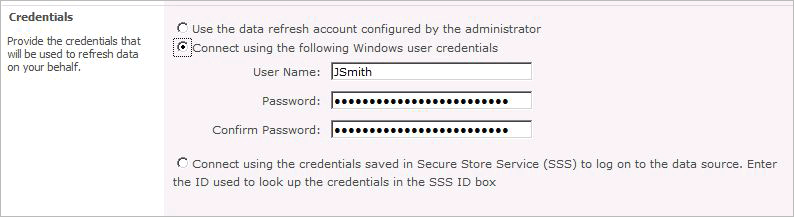
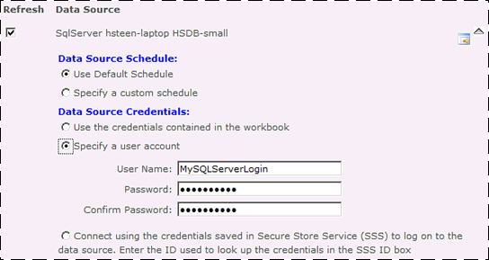

# PowerPivot Data Refresh with SharePoint 2010
  [!INCLUDE[ssGemini](../includes/ssgemini-md.md)]t data refresh is a scheduled server-side operation that queries external data sources to update embedded [!INCLUDE[ssGemini](../includes/ssgemini-md.md)] data in an Excel 2010 workbook that is stored in a content library.  
  
 Data refresh is a built-in feature of [!INCLUDE[ssGemini](../includes/ssgemini-md.md)] for SharePoint, but using it requires that you run specific services and timer jobs in your SharePoint 2010 farm. Additional administrative steps, such as installing data providers and checking database permissions, are often required for data refresh to succeed.  
  
 **[!INCLUDE[applies](../includes/applies-md.md)]**  SharePoint 2010  
  
> [!NOTE]  
>  [!INCLUDE[ssCurrent](../includes/sscurrent-md.md)] and SharePoint Server 2013 Excel Services use a different architecture for data refresh of [!INCLUDE[ssGemini](../includes/ssgemini-md.md)] data models. The new architecture utilizes Excel Services as the primary component to load PowerPivot data models. The previous data refresh architecture used relied on a server running PowerPivot System Service and [!INCLUDE[ssASnoversion](../includes/ssasnoversion-md.md)] in SharePoint mode to load data models. For more information, see [PowerPivot Data Refresh with SharePoint 2013](power-pivot-sharepoint/power-pivot-data-refresh-with-sharepoint-2013.md).  
  
 **In this topic:**  
  
 [Step 1: Enable Secure Store Service and Generate a Master Key](#bkmk_services)  
  
 [Step 2: Turn off credential options that you do not want to support](#bkmk_creds)  
  
 [Step 3: Create target applications to store credentials used in data refresh](#bkmk_stored)  
  
 [Step 4: Configure the server for scalable data refresh](#bkmk_scale)  
  
 [Step 5: Install Data Providers Used to Import PowerPivot Data](#bkmk_installdp)  
  
 [Step 6: Grant permissions to create schedules and access external data sources](#bkmk_accounts)  
  
 [Step 7: Enable workbook upgrade for data refresh](#bkmk_upgradewrkbk)  
  
 [Step 8: Verify data refresh configuration](#bkmk_verify)  
  
 [Modify Configuration Settings for Data Refresh](#bkmk_config)  
  
 [Reschedule the PowerPivot Data Refresh timer job](#configTimerJob)  
  
 [Disable the Data Refresh Timer Job](#bkmk_disableDR)  
  
 After you ensure that the server environment and permissions are configured, data refresh is ready to use. To use data refresh, a SharePoint user creates a schedule on a PowerPivot workbook that specifies how often data refresh occurs. Creating the schedule is typically done by the workbook owner or author who published the file to SharePoint. This person creates and manages the data refresh schedules for the workbooks that he or she owns. For more information, see [Schedule a Data Refresh &#40;PowerPivot for SharePoint&#41;](schedule-a-data-refresh-powerpivot-for-sharepoint.md).  
  
##   Step 1: Enable Secure Store Service and Generate a Master Key  
 PowerPivot data refresh depends on Secure Store Service to provide credentials used to run data refresh jobs and to connect to external data sources that use stored credentials.  
  
 If you installed PowerPivot for SharePoint using the New Server option, the Secure Store Service is configured for you. For all other installation scenarios, you must create and configure a service application and generate a master encryption key for Secure Store Service.  
  
> [!NOTE]  
>  You must be a farm administrator to configure Secure Store Service or delegate Secure Store Service administration to another user. You must be a service application administrator to configure or modify settings after it is enabled.  
  
1.  In Central Administration, in Application Management, click **Manage service applications**.  
  
2.  In the Service Applications ribbon, in Create, click **New**.  
  
3.  Select **Secure Store Service**.  
  
4.  In the **Create Secure Store Application** page, enter a name for the application.  
  
5.  In **Database**, specify the SQL Server instance that will host the database for this service application. The default value is the SQL Server Database Engine instance that hosts the farm configuration databases.  
  
6.  In **Database Name**, enter the name of the service application database. The default value is Secure_Store_Service_DB_\<guid>. The default name corresponds to the default name of the service application. If you entered a unique service application name, follow a similar naming convention for your database name so that you can manage them together.  
  
7.  In **Database Authentication**, the default is Windows Authentication. If you choose SQL Authentication, refer to the SharePoint administrator guide for guidance on how to use the authentication type in your farm.  
  
8.  In Application Pool, select **Create new application pool.** Specify a descriptive name that will help other server administrators identify how the application pool is used.  
  
9. Select a security account for the application pool. Specify a managed account to use a domain user account.  
  
10. Accept the remaining default values, and then click **OK.** The service application will appear alongside other managed services in the farm's service application list.  
  
11. Click the Secure Store Service application from the list.  
  
12. In the Service Applications ribbon, click **Manage**.  
  
13. In Key Management, click **Generate New Key**.  
  
14. Enter and then confirm a pass phrase. The pass phrase will be used to add additional secure store shared service applications.  
  
15. Click **OK**.  
  
 Audit logging of Store Service operations, which is useful for troubleshooting purposes, must be enabled before it is available. For more information about how to enable logging, see [Configure Secure Store Service (SharePoint 2010)](https://go.microsoft.com/fwlink/p/?LinkID=223294).  
  
##   Step 2: Turn off credential options that you do not want to support  
 PowerPivot data refresh provides three credential options in a data refresh schedule. When a workbook owner schedules data refresh, he or she chooses one of these options, thereby determining the account under which the data refresh job runs. As an administrator, you can determine which credential options are available to schedule owners.  
  
 You must have at least one option that is available in order for data refresh to work.  
  
   
  
 Option 1, **Use the data refresh account configured by the administrator**, always appears on the schedule definition page, but only works if you configure the unattended data refresh account. For more information on how to create the account, see [Configure the PowerPivot Unattended Data Refresh Account &#40;PowerPivot for SharePoint&#41;](configure-unattended-data-refresh-account-powerpivot-sharepoint.md).  
  
 Option 2, **Connect using the following windows credentials**, always appears on the page, but only works when you enable the **Allow users to enter custom Windows credentials** option in the service application configuration page. This option is enabled by default, but you can disable it if the disadvantages of using it outweigh the advantages (see below).  
  
 Option 3, **Connect using the credentials saved in Secure Store Service**, always appears on the page, but only works when a schedule owner provides a valid target application. An administrator must create these target applications in advance and then provide the application name to those who create the data refresh schedules. For more information on how to create a target application for data refresh operations, see [Configure Stored Credentials for PowerPivot Data Refresh &#40;PowerPivot for SharePoint&#41;](configure-stored-credentials-data-refresh-powerpivot-sharepoint.md).  
  
 **Configuring credential option 2, "Connect using the following Windows user credentials"**  
  
 PowerPivot service application includes a credential option that allows schedule owners to enter an arbitrary Windows user name and password for running a data refresh job. This is the second credential option in the schedule definition page:  
  
   
  
 This credential option is enabled by default. When this credential option is enabled, PowerPivot System Service will generate a target application in Secure Store Service to store the user name and password entered by the schedule owner. A generated target application is created using this naming convention: PowerPivotDataRefresh_\<guid>. One target application is created for each set of Windows credentials. If a target application already exists that is owned by the PowerPivot System Service and stores the username and password entered by the person defining the schedule, PowerPivot System Service will use that target application rather than create a new one.  
  
 The primary advantage of using this credential option is ease of use and simplicity. Advance work is minimal because target applications are created for you. Also, running data refresh under the credentials of the schedule owner (who is most likely the person who created the workbook) simplifies permission requirements downstream. Most likely, this user already has permissions on the target database. When data refresh runs under this person's Windows user identity, any data connections that specify 'current user' will work automatically.  
  
 The disadvantage is limited management capability. Although target applications are created automatically, they are not deleted automatically or updated as account information changes. Password expiration policies might cause these target applications to become out of date. Data refresh jobs that use expired credentials will start to fail. When this occurs, schedule owners will need to update their credentials by providing current user name and password values in a data refresh schedule. A new target application will be created at that point. Over time, as users add and revise credential information in their data refresh schedules, you might find that you have a large number of auto-generated target applications on your system.  
  
 Currently, there is no way to determine which of these target applications are active or inactive, nor is there a way to trace a specific target application back to the data refresh schedules that use it. In general, you should leave the target applications alone, as deleting them might break existing data refresh schedules. Deleting a target application that is still in use will cause data refresh to fail with the message, "Target application not found", appearing in the data refresh history page of the workbook.  
  
 Should you choose to disable this credential option, you can safely delete all of the target applications that were generated for PowerPivot data refresh.  
  
 **Disabling the use of arbitrary Windows credentials in data refresh schedules**  
  
1.  In Central Administration, in Application Management, click **Manage Service Applications**.  
  
2.  Click the PowerPivot service application name. The PowerPivot Management Dashboard appears.  
  
3.  In Actions, click **Configure service application settings** to open the PowerPivot Service Application Settings page  
  
4.  In the Data Refresh section, clear the **Allow users to enter custom Windows credentials** checkbox.  
  
       
  
##   Step 3: Create target applications to store credentials used in data refresh  
 Once Secure Store Service is configured, SharePoint administrators can create target applications to make stored credentials available for data refresh purposes, including the PowerPivot unattended data refresh account or any other account that is used to either run the job or connect to external data sources.  
  
 Recall from the previous section that you need to create target applications in order for certain credential options to be usable. Specifically, you must create target applications for the PowerPivot unattended data refresh account, plus any additional stored credentials that you expect would be used in data refresh operations.  
  
 For more information about how to create target applications that contain stored credentials, see [Configure the PowerPivot Unattended Data Refresh Account &#40;PowerPivot for SharePoint&#41;](configure-unattended-data-refresh-account-powerpivot-sharepoint.md) and [Configure Stored Credentials for PowerPivot Data Refresh &#40;PowerPivot for SharePoint&#41;](configure-stored-credentials-data-refresh-powerpivot-sharepoint.md).  
  
##   Step 4: Configure the server for scalable data refresh  
 By default, each PowerPivot for SharePoint installation supports both on-demand queries and scheduled data refresh.  
  
 For each installation, you can specify whether the Analysis Services server instance supports both query and scheduled data refresh, or is dedicated to a specific type of operation. If you have multiple installations of PowerPivot for SharePoint in your farm, you might consider dedicating a server for just data refresh operations if you find that jobs are delayed or failing.  
  
 Additionally, if the underlying hardware supports it, you can increase the number of data refresh jobs that run in parallel. By default, the number of jobs that can run in parallel is calculated based on system memory, but you can increase that number if you have additional CPU capacity to support the workload.  
  
 For more information, see [Configure Dedicated Data Refresh or Query-Only Processing &#40;PowerPivot for SharePoint&#41;](configure-dedicated-data-refresh-query-only-processing-powerpivot-sharepoint.md).  
  
##   Step 5: Install Data Providers Used to Import PowerPivot Data  
 A data refresh operation is essentially a repeat of an import operation that retrieved the original data. This means that the same data providers used to import the data in the PowerPivot client application must also be installed on the PowerPivot server.  
  
 You must be a local administrator to install data providers on a Windows server. If you install additional drivers, be sure to install them on each computer in the SharePoint farm that has an installation of PowerPivot for SharePoint. If you have multiple PowerPivot servers in the farm, you must install the providers on each one.  
  
 Remember that SharePoint servers are 64-bit applications. Be sure to install the 64-bit version of the data providers you are using to support data refresh operations.  
  
##   Step 6: Grant permissions to create schedules and access external data sources  
 Workbook owners or authors must have **Contribute** permission to schedule data refresh on a workbook. Given this permission level, he or she can open and edit the workbook's data refresh configuration page to specify the credentials and schedule information used to refresh the data.  
  
 In addition to SharePoint permissions, database permissions on external data sources must also be reviewed to ensure that accounts used during data refresh have sufficient access rights to the data. Determining permission requirements will require careful evaluation on your part because the permissions that you need to grant will vary depending on the connection string in the workbook and the user identity under which the data refresh job is running.  
  
 **Why existing connection strings in a PowerPivot workbook matter to PowerPivot data refresh operations**  
  
 When data refresh runs, the server sends a connection request to the external data source using the connection string that was created when the data was originally imported. The server location, database name, and authentication parameters specified in that connection string are now reused during data refresh to access the same data sources. The connection string and its overall construction cannot be modified for data refresh purposes. It is simply reused as-is during data refresh. In some cases, if you are using non-Windows authentication to connect to a data source, you can override the user name and password in the connection string. More detail about this is provided further on in this topic.  
  
 For most workbooks, the default authentication option on the connection is to use trusted connections or Windows integrated security, resulting in connection strings that include `SSPI=IntegratedSecurity` or `SSPI=TrustedConnection`. When this connection string is used during data refresh, the account used to run the data refresh job becomes the 'current user'. As such, this account needs read permissions on any external data source that is accessed via a trusted connection.  
  
 **Did you enable the PowerPivot unattended data refresh account?**  
  
 If yes, then you should grant that account read permissions on data sources that are accessed during data refresh. The reason why this account needs read permissions is because in a workbook that uses the default authentication options, the unattended account will be the 'current user' during data refresh. Unless the schedule owner overrides the credentials in the connection string, this account will need read permissions on any number of data sources that are actively used in your organization.  
  
 **Are you using credential option 2: allowing the schedule owner to enter a Windows user name and password?**  
  
 Typically, users who create PowerPivot workbooks already have sufficient permissions because he or she already imported the data in the first place. If these users subsequently configure data refresh to run under their own Windows user identity, their Windows user account, which already has rights on the database, will be used to retrieve data during data refresh. Existing permissions should be sufficient.  
  
 **Are you using credential option 3: using a Secure Store Service target application to provide a user identity for running data refresh jobs?**  
  
 Any account used to run a data refresh job needs read permissions, for the same reasons as those described for the PowerPivot unattended data refresh account.  
  
 **How to check connection strings to determine whether you can override credentials used during data refresh**  
  
 As previously noted, you can substitute a different user name and password at the data refresh job level if the connection is using non-Windows authentication (for example, SQL Server authentication). Non-Windows credentials are passed on the connection string using the User ID and Password parameters. If your workbook contains a connection string with these parameters, you can optionally specify a different user name and password for refreshing data from that data source.  
  
 The following steps explain how to determine whether you have a connection string that accepts user name and password overrides.  
  
1.  Open the workbook in Excel.  
  
2.  Open the PowerPivot window (in Excel, on the PowerPivot ribbon, click PowerPivot Window).  
  
3.  Click **Design**.  
  
4.  Click **Existing Connections**.  
  
     All of the connections used in the workbook are listed under **PowerPivot Data Connections**.  
  
5.  Select the connection and click **Edit**, and then click **Advanced**. The connection string is at the bottom of the page.  
  
 If you see **Integrated Security=SSPI** in the connection string, you cannot override the credentials in the connection string. The connection will always use the current user. Any credentials that you provide are ignored.  
  
 If you see **Persist Security Info=False, Password=\*\*\*\*\*\*\*\*\*\*\*, UserID=\<userlogin>**,then you have a connection string that will accept credential overrides. Credentials that appear in a connection string (such as UserID and Password) are not Windows credentials, but rather database logins or other sign-in accounts that are valid for the target data source.  
  
 **How to override credentials in the connection string**  
  
 Overriding credentials is done by specifying data source credentials in the data refresh schedule. As an administrator, you can provide a target application in Secure Store Service that maps the credentials used to access external data. The schedule owner can then enter the target application ID in the data refresh schedule that he or she defines. For more information about creating this target application, see [Configure Stored Credentials for PowerPivot Data Refresh &#40;PowerPivot for SharePoint&#41;](configure-stored-credentials-data-refresh-powerpivot-sharepoint.md).  
  
 Alternatively, the schedule owner can type in the set of credentials that are used to connect to data sources during data refresh. The following illustration shows this data source option in the schedule definition page.  
  
   
  
 **Identifying data access requirements**  
  
 As noted in previous sections, the account used to run data refresh and connect to external data sources is often one and the same. As such, the account used to access external data sources is determined by the options set in this part of the data refresh schedule page. This might be the PowerPivot unattended data refresh account, the Windows account of an individual user, or the account that is stored in a predefined target application.  
  
   
  
 In cases where the account used to run data refresh is different from the account used to import data (for example, the PowerPivot unattended data refresh account via credential option one, or some other set of stored credentials via credential option three), you will need to create a new database login for that account and grant it read permissions on the external data sources.  
  
 Once you understand which accounts require data access, you can begin to check permissions on the data sources that are most often used in PowerPivot workbooks. Start with any data warehouses or reporting databases that are actively used, but also solicit input from your most active PowerPivot users to find out which data sources they are using. Once you have a list of data sources, you can begin checking each one to ensure that permissions are set correctly.  
  
##   Step 7: Enable workbook upgrade for data refresh  
 By default, workbooks that were created using the [!INCLUDE[ssKilimanjaro](../includes/sskilimanjaro-md.md)] version of PowerPivot for Excel cannot be configured for scheduled data refresh on a [!INCLUDE[ssSQL11](../includes/sssql11-md.md)] version of PowerPivot for SharePoint. If you host newer and older versions of PowerPivot workbooks in your SharePoint environment, you must upgrade any [!INCLUDE[ssKilimanjaro](../includes/sskilimanjaro-md.md)] workbooks first before they can be scheduled for automatic data refresh on the server.  
  
##   Step 8: Verify data refresh configuration  
 To verify data refresh, you must have a PowerPivot workbook that is published to a SharePoint site. You must have Contribute permissions on the workbook and permissions to access any data sources that are included in the data refresh schedule.  
  
 When you create the schedule, select the **Also refresh as soon as possible** checkbox to run data refresh immediately. You can then check the data refresh history page of that workbook to verify that it ran successfully. Recall that the PowerPivot Data Refresh timer job runs every minute. It will take at least that long to get confirmation that data refresh succeeded.  
  
 Be sure to try all of the credential options you plan to support. For example, if you configured the PowerPivot unattended data refresh account, verify that data refresh succeeds using that option. For more information about scheduling and viewing status information, see [Schedule a Data Refresh &#40;PowerPivot for SharePoint&#41;](schedule-a-data-refresh-powerpivot-for-sharepoint.md) and [View Data Refresh History &#40;PowerPivot for SharePoint&#41;](power-pivot-sharepoint/view-data-refresh-history-power-pivot-for-sharepoint.md).  
  
 If data refresh fails, refer to the [Troubleshooting PowerPivot Data Refresh](https://go.microsoft.com/fwlink/?LinkID=223279) page on the TechNet wiki for possible solutions.  
  
##   Modify Configuration Settings for Data Refresh  
 Each PowerPivot service application has configuration settings that affect data refresh operations. This section explains how to modify those settings.  
  
###   Set 'Business Hours' to determine off-hours processing  
 SharePoint users who schedule data refresh operations can specify an earliest start time of "After business hours". This may be useful if they want to retrieve business transaction data that accumulated during the business day. As a farm administrator, you can specify the range of hours that best defines a business day for your organization. If you define the business day to be from 04:00 to 20:00, then data refresh processing that is based on an "After business hours" start time will begin at 20:01.  
  
 Data refresh requests that run during off-hours are added to the queue in the order in which the request is received. Individual requests will be processed as server resources become available.  
  
1.  In Central Administration, in Application Management, click **Manage Service Applications**.  
  
2.  Click the PowerPivot service application name. The PowerPivot Management Dashboard appears.  
  
3.  In Actions, click **Configure service application settings** to open the PowerPivot Service Application Settings page  
  
4.  In the Data Refresh section, in Business Hours, enter a start time and end time that defines the after business hours processing period.  
  
     If you do not want an off-hours processing period defined, you can enter the same value for both Start Time and End Time (for example, 12:00 for both times). However, be aware that the schedule definition pages on the SharePoint sites will still have "After business hours" as an option. Users who select that option on a farm that has no off-hour processing range defined for it will eventually get data refresh errors as processing jobs fail to start.  
  
5.  Click **OK**.  
  
###   Limit how long data refresh history is retained  
 Data refresh history is a detailed record of the success and failure messages that are generated for data refresh operations over time. History information is gathered and managed through the usage data collection system in the farm. As such, limits that you set on usage data history also apply to data refresh history. Because the usage activity reports pull together data from across the PowerPivot system, a single history setting is used to control data retention for both data refresh history and all other usage data that is collected and stored.  
  
1.  In Central Administration, in Application Management, click **Manage Service Applications**.  
  
2.  Click the PowerPivot service application name. The PowerPivot Management Dashboard appears.  
  
3.  In Actions, click **Configure service application settings** to open the PowerPivot Service Application Settings page  
  
4.  In the Usage Data Collection section, in Usage Data History, type the number of days for which you want to keep a record of data refresh activity for each workbook.  
  
     The default is 365 days. The minimum value is 1 day and the maximum is 5000 days. 0 specifies an unlimited retention period; data is never deleted. Note that there is no setting for turning off history.  
  
5.  Click **OK**.  
  
 History information is made available to SharePoint users when they choose the Manage Data Refresh option on a workbook that has a data refresh history. This information is also used in the PowerPivot Management Dashboard used by farm administrators to manage PowerPivot service operations. For more information, see [View Data Refresh History &#40;PowerPivot for SharePoint&#41;](power-pivot-sharepoint/view-data-refresh-history-power-pivot-for-sharepoint.md).  
  
 Long-term physical storage of history data is in the PowerPivot service application database for the PowerPivot service application. For more information about how usage data is collected and stored, see [PowerPivot Usage Data Collection](power-pivot-sharepoint/power-pivot-usage-data-collection.md).  
  
##   Reschedule the PowerPivot Data Refresh timer job  
 Scheduled data refresh is triggered by a PowerPivot Data Refresh timer job that scans schedule information in the PowerPivot service application database at one minute intervals. When data refresh is scheduled to begin, the timer job adds the request to a processing queue on an available PowerPivot server.  
  
 You can increase the length of time between scans as a performance tuning technique. You can also disable the timer job to temporarily stop data refresh operations while you troubleshoot problems.  
  
 The default setting is one minute, which is the lowest value you can specify. This value is recommended because it provides the most predictable outcome for schedules that run at arbitrary times throughout the day. For example, if a user schedules data refresh for 4:15 PM, and the timer job scans for schedules every minute, the scheduled data refresh request will be detected at 4:15 and processing will occur within a few minutes of 4:15.  
  
 If you raise the scan interval so that it runs very infrequently (for example, once a day at midnight), all of the data refresh operations that were scheduled to run during that interval are added to the processing queue all at once, potentially overwhelming the server and starving other applications of system resources. Depending on the number of scheduled refreshes, the processing queue for data refresh operations might build up to such an extent that not all jobs will be able to complete. Data refresh requests at the end of the queue might be dropped if they run into the next processing interval.  
  
 If your hardware supports it, you can mitigate this problem by specifying additional processors to run more data refresh jobs in parallel. For more information, see [Configure Dedicated Data Refresh or Query-Only Processing &#40;PowerPivot for SharePoint&#41;](configure-dedicated-data-refresh-query-only-processing-powerpivot-sharepoint.md). For more information about how data refresh requests are discovered, added to a queue, and processed, see [PowerPivot Data Refresh](power-pivot-sharepoint/power-pivot-data-refresh.md).  
  
1.  In Central Administration, click **Monitoring**.  
  
2.  Click **Review Job Definitions**.  
  
3.  Select the **PowerPivot Data Refresh Timer Job**.  
  
4.  Modify the schedule frequency to change how often the timer job scans for data refresh schedule information.  
  
##   Disable the Data Refresh Timer Job  
 The PowerPivot data refresh timer job is a farm-level timer job that is either enabled or disabled for all PowerPivot server instances in the farm. It is not tied to a specific Web application or PowerPivot service application. You cannot disable it on some servers to force data refresh processing to other servers in the farm.  
  
 If you disable the PowerPivot data refresh timer job, requests that were already in the queue will be processed, but no new requests will be added until you re-enable the job. Requests that were scheduled to occur in the past are not processed.  
  
 Disabling the timer job has no effect on feature availability in application pages. There is no way to remove or hide the data refresh feature in web applications. Users who have Contribute permissions or above will still be able to create new schedules for data refresh operations, even if the timer job is permanently disabled.  
  
## See Also  
 [Schedule a Data Refresh &#40;PowerPivot for SharePoint&#41;](schedule-a-data-refresh-powerpivot-for-sharepoint.md)   
 [Configure Dedicated Data Refresh or Query-Only Processing &#40;PowerPivot for SharePoint&#41;](configure-dedicated-data-refresh-query-only-processing-powerpivot-sharepoint.md)   
 [Configure the PowerPivot Unattended Data Refresh Account &#40;PowerPivot for SharePoint&#41;](configure-unattended-data-refresh-account-powerpivot-sharepoint.md)   
 [Configure Stored Credentials for PowerPivot Data Refresh &#40;PowerPivot for SharePoint&#41;](configure-stored-credentials-data-refresh-powerpivot-sharepoint.md)  
  
  
