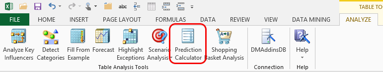

# Prediction Calculator (Table Analysis Tools for Excel)
    
  
 The **Prediction Calculator** tool helps you create a scorecard that can be used to analyze new data and evaluate options or risk. For example, if you have historical and demographic data about customers, the **Prediction Calculator** tool can help you with two key tasks:  
  
-   Generating an underlying analysis of demographics, purchasing behavior, and various other factors.  
  
-   Creating a working scorecard that helps you evaluate members and make recommendations for new products or service offerings.  
  
 The wizard also creates a worksheet that stores all the underlying calculations, so that you can interact with the model and see how different input values affect the final score.  
  
 If you choose, the wizard can also create a printed version of the worksheet that you can use for offline scoring. You cannot interact with the model as you can with the online Excel workbook, but the printed version provides all the calculations that you need to enter values and compute a final score.  
  
## Using the Prediction Calculator Tool  
  
1.  Open an Excel table that contains the data you want to analyze.  
  
2.  Click **Prediction Calculator** on the **Analyze** tab.  
  
3.  In the **Prediction Calculator** dialog box, for Target, choose the column that you want to predict, such as purchasing behavior.  
  
4.  Specify the targeted value. If the value is numeric, use the option **In range**, and then type the minimum and maximum values for the desired range. If the value is discrete, select the **Exactly** option, and then select the value from the dropdown list.  
  
5.  Click **Choose columns to use for analysis**.  
  
6.  In the **Advanced Column Selection** dialog box, select columns that have useful information. Remove any columns that are not relevant to the analysis. Click **OK**.  
  
     To avoid skewing the results, you should also remove columns that have duplicate information. For example, if you have an Income column that contains numeric data, and an Income Group column that contains the labels High, Medium, and Low, you should not include both columns in the same model. Instead, you could create a separate model for each column.  
  
7.  In the **Output Options** section, select **Operational Calculator** to create the analysis and scorecard within an Excel workbook. Select **Printer-ready Calculator** to create the analysis and also generate a report that can be printed and used for scoring by hand.  
  
8.  Click **Run**.  
  
     The tool creates new worksheets that contain the reports and scorecards.  
  
### Requirements  
 The **Prediction Calculator** tool uses the Microsoft Logistic Regression algorithm, which can work with discrete values, as well as discretized and continuous numeric data.  
  
## Understanding the Scoring Reports  
 If you select both output options, the Prediction Calculator creates the following three new worksheets within the current workbook:  
  
-   A **Prediction Report**that contains the results of analysis, complete with interactive tables and graphs that help you experiment with interactions and profits.  
  
-   An interactive **Prediction Calculator** that helps you create scores.  
  
-   A **Printable Calculator** with instructions and coefficients to use in scoring.  
  
-   This section describes the information in each report and how to use the various report options.  
  
### Prediction Report with Graphs  
 The first prediction report is titled **Prediction Calculator Report for the \<target state> of \<target attribute>**. It contains a table of factors derived from analysis, together with tools to help you assess the financial impact of a particular analysis.  
  
#### Table for Specifying Costs and Profits  
 The first tool in this report, in the upper left-hand side of the report, is a table where you can specify the costs and profits associated with correctly and incorrectly predicting a value.  These costs and profits are needed to compute the optimum score threshold for the calculator.  
  
|Item|Description and example|  
|----------|-----------------------------|  
|False Positive Cost|Cost of assuming the model predicted a positive result correctly when actually the prediction is wrong.   For example, the model predicts that a customer will purchase something, and based on that you devise a campaign to target that customer. You might enter the cost of outreach to the customer here.|  
|False Negative Cost|Cost of assuming the model predicted a negative correctly when actually the prediction is wrong.   For example, the model might predict that older customers are unlikely to purchase a bike, but you find that the model was skewed and as a result you missed a chance to target older customers. You might assign a missed opportunity cost here.|  
|True Positive Profit|Profit from correctly predicting a positive result. For example, if you target the right customers and outreach results in a sale, you would enter the per-customer profit here.|  
|True Negative Profit|Profit from correctly predicting a negative result.   For example, if you can correctly identify customers who should not be targeted, you might enter X number of advertising dollars per customer here.|  
  
#### Chart for Viewing Maximum Profit  
 As you enter values in the table, the related graphs update automatically to show you the best point for maximizing profit given the current model. The line graph to the right of this table displays the profit for various score thresholds. The profit is estimated using the profit and cost figures that you type into the table, based on the predictions and probabilities from the model.  
  
 For example, if, in the upper left table, the cell for **Suggested Threshold to maximize profit** shows the value 500, the chart on the right-hand side will show 500 as the highest point on the line graph. What this value of 500 means is that to maximize profits, you should use the top 500 recommendations from the mining model, ordered by probability.  
  
#### Table Listing Scores for Each Attribute and Value  
 The table in the lower left of the report shows a detailed breakdown of the values that were detected, and how each value affects the outcome. You cannot change the values in this table; they are displayed to help you understand the prediction.  
  
 For example, the following table shows an example of the results when the target outcome is that a customer purchases a bike. The table lists each input column that was used in the model, regardless of whether the input affected the model. The table also lists the discrete values and the discretized values if the input column contained continuous numeric data.  
  
 The values in the **Relative Impact** column are probabilities, represented as percentages. The cell is shaded to visually represent the impact of this value on the outcomes.  
  
|Attribute|Value|Relative Impact|  
|---------------|-----------|---------------------|  
|Marital Status|Married|0|  
|Marital Status|Single|71|  
|Gender|Female|13|  
|Gender|Male|0|  
  
 You can interpret these factors as follows:  
  
-   Being married does not affect the customer's likelihood of buying a bike.  
  
-   However, being single is a strong indicator (70 percent) that the customer is likely to buy a bike.  
  
-   The customer's gender has only marginal effect (13 percent) on predicted bike-buying behavior if the customer is a woman, and has no effect on predicted bike-buying behavior if the customer is a man.  
  
#### Chart of Cumulative Misclassification Cost  
 The area chart in the lower right of the report shows the cumulative misclassification cost for various score thresholds. This chart also uses the cost and profit figures that you enter for false positives, true positives, false negatives, and false positives.  
  
 Unlike the chart in the upper right of the report, which focuses on maximizing profit, this chart incorporates the cost of making the wrong prediction. This chart is especially useful in scenarios such as prevention, where the cost of making the wrong decision significantly outweighs the cost of guessing correctly.  
  
 For example, although the first chart suggests that targeting the top 500 customers predicted by the model is the way to maximum profits, you might decide after looking at this second chart that the costs of wrongly targeting customers is too great, and decide instead to cut off the marketing campaign at the first 400 customers.  
  
### Interactive Prediction Calculator  
 The second worksheet created by the Prediction Calculator tool is titled **Prediction Calculator for the \<target state> of \<target attribute>**. It is an interactive worksheet that you can use to calculate individual scores. Because this worksheet uses patterns and statistics stored in the model, you can experiment with different values and see how they affect the predicted score. This report also has two sections: one is interactive, and one is provided as a reference.  
  
#### First table  
 You can select or type a new value in the **Value** column of the table to see how changing the value affects the score.  
  
 For example, if the report contains the following values, you might decrease the value of Cars to 1 and then to 0 to see how that affects customer purchasing behavior. As you change the value of **Cars** to 0, the prediction at the bottom changes to TRUE.  
  
|Attribute|Value|Relative Impact|  
|---------------|-----------|---------------------|  
|Marital Status|Married|0|  
|Gender|Male|0|  
|Income|39050 - 71062|117|  
|Children|0|157|  
|Education|Bachelors|22|  
|Occupation|Skilled Manual|33|  
|Home Owner|Yes|8|  
|Cars|2|50|  
|Commute Distance|0-1 Miles|99|  
|Region|North America|0|  
|Age|37 - 46|5|  
|Total||491|  
|Prediction for 'Yes'||FALSE|  
  
 When you type in the new value, the score displayed in the cell, Prediction for Yes, changes to TRUE, and the **Relative Impact** scores for the various attributes are updated as well.  
  
> [!NOTE]  
>  Even if you alter only one value, such as the number of cars, the values and impacts of other attributes may change when you do so. This is because data mining models often find complex relationships among data, and changing any one variable may have unforeseen effects. For this reason, we recommend that you use the interactive prediction calculator to experiment with different values, or browse the mining model to better understand the interactions. For more information, see [Browse Models](prediction-calculator-table-analysis-tools-for-excel.md).  
  
#### Score Breakdown  
 This table shows the individual scores for each possible state of the input columns, and the relative impact that the score has on the outcomes. This table is static and for reference only.  
  
### Printable Prediction Calculator  
 The third worksheet created by the Prediction Calculator tool is titled **PrintablePrediction Calculator for the \<target state> of \<target attribute>**. This scorecard is intended to be printed out so that you can manually calculate scores when you are away from your computer.  
  
##### To print and use the scoring report generated by the Prediction Calculator  
  
1.  Click the tab that is titled **Printable Prediction Calculator for \<attribute>**.  
  
2.  On the Excel File menu, select **Print Preview**.  
  
3.  Change the page orientation, margins, and other printing options until the scorecard fits on the page the way you want.  
  
     This scorecard is not dynamic and is not connected to the model in any way, so you can move columns or rows to improve the formatting without affecting the underlying data.  
  
4.  Print the scorecard.  
  
5.  For each attribute, choose only one value. For the value you choose, put a checkmark in the box, and write the corresponding number in the **Score** column.  
  
6.  Fill in as many attributes as possible to ensure accuracy.  
  
7.  Calculate the sum of the scores for each attribute and enter that number in the **Total** row.  
  
8.  Convert the score to a predicted result by using the criteria printed on the sheet immediately after the **Total** row.  
  
## Related Tools  
 [!INCLUDE[ssASnoversion](../includes/ssasnoversion-md.md)] provides the Microsoft Logistic Regression algorithm for use in this type of analysis. If you are already familiar with logistic regression, you can easily create logistic regression models by using the **Advanced** option of the Data Mining Client for Excel. For more information, see [Advanced Modeling &#40;Data Mining Add-ins for Excel&#41;](advanced-modeling-data-mining-add-ins-for-excel.md). For more information about the options and parameters for logistic regression models, see the topic "Microsoft Logistic Regression Algorithm" in [!INCLUDE[ssNoVersion](../includes/ssnoversion-md.md)] Books Online.  
  
## See Also  
 [Table Analysis Tools for Excel](table-analysis-tools-for-excel.md)  
  
  
