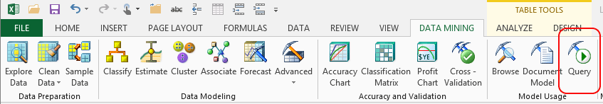

# Query (SQL Server Data Mining Add-ins)
    
  
 The **Query** wizard helps you interact with existing mining models to make predictions based on data in an Excel table, an Excel range, or another data source. The process of applying new data to an existing model to predict trends is called a *prediction query*.  
  
 The **Query** wizard also provides an advanced editor for creating or modifying data mining models, for generating custom queries, or for working with structures not supported in the other tools, such as nested datasets.  
  
-   Use the text editor to type or paste in the Data Mining Extensions (DMX) statements you've created elsewhere.  
  
-   Use the interactive Query Builder to compose a custom DMX statement with the help of templates and dialog boxes.  
  
-   Create DMX statements to manage or back up mining models and structures.  
  
## Using the Query Wizard  
  
1.  First, you must specify a source for the data to use as input. You can use data in an existing Excel table or range, or you can specify a SQL statement to retrieve the data.  
  
2.  Next, the wizard presents a list of data mining models on the server to which you are connected. If you know the model you want and are familiar with data mining, you can also click **Advanced** to open the **Data Mining Advanced Query Editor**.  
  
3.  Depending on the type of model that you choose, you must specify the column that contains the data to be evaluated, and define mappings between the input data columns and the model columns. Depending on the algorithm you choose, you can set other properties on the model.  
  
4.  Finally, the wizard also gives you the ability to choose one or more predictions, and specify a destination in which to store the results.  
  
 At any time, you can click **Advanced** to switch to the **Data Mining Advanced Query Editor**, which gives you more control over each part of the DMX statement. For more information about how to use the advanced query editing tools, see [Advanced Data Mining Query Editor](advanced-data-mining-query-editor.md).  
  
### Requirements  
 To use the **Query** wizard, you must be connected to an instance of [!INCLUDE[ssASnoversion](../includes/ssasnoversion-md.md)]. Moreover, the server must contain at least one data mining model of an appropriate type. If no mining models are available, you can create one by using the wizards provided in the Data Mining Client for Excel. For information about how to create a new mining mode by using a wizard, see [Creating a Data Mining Model](creating-a-data-mining-model.md).  
  
## See Also  
 [Deploying and Scaling Mining Models &#40;Data Mining Add-ins for Excel&#41;](deploying-and-scaling-mining-models-data-mining-add-ins-for-excel.md)   
 [Data Mining Client for Excel &#40;SQL Server Data Mining Add-ins&#41;](data-mining-client-for-excel-sql-server-data-mining-add-ins.md)  
  
  
