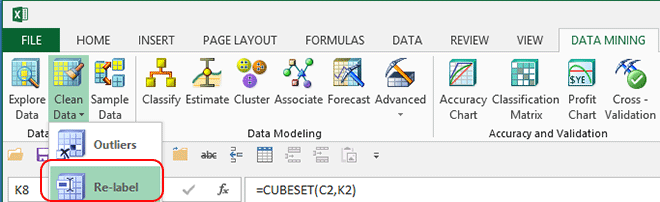

# Relabel (SQL Server Data Mining Add-ins)
    
  
 The Data Mining Client for Excel helps you create new labels for data to make it easier to understand the results of analysis.  
  
 Reasons for relabeling include:  
  
-   The data includes results that were coded, such as 1 for Male and 2 for Female.  
  
-   You are bucketing numeric values and want to give the ranges a descriptive name.  
  
-   You want to simplify long names.  
  
## Using the Relabel Wizard  
  
1.  In the **Data Mining** ribbon, click **Clean** and then select **Re-Label**.  
  
2.  Select the table or data range that has the data you want to fix.  
  
3.  In the **Re-label** page of the wizard, select a single column, either by choosing the column from the dropdown list, or by clicking the column in the **Data samples** pane.  
  
     The **Data samples** pane only shows about 50 rows of data, but they are sampled to ensure that you see a good spread of values.  
  
     Click the column header for **Count** to sort by the count of each value.  
  
     You can also sort by **Original Labels**, which is handy if you want to re-label all the highest or lowest values first.  
  
4.  In the **Re-label** data page of the wizard, review the values in the **Original Labels** column, and decide how you want to group or edit them.  
  
5.  Type a new value into the row under **New Labels**. You can also choose a value from the list of existing values. As you type new values, they become available for re-use right away.  
  
6.  When you have entered enough rows, click **Next**, and on the **Select Destination** page, choose where you'll save the relabeled data.  
  
    -   **Add as a new column to the current worksheet**  
  
         Click to add a new column to the table that contains the new values.  
  
    -   **Copy sheet data with changes to a new worksheet**  
  
         Click to create a new worksheet that contains the updated data.  
  
    -   **Change data in place**  
  
         Click to replace the original data with the new values.  
  
## See Also  
 [Exploring and Cleaning Data](exploring-and-cleaning-data.md)  
  
  
